# Spice themes for Omarchy

[](https://bjarneo.github.io/spice-themes)

This repo has 100 spice themes for [Omarchy](https://omarchy.org), from cumin to mulling spices. Each theme has a night variant and a day variant. That makes 200 Omarchy themes. Each variant has a 16-color ANSI palette, 5 backgrounds at 6K and a dust video.

- Site: [bjarneo.github.io/spice-themes](https://bjarneo.github.io/spice-themes)
- Screenshots: real captures of an Omarchy desktop with each variant applied
- Backgrounds: 1000 images at 6K, 6144×3456, and 200 dust videos at 3840×2160

## Variants

| Variant | Theme name | What it is | Lowest ANSI contrast | Lowest text contrast |
| --- | --- | --- | --- | --- |
| Night | `saffron-night` | A dark background with the colors of the spice. For the evening and dim rooms. | 5.5:1 | 13.8:1 |
| Day | `saffron-day` | A cream background with the same hues. For bright rooms and daylight. | 4.5:1 | 12.1:1 |

The contrast columns show the lowest WCAG contrast ratio against the background, over all 100 themes. The script raises or lowers the lightness of each color until it reaches its target. The 6 main ANSI colors reach at least 4.5:1, the WCAG AA level. The muted color for comments reaches at least 3.8:1. Each variant is a complete Omarchy theme with its own folder, so you can install any mix of them.

## Signature palettes

50 spices use a signature palette. Like Osaka Jade and Miasma in Omarchy, they fill the 6 ANSI slots with the colors of the spice, so a slot can hold a color that is not its name. The blue of Turmeric is the orange of its skin, and the chilies use the reds and browns of their pods. The other spices keep a classic palette, where red is red and blue is blue.

The contrast targets above apply to both kinds. A check also keeps the 6 slots apart, so no 2 slots look the same.

Signature palettes: [Nigella](#nigella), [Poppy Seed](#poppy-seed), [Annatto](#annatto), [Black Pepper](#black-pepper), [Green Peppercorn](#green-peppercorn), [Pink Peppercorn](#pink-peppercorn), [Sichuan Pepper](#sichuan-pepper), [Sansho](#sansho), [Tasmanian Pepperberry](#tasmanian-pepperberry), [Cayenne](#cayenne), [Sweet Paprika](#sweet-paprika), [Smoked Paprika](#smoked-paprika), [Chipotle](#chipotle), [Ancho](#ancho), [Guajillo](#guajillo), [Pasilla](#pasilla), [Chile de Árbol](#chile-de-árbol), [Kashmiri Chili](#kashmiri-chili), [Bird's Eye Chili](#birds-eye-chili), [Habanero](#habanero), [Ghost Pepper](#ghost-pepper), [Aleppo Pepper](#aleppo-pepper), [Urfa Biber](#urfa-biber), [Gochugaru](#gochugaru), [Ají Amarillo](#ají-amarillo), [Ceylon Cinnamon](#ceylon-cinnamon), [Turmeric](#turmeric), [Orris Root](#orris-root), [Wasabi](#wasabi), [Saffron](#saffron), [Clove](#clove), [Lavender](#lavender), [Rose](#rose), [Hibiscus](#hibiscus), [Safflower](#safflower), [Fennel Pollen](#fennel-pollen), [Green Cardamom](#green-cardamom), [Vanilla](#vanilla), [Star Anise](#star-anise), [Juniper](#juniper), [Sumac](#sumac), [Mace](#mace), [Chenpi](#chenpi), [Barberry](#barberry), [Kokum](#kokum), [Mastic](#mastic), [Za'atar](#zaatar), [Berbere](#berbere), [Curry Powder](#curry-powder), [Mulling Spices](#mulling-spices).

## Backgrounds

Each variant has 6 backgrounds: 5 images and 1 video. Omarchy shows them in this order. To show the next one, run `omarchy theme bg next`.

| File | What it shows |
| --- | --- |
| `0-omarchy-wordmark.jpg` | The Omarchy wordmark spelled in the whole spice on a table. For large spices and for spices that are sold ground, the ground spice is sifted through a stencil of the wordmark, with whole pieces around it. |
| `1-spice-bowl.jpg` | The spice in a small bowl of glazed ceramic, wood, brass or stone, with pieces on the table. Large and flat pieces, such as star anise and bay leaves, rest on a heap of the ground spice. Long pieces lie on the table next to it. |
| `2-spice-card.jpg` | A profile card: the botanical name, the part of the plant, the flavor, the heat and the colors. A chili card shows its Scoville range. A blend card lists its parts. |
| `3-ground.jpg` | A wooden spoon heaped with the ground spice, with a small spill and whole pieces. |
| `4-whole.jpg` | Whole pieces from a low angle with a shallow focus. A blend shows its parts. |
| `5-dust.mp4` | A 12 second loop at 3840×2160. The wordmark lies sifted in the ground spice, seen from above, and fine dust drifts through a beam of light. |

The wordmark, the bowl, the spoon, the whole pieces and the still of the dust video are photographic renders. The GPU ray-marches each 3D scene with soft shadows, reflections and depth of field. The card is a flat drawing.

## Install

`install.sh` copies themes into `~/.config/omarchy/themes`. Each theme variant becomes a normal Omarchy theme folder. The script installs the night and day variants of a theme unless you name one with `--variant`.

### Install one theme without a clone

The script downloads only the themes that you name:

```bash
curl -fsSL https://bjarneo.github.io/spice-themes/install.sh | bash -s -- saffron --set
```

To install one variant only, add `--variant`:

```bash
curl -fsSL https://bjarneo.github.io/spice-themes/install.sh | bash -s -- saffron cumin --variant day
```

`--set` applies the first installed variant of the last theme.

### Install from a clone

```bash
git clone --depth 1 https://github.com/bjarneo/spice-themes ~/.local/share/spice-themes
cd ~/.local/share/spice-themes
./install.sh --all
omarchy theme set saffron-night
```

The full repo is about 2630 MB because it has 1000 backgrounds at 6K. To download less, use the `curl` command above. It downloads only the folders that you name.

### Options

| Command | Result |
| --- | --- |
| `install.sh saffron cumin` | Installs the night and day variants of the named themes |
| `install.sh saffron --variant day` | Installs only this variant |
| `install.sh --all` | Installs all 200 themes |
| `install.sh --list` | Lists the 100 theme names |
| `install.sh saffron --set` | Installs the theme, then applies its night variant |
| `install.sh --update` | Installs again every theme variant that the script installed |
| `install.sh --remove saffron` | Removes the variants of a theme that the script installed |
| `install.sh --link saffron` | Links to the clone instead of copying. Run `git pull` in the clone to update. |
| `install.sh --force saffron` | Replaces a theme with the same name that the script did not install |

The variant names are `night` and `day`. The script writes a `.spice-themes` marker file in each theme that it copies. `--update` and `--remove` use this file, so they never change a theme that you made.

### Apply with Aether

[Aether](https://github.com/omacom/aether) can apply a theme straight from the [site](https://bjarneo.github.io/spice-themes). Open a spice, pick a variant and a background, and select 1 of these buttons:

| Button | Result |
| --- | --- |
| Apply with Aether | Aether loads the palette and the background, then applies them at once through its own theme. |
| Install as Omarchy theme | Aether adds the variant to `~/.config/omarchy/themes` and activates it at once. This stops if a theme with the same name exists, for example after `install.sh`. |
| Open in editor | Aether opens the palette in its editor. Nothing changes until you select Apply. |

Aether stops a download after 60 seconds. On a slow connection, a 6K background can take longer, so the links download a 3840×2160 copy from `site/assets/aether/`. GitHub does not render `aether://` links, so use the site or build a link yourself:

```text
aether://apply?colors=https://bjarneo.github.io/spice-themes/saffron/night/colors.toml&wallpaper=https://bjarneo.github.io/spice-themes/assets/aether/saffron/night/1-spice-bowl.jpg&silent=true
```

Add `&as_omarchy_theme=saffron-night` to install the variant. Use `&edit=true` instead of `&silent=true` to open the editor.

### Name conflicts

All theme names end in `-night` or `-day`, so they do not collide with the themes that ship with Omarchy, with [coffee-themes](https://github.com/bjarneo/coffee-themes) or with [100-themes](https://github.com/bjarneo/100-themes). The script does not replace a theme that it did not install. If `~/.config/omarchy/themes/saffron-night` exists, the script skips it and tells you. Rename your theme, or use `--force` to replace it.

Folder names drop accents and apostrophes. Ají Amarillo is `aji-amarillo`, and Za'atar is `zaatar`.

`omarchy theme install <url>` does not work with this repo. That command expects one theme at the root of a repo.

## Switch themes and backgrounds

```bash
omarchy theme set saffron-night   # apply a theme
omarchy theme set saffron-day     # the same spice in daylight
omarchy theme bg next             # show the next background of the current theme
```

## The rack

| Category | Spices |
| --- | --- |
| Seeds | [Cumin](#cumin), [Caraway](#caraway), [Fennel Seed](#fennel-seed), [Anise Seed](#anise-seed), [Coriander Seed](#coriander-seed), [Dill Seed](#dill-seed), [Celery Seed](#celery-seed), [Ajwain](#ajwain), [Nigella](#nigella), [Fenugreek](#fenugreek), [Yellow Mustard Seed](#yellow-mustard-seed), [Brown Mustard Seed](#brown-mustard-seed), [White Sesame](#white-sesame), [Black Sesame](#black-sesame), [Poppy Seed](#poppy-seed), [Annatto](#annatto), [Mahleb](#mahleb), [Wattleseed](#wattleseed), [Kala Jeera](#kala-jeera), [Tonka Bean](#tonka-bean) |
| Peppercorns | [Black Pepper](#black-pepper), [White Pepper](#white-pepper), [Green Peppercorn](#green-peppercorn), [Pink Peppercorn](#pink-peppercorn), [Long Pepper](#long-pepper), [Cubeb](#cubeb), [Sichuan Pepper](#sichuan-pepper), [Sansho](#sansho), [Grains of Paradise](#grains-of-paradise), [Tasmanian Pepperberry](#tasmanian-pepperberry), [Grains of Selim](#grains-of-selim) |
| Chilies | [Cayenne](#cayenne), [Sweet Paprika](#sweet-paprika), [Smoked Paprika](#smoked-paprika), [Chipotle](#chipotle), [Ancho](#ancho), [Guajillo](#guajillo), [Pasilla](#pasilla), [Chile de Árbol](#chile-de-árbol), [Kashmiri Chili](#kashmiri-chili), [Bird's Eye Chili](#birds-eye-chili), [Habanero](#habanero), [Ghost Pepper](#ghost-pepper), [Cascabel](#cascabel), [Aleppo Pepper](#aleppo-pepper), [Urfa Biber](#urfa-biber), [Gochugaru](#gochugaru), [Espelette Pepper](#espelette-pepper), [Ají Amarillo](#ají-amarillo) |
| Barks and roots | [Ceylon Cinnamon](#ceylon-cinnamon), [Cassia](#cassia), [Ginger](#ginger), [Turmeric](#turmeric), [Galangal](#galangal), [Licorice Root](#licorice-root), [Orris Root](#orris-root), [Horseradish](#horseradish), [Wasabi](#wasabi) |
| Flowers, buds and leaves | [Saffron](#saffron), [Clove](#clove), [Lavender](#lavender), [Rose](#rose), [Hibiscus](#hibiscus), [Safflower](#safflower), [Bay Leaf](#bay-leaf), [Fennel Pollen](#fennel-pollen) |
| Fruits and pods | [Green Cardamom](#green-cardamom), [Black Cardamom](#black-cardamom), [Vanilla](#vanilla), [Star Anise](#star-anise), [Allspice](#allspice), [Juniper](#juniper), [Sumac](#sumac), [Tamarind](#tamarind), [Amchur](#amchur), [Dried Lime](#dried-lime), [Nutmeg](#nutmeg), [Mace](#mace), [Anardana](#anardana), [Chenpi](#chenpi), [Barberry](#barberry), [Kokum](#kokum) |
| Resins | [Asafoetida](#asafoetida), [Mastic](#mastic) |
| Blends | [Garam Masala](#garam-masala), [Ras el Hanout](#ras-el-hanout), [Za'atar](#zaatar), [Berbere](#berbere), [Chinese Five-Spice](#chinese-five-spice), [Curry Powder](#curry-powder), [Shichimi Togarashi](#shichimi-togarashi), [Baharat](#baharat), [Dukkah](#dukkah), [Panch Phoron](#panch-phoron), [Quatre Épices](#quatre-épices), [Advieh](#advieh), [Chaat Masala](#chaat-masala), [Hawaij](#hawaij), [Jerk Seasoning](#jerk-seasoning), [Mulling Spices](#mulling-spices) |

## Seeds

### Cumin

[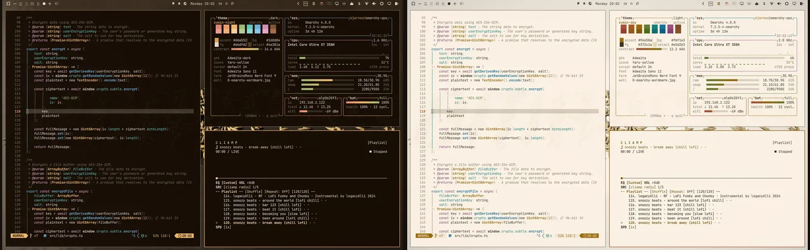](https://bjarneo.github.io/spice-themes/#cumin)

`01` · Origin: Eastern Mediterranean to South Asia · Folder: [`cumin/`](cumin/) · [Open on the site](https://bjarneo.github.io/spice-themes/#cumin)

Long, ridged seeds with a warm, earthy taste. Cooks toast them in oil at the start of a curry or a chili.

Botanical name: *Cuminum cyminum* · Part: seed · Flavor: earthy, warm, nutty · Heat: none

| Variant | Theme name | `background` | `foreground` | `accent` | Icons |
| --- | --- | --- | --- | --- | --- |
| Night | [`cumin-night`](cumin/night/) | `#160d04` | `#ebdfd2` | `#dda552` | `Yaru-yellow` |
| Day | [`cumin-day`](cumin/day/) | `#fbf1e3` | `#372c1a` | `#96650a` | `Yaru-yellow` |

<details>
<summary>All 16 ANSI colors of each variant</summary>

| Variant | Normal, 0 to 7 | Bright, 8 to 15 |
| --- | --- | --- |
| Night | `#261c10` `#e48875` `#a0bd77` `#f5bc69` `#6cb4e1` `#d990be` `#64cbc4` `#d5c8ba` | `#7f6e5c` `#f1a494` `#b9d298` `#fdd7a4` `#90c9ee` `#e9abd1` `#8edfd8` `#fbf6f0` |
| Day | `#ebdecb` `#a44937` `#5b772b` `#966501` `#106b97` `#944c7c` `#0b7c77` `#574b3a` | `#857866` `#923524` `#486410` `#7c5302` `#085980` `#83396b` `#086763` `#1d1407` |

</details>

```bash
curl -fsSL https://bjarneo.github.io/spice-themes/install.sh | bash -s -- cumin --set
```

### Caraway

[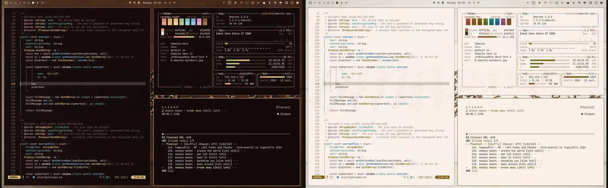](https://bjarneo.github.io/spice-themes/#caraway)

`02` · Origin: Europe and Western Asia · Folder: [`caraway/`](caraway/) · [Open on the site](https://bjarneo.github.io/spice-themes/#caraway)

Curved, dark seeds with pale ridges and a sharp, anise-like taste. They flavor rye bread, sauerkraut and aquavit.

Botanical name: *Carum carvi* · Part: seed · Flavor: anise, earthy, peppery · Heat: none

| Variant | Theme name | `background` | `foreground` | `accent` | Icons |
| --- | --- | --- | --- | --- | --- |
| Night | [`caraway-night`](caraway/night/) | `#130908` | `#eedddb` | `#e7b18c` | `Yaru` |
| Day | [`caraway-day`](caraway/day/) | `#fbf0e9` | `#392a21` | `#97623b` | `Yaru` |

<details>
<summary>All 16 ANSI colors of each variant</summary>

| Variant | Normal, 0 to 7 | Bright, 8 to 15 |
| --- | --- | --- |
| Night | `#231716` `#dc8d7c` `#acb978` `#e5c379` `#7bb1dd` `#d494bc` `#71c9c8` `#d8c6c4` | `#816c69` `#eaa899` `#c3ce99` `#f7db9f` `#9ac7eb` `#e4aecf` `#97dddc` `#fef4f3` |
| Day | `#ecddd3` `#9d4f3f` `#69742f` `#775902` `#2e6893` `#8f5079` `#117b7b` `#584a40` | `#87776c` `#8c3c2d` `#556013` `#634900` `#155782` `#7e3e68` `#0f6666` `#1e130c` |

</details>

```bash
curl -fsSL https://bjarneo.github.io/spice-themes/install.sh | bash -s -- caraway --set
```

### Fennel Seed

[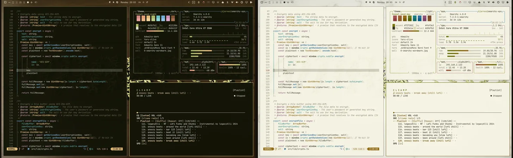](https://bjarneo.github.io/spice-themes/#fennel-seed)

`03` · Origin: Mediterranean · Folder: [`fennel-seed/`](fennel-seed/) · [Open on the site](https://bjarneo.github.io/spice-themes/#fennel-seed)

Green, ridged seeds with a sweet licorice taste. They flavor Italian sausage, and in India people chew them after a meal.

Botanical name: *Foeniculum vulgare* · Part: seed · Flavor: sweet, licorice, fresh · Heat: none

| Variant | Theme name | `background` | `foreground` | `accent` | Icons |
| --- | --- | --- | --- | --- | --- |
| Night | [`fennel-seed-night`](fennel-seed/night/) | `#121306` | `#e1e3d2` | `#b5b761` | `Yaru-olive` |
| Day | [`fennel-seed-day`](fennel-seed/day/) | `#f6f3e3` | `#322e1a` | `#727202` | `Yaru-olive` |

<details>
<summary>All 16 ANSI colors of each variant</summary>

| Variant | Normal, 0 to 7 | Bright, 8 to 15 |
| --- | --- | --- |
| Night | `#212213` `#dc8b85` `#aabb68` `#e9c17a` `#76b2de` `#d593bb` `#6bc9cb` `#caccbb` | `#72745d` `#eaa6a0` `#c1d08d` `#fbd9a0` `#96c7ec` `#e5aecf` `#93ddde` `#f7f8f0` |
| Day | `#e5e1cb` `#9e4d49` `#677612` `#90680f` `#266995` `#904f79` `#117b7d` `#514e3a` | `#7f7b66` `#8c3a37` `#546102` `#785503` `#065884` `#7e3d68` `#0f6668` `#191607` |

</details>

```bash
curl -fsSL https://bjarneo.github.io/spice-themes/install.sh | bash -s -- fennel-seed --set
```

### Anise Seed

[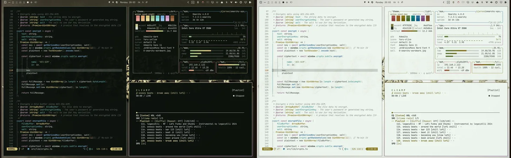](https://bjarneo.github.io/spice-themes/#anise-seed)

`04` · Origin: Eastern Mediterranean · Folder: [`anise-seed/`](anise-seed/) · [Open on the site](https://bjarneo.github.io/spice-themes/#anise-seed)

Small, grey-green seeds with a strong licorice taste. They flavor ouzo, pastis and anise cookies.

Botanical name: *Pimpinella anisum* · Part: seed · Flavor: licorice, sweet, warm · Heat: none

| Variant | Theme name | `background` | `foreground` | `accent` | Icons |
| --- | --- | --- | --- | --- | --- |
| Night | [`anise-seed-night`](anise-seed/night/) | `#0b110c` | `#dae4dc` | `#d5cc97` | `Yaru-yellow` |
| Day | [`anise-seed-day`](anise-seed/day/) | `#edf5ee` | `#263128` | `#797038` | `Yaru-olive` |

<details>
<summary>All 16 ANSI colors of each variant</summary>

| Variant | Normal, 0 to 7 | Bright, 8 to 15 |
| --- | --- | --- |
| Night | `#19201b` `#dc8c83` `#9abe81` `#dac87a` `#76b2e0` `#ce95c7` `#6acaca` `#c3cec5` | `#69766b` `#eba79e` `#b4d2a0` `#eedfa0` `#97c7ee` `#dfafd9` `#92dede` `#f2f9f3` |
| Day | `#d9e4da` `#9e4e46` `#56793a` `#816e0b` `#266996` `#8a5285` `#0a7b7c` `#455147` | `#727e74` `#8c3b35` `#416522` `#6c5b02` `#085886` `#794074` `#086667` `#101911` |

</details>

```bash
curl -fsSL https://bjarneo.github.io/spice-themes/install.sh | bash -s -- anise-seed --set
```

### Coriander Seed

[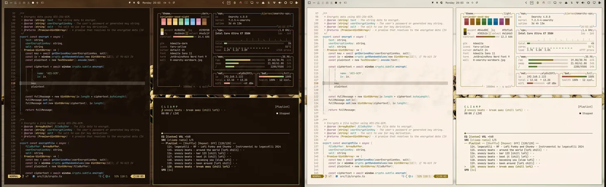](https://bjarneo.github.io/spice-themes/#coriander-seed)

`05` · Origin: Mediterranean and the Middle East · Folder: [`coriander-seed/`](coriander-seed/) · [Open on the site](https://bjarneo.github.io/spice-themes/#coriander-seed)

Round, ribbed seeds with a citrus and floral taste. They are the dried fruit of the cilantro plant.

Botanical name: *Coriandrum sativum* · Part: seed · Flavor: citrus, floral, warm · Heat: none

| Variant | Theme name | `background` | `foreground` | `accent` | Icons |
| --- | --- | --- | --- | --- | --- |
| Night | [`coriander-seed-night`](coriander-seed/night/) | `#190f08` | `#edded4` | `#c8b05a` | `Yaru-yellow` |
| Day | [`coriander-seed-day`](coriander-seed/day/) | `#fbf1e5` | `#382b1b` | `#846d00` | `Yaru-yellow` |

<details>
<summary>All 16 ANSI colors of each variant</summary>

| Variant | Normal, 0 to 7 | Bright, 8 to 15 |
| --- | --- | --- |
| Night | `#291e15` `#e48682` `#90c181` `#e5c46a` `#71b2e5` `#da8fbe` `#5eccca` `#d7c7bc` | `#816d5f` `#f1a29e` `#acd5a0` `#f7dc94` `#93c7f2` `#e9aad1` `#8bdfde` `#fcf5f0` |
| Day | `#ecdecd` `#a54746` `#497b38` `#886b00` `#1d699c` `#954b7c` `#0b7b7b` `#574b3b` | `#867868` `#933334` `#346721` `#705803` `#015789` `#84386b` `#076666` `#1e1408` |

</details>

```bash
curl -fsSL https://bjarneo.github.io/spice-themes/install.sh | bash -s -- coriander-seed --set
```

### Dill Seed

[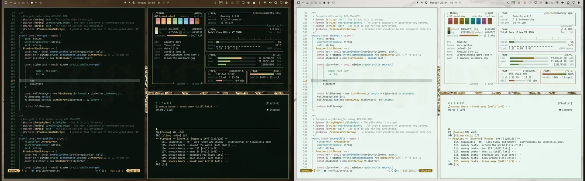](https://bjarneo.github.io/spice-themes/#dill-seed)

`06` · Origin: Eastern Mediterranean and Western Asia · Folder: [`dill-seed/`](dill-seed/) · [Open on the site](https://bjarneo.github.io/spice-themes/#dill-seed)

Flat, oval seeds with a pale edge. They give dill pickles their sharp taste.

Botanical name: *Anethum graveolens* · Part: seed · Flavor: grassy, sharp, caraway · Heat: none

| Variant | Theme name | `background` | `foreground` | `accent` | Icons |
| --- | --- | --- | --- | --- | --- |
| Night | [`dill-seed-night`](dill-seed/night/) | `#08110d` | `#d7e5de` | `#dcc091` | `Yaru-yellow` |
| Day | [`dill-seed-day`](dill-seed/day/) | `#eaf6f0` | `#21322b` | `#866a37` | `Yaru-yellow` |

<details>
<summary>All 16 ANSI colors of each variant</summary>

| Variant | Normal, 0 to 7 | Bright, 8 to 15 |
| --- | --- | --- |
| Night | `#15201b` `#dc8b86` `#8ec18b` `#e7c27a` `#77b2e0` `#d792b9` `#6acac7` `#bfcfc7` | `#64776e` `#eaa6a1` `#abd5a8` `#f9daa0` `#97c7ee` `#e7adcc` `#92dedb` `#f1f9f5` |
| Day | `#d5e5dd` `#9e4d4a` `#467a44` `#8e690d` `#276997` `#924f76` `#0d7c7a` `#41514a` | `#6e7f77` `#8c3a38` `#316730` `#765601` `#0b5886` `#813d66` `#0c6765` `#0c1914` |

</details>

```bash
curl -fsSL https://bjarneo.github.io/spice-themes/install.sh | bash -s -- dill-seed --set
```

### Celery Seed

[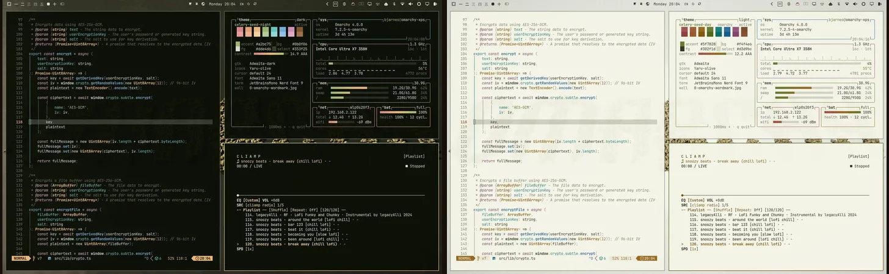](https://bjarneo.github.io/spice-themes/#celery-seed)

`07` · Origin: Mediterranean · Folder: [`celery-seed/`](celery-seed/) · [Open on the site](https://bjarneo.github.io/spice-themes/#celery-seed)

Very small seeds with a strong, bitter celery taste. A pinch flavors coleslaw, potato salad and a Bloody Mary.

Botanical name: *Apium graveolens* · Part: seed · Flavor: grassy, bitter, savory · Heat: none

| Variant | Theme name | `background` | `foreground` | `accent` | Icons |
| --- | --- | --- | --- | --- | --- |
| Night | [`celery-seed-night`](celery-seed/night/) | `#0b0f06` | `#dde4d6` | `#a2bc75` | `Yaru-olive` |
| Day | [`celery-seed-day`](celery-seed/day/) | `#f4f4e6` | `#302f1d` | `#5f7828` | `Yaru-olive` |

<details>
<summary>All 16 ANSI colors of each variant</summary>

| Variant | Normal, 0 to 7 | Bright, 8 to 15 |
| --- | --- | --- |
| Night | `#191e12` `#dc8b88` `#a0bd76` `#f0bd7d` `#78b2df` `#d693b9` `#6ccac7` `#c6cebe` | `#6c7562` `#eba6a2` `#b9d298` `#ffd6a6` `#98c7ed` `#e6adcd` `#94dedb` `#f5f8f1` |
| Day | `#e2e2cf` `#9e4d4b` `#5d782c` `#966417` `#296996` `#924f77` `#137b79` `#4f4e3d` | `#7c7c69` `#8c3a3a` `#49640e` `#805202` `#0e5885` `#803d66` `#006765` `#171709` |

</details>

```bash
curl -fsSL https://bjarneo.github.io/spice-themes/install.sh | bash -s -- celery-seed --set
```

### Ajwain

[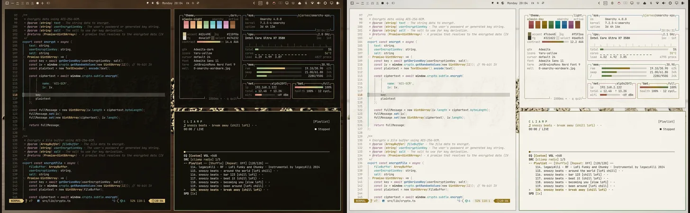](https://bjarneo.github.io/spice-themes/#ajwain)

`08` · Origin: Eastern Mediterranean and India · Folder: [`ajwain/`](ajwain/) · [Open on the site](https://bjarneo.github.io/spice-themes/#ajwain)

Small, striped seeds with a strong thyme taste. Indian cooks fry them in ghee for breads, pakoras and dals.

Botanical name: *Trachyspermum ammi* · Part: seed · Flavor: thyme, pungent, bitter · Heat: none

| Variant | Theme name | `background` | `foreground` | `accent` | Icons |
| --- | --- | --- | --- | --- | --- |
| Night | [`ajwain-night`](ajwain/night/) | `#110f0a` | `#e4e1d7` | `#d2c498` | `Yaru-yellow` |
| Day | [`ajwain-day`](ajwain/day/) | `#f5f2ea` | `#322d22` | `#7c6e40` | `Yaru-yellow` |

<details>
<summary>All 16 ANSI colors of each variant</summary>

| Variant | Normal, 0 to 7 | Bright, 8 to 15 |
| --- | --- | --- |
| Night | `#201e18` `#dc8b87` `#95bf87` `#e5c379` `#79b1de` `#d493bd` `#6dc9cb` `#cecbbf` | `#757264` `#eba6a2` `#b0d3a5` `#f7db9f` `#99c6ec` `#e4aed0` `#94ddde` `#f9f7ef` |
| Day | `#e4e0d4` `#9e4d4b` `#4f7940` `#8b6909` `#2b6895` `#90507a` `#017b7e` `#514d41` | `#7f7a6d` `#8c3a3a` `#3b662b` `#755701` `#125784` `#7e3e6a` `#026668` `#19160c` |

</details>

```bash
curl -fsSL https://bjarneo.github.io/spice-themes/install.sh | bash -s -- ajwain --set
```

### Nigella

[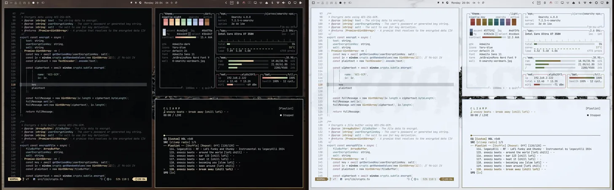](https://bjarneo.github.io/spice-themes/#nigella)

`09` · Signature palette · Origin: Southwest Asia · Folder: [`nigella/`](nigella/) · [Open on the site](https://bjarneo.github.io/spice-themes/#nigella)

Small, black, angular seeds with an onion and pepper taste. They go on naan and into the Bengali blend panch phoron.

Botanical name: *Nigella sativa* · Part: seed · Flavor: onion, peppery, bitter · Heat: none

| Variant | Theme name | `background` | `foreground` | `accent` | Icons |
| --- | --- | --- | --- | --- | --- |
| Night | [`nigella-night`](nigella/night/) | `#06070a` | `#dce2e9` | `#c4d2e5` | `Yaru-blue` |
| Day | [`nigella-day`](nigella/day/) | `#edf3fb` | `#282e36` | `#577191` | `Yaru-blue` |

<details>
<summary>All 16 ANSI colors of each variant</summary>

| Variant | Normal, 0 to 7 | Bright, 8 to 15 |
| --- | --- | --- |
| Night | `#131518` `#dc8c85` `#a6c99f` `#f3dba9` `#9bb2d8` `#d5b0d0` `#acdbe3` `#c5cbd4` | `#6b727b` `#eba7a0` `#c1deba` `#ffedc7` `#b5c8e8` `#e8c9e4` `#caf0f7` `#f2f7fe` |
| Day | `#d9e1ec` `#934440` `#54774d` `#836b38` `#51678c` `#836080` `#33636c` `#474e56` | `#747b84` `#81312e` `#416439` `#705822` `#3f567b` `#724f6f` `#1f535b` `#12161d` |

</details>

```bash
curl -fsSL https://bjarneo.github.io/spice-themes/install.sh | bash -s -- nigella --set
```

### Fenugreek

[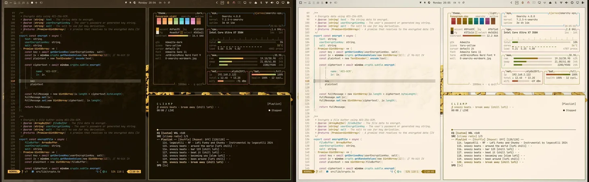](https://bjarneo.github.io/spice-themes/#fenugreek)

`10` · Origin: Mediterranean and Western Asia · Folder: [`fenugreek/`](fenugreek/) · [Open on the site](https://bjarneo.github.io/spice-themes/#fenugreek)

Hard, small, yellow-brown seeds shaped like boxes. They taste bitter when raw and like maple syrup when toasted.

Botanical name: *Trigonella foenum-graecum* · Part: seed · Flavor: bitter, maple, nutty · Heat: none

| Variant | Theme name | `background` | `foreground` | `accent` | Icons |
| --- | --- | --- | --- | --- | --- |
| Night | [`fenugreek-night`](fenugreek/night/) | `#181003` | `#eae0cf` | `#dfa635` | `Yaru-yellow` |
| Day | [`fenugreek-day`](fenugreek/day/) | `#fbf1e0` | `#372c16` | `#8f6609` | `Yaru-yellow` |

<details>
<summary>All 16 ANSI colors of each variant</summary>

| Variant | Normal, 0 to 7 | Bright, 8 to 15 |
| --- | --- | --- |
| Night | `#281f0e` `#ec8274` `#9abf6e` `#f7bc50` `#61b4ea` `#e28abc` `#4ccecc` `#d4c9b7` | `#7d7058` `#f8a093` `#b4d391` `#fed899` `#87c9f6` `#f0a7cf` `#80e1df` `#faf6ef` |
| Day | `#ecdfc6` `#ac4136` `#55791d` `#926706` `#036a9b` `#9c4579` `#117a79` `#564c37` | `#847963` `#9a2b22` `#436405` `#795504` `#075881` `#8a3169` `#0c6564` `#1d1506` |

</details>

```bash
curl -fsSL https://bjarneo.github.io/spice-themes/install.sh | bash -s -- fenugreek --set
```

### Yellow Mustard Seed

[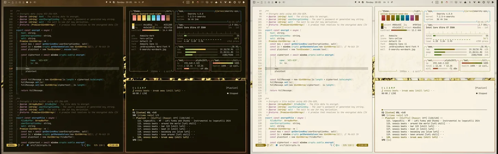](https://bjarneo.github.io/spice-themes/#yellow-mustard-seed)

`11` · Origin: Mediterranean · Folder: [`yellow-mustard-seed/`](yellow-mustard-seed/) · [Open on the site](https://bjarneo.github.io/spice-themes/#yellow-mustard-seed)

Small, pale yellow seeds with a mild heat. They are the base of mild yellow mustard.

Botanical name: *Sinapis alba* · Part: seed · Flavor: tangy, mild, sharp · Heat: mild

| Variant | Theme name | `background` | `foreground` | `accent` | Icons |
| --- | --- | --- | --- | --- | --- |
| Night | [`yellow-mustard-seed-night`](yellow-mustard-seed/night/) | `#151205` | `#e5e2d0` | `#ecd05a` | `Yaru-yellow` |
| Day | [`yellow-mustard-seed-day`](yellow-mustard-seed/day/) | `#f8f2e2` | `#342d18` | `#806c03` | `Yaru-yellow` |

<details>
<summary>All 16 ANSI colors of each variant</summary>

| Variant | Normal, 0 to 7 | Bright, 8 to 15 |
| --- | --- | --- |
| Night | `#242111` `#ec8273` `#94c172` `#e9c34e` `#62b4ec` `#e08abf` `#47cecf` `#cfcbb9` | `#77725a` `#f8a092` `#afd595` `#fadb81` `#89c9f8` `#efa7d2` `#7ee1e2` `#f8f7ef` |
| Day | `#e8e0c9` `#ac4135` `#4d7b24` `#876b00` `#096a9d` `#9b457d` `#0a7b7c` `#534d39` | `#817a65` `#9a2b21` `#396700` `#715901` `#005886` `#89316c` `#056667` `#1b1606` |

</details>

```bash
curl -fsSL https://bjarneo.github.io/spice-themes/install.sh | bash -s -- yellow-mustard-seed --set
```

### Brown Mustard Seed

[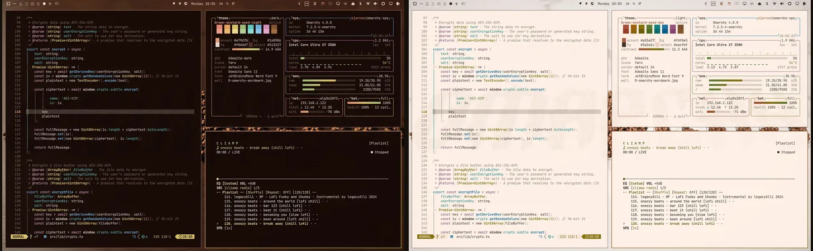](https://bjarneo.github.io/spice-themes/#brown-mustard-seed)

`12` · Origin: Himalayan foothills and India · Folder: [`brown-mustard-seed/`](brown-mustard-seed/) · [Open on the site](https://bjarneo.github.io/spice-themes/#brown-mustard-seed)

Very small, reddish-brown seeds. They pop in hot oil in Indian cooking and give Dijon mustard its heat.

Botanical name: *Brassica juncea* · Part: seed · Flavor: sharp, nutty, pungent · Heat: warm

| Variant | Theme name | `background` | `foreground` | `accent` | Icons |
| --- | --- | --- | --- | --- | --- |
| Night | [`brown-mustard-seed-night`](brown-mustard-seed/night/) | `#160906` | `#f0ddd7` | `#e79d7b` | `Yaru` |
| Day | [`brown-mustard-seed-day`](brown-mustard-seed/day/) | `#fdf0e5` | `#3a2a1c` | `#a55a37` | `Yaru` |

<details>
<summary>All 16 ANSI colors of each variant</summary>

| Variant | Normal, 0 to 7 | Bright, 8 to 15 |
| --- | --- | --- |
| Night | `#271713` `#e38973` `#9dbe79` `#dec76a` `#6eb4e1` `#d990be` `#63cbc7` `#dac6bf` | `#846b63` `#f1a591` `#b6d39a` `#f1de95` `#91c9ef` `#e9abd1` `#8edfdb` `#fdf5f2` |
| Day | `#efdccd` `#a44934` `#57782e` `#826d02` `#156a98` `#944c7c` `#077c79` `#5a493c` | `#887768` `#92351f` `#456515` `#6b5904` `#005982` `#83396b` `#026663` `#1f1308` |

</details>

```bash
curl -fsSL https://bjarneo.github.io/spice-themes/install.sh | bash -s -- brown-mustard-seed --set
```

### White Sesame

[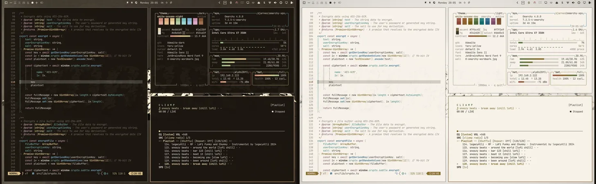](https://bjarneo.github.io/spice-themes/#white-sesame)

`13` · Origin: Africa and India · Folder: [`white-sesame/`](white-sesame/) · [Open on the site](https://bjarneo.github.io/spice-themes/#white-sesame)

Flat, cream-white seeds with a nutty taste. Toasted, they go on buns and sushi. Ground, they become tahini.

Botanical name: *Sesamum indicum* · Part: seed · Flavor: nutty, sweet, toasty · Heat: none

| Variant | Theme name | `background` | `foreground` | `accent` | Icons |
| --- | --- | --- | --- | --- | --- |
| Night | [`white-sesame-night`](white-sesame/night/) | `#1a150f` | `#e8e0d5` | `#eddcb9` | `Yaru-yellow` |
| Day | [`white-sesame-day`](white-sesame/day/) | `#f7f2e9` | `#342d20` | `#7f6c45` | `Yaru-yellow` |

<details>
<summary>All 16 ANSI colors of each variant</summary>

| Variant | Normal, 0 to 7 | Bright, 8 to 15 |
| --- | --- | --- |
| Night | `#2a241d` `#d79080` `#9fbc8b` `#e1c488` `#80b2d4` `#cf97b7` `#7ec6c5` `#d2c9be` | `#7d7365` `#e6aa9c` `#b9d1a8` `#f4dcab` `#9ec7e4` `#e0b1cb` `#a0dad9` `#fbf6f0` |
| Day | `#e7dfd4` `#995243` `#5b7745` `#876a28` `#34698b` `#8b5575` `#257a79` `#544c3f` | `#81796c` `#874031` `#476330` `#745708` `#1f587a` `#7a4364` `#086565` `#1b150b` |

</details>

```bash
curl -fsSL https://bjarneo.github.io/spice-themes/install.sh | bash -s -- white-sesame --set
```

### Black Sesame

[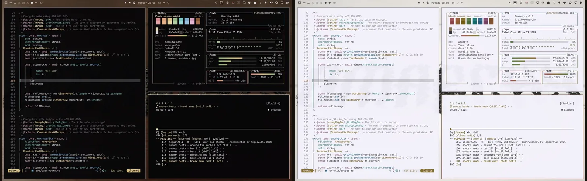](https://bjarneo.github.io/spice-themes/#black-sesame)

`14` · Origin: Africa and India · Folder: [`black-sesame/`](black-sesame/) · [Open on the site](https://bjarneo.github.io/spice-themes/#black-sesame)

Black sesame seeds have a stronger, more bitter taste than white ones. In East Asia they flavor desserts, soups and ice cream.

Botanical name: *Sesamum indicum* · Part: seed · Flavor: nutty, earthy, bitter · Heat: none

| Variant | Theme name | `background` | `foreground` | `accent` | Icons |
| --- | --- | --- | --- | --- | --- |
| Night | [`black-sesame-night`](black-sesame/night/) | `#070608` | `#e2e0e8` | `#ecdcc1` | `Yaru-yellow` |
| Day | [`black-sesame-day`](black-sesame/day/) | `#f3f1fa` | `#2f2c34` | `#816b46` | `Yaru-yellow` |

<details>
<summary>All 16 ANSI colors of each variant</summary>

| Variant | Normal, 0 to 7 | Bright, 8 to 15 |
| --- | --- | --- |
| Night | `#141316` `#d78e8f` `#9cbd8b` `#dec588` `#80b1d8` `#d9a0c3` `#7ac7c7` `#ccc9d2` | `#737079` `#e6a8a8` `#b6d2a8` `#f1dcaa` `#9ec6e7` `#eabad7` `#9ddbdb` `#f8f5fd` |
| Day | `#e2deea` `#995053` `#567744` `#846b28` `#35688e` `#824c6e` `#1d7a7b` `#4e4b54` | `#7b7982` `#873e42` `#436431` `#725807` `#1f577d` `#713a5e` `#0d6667` `#17151b` |

</details>

```bash
curl -fsSL https://bjarneo.github.io/spice-themes/install.sh | bash -s -- black-sesame --set
```

### Poppy Seed

[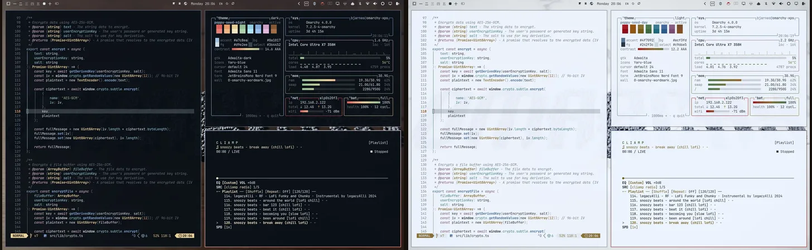](https://bjarneo.github.io/spice-themes/#poppy-seed)

`15` · Signature palette · Origin: Eastern Mediterranean · Folder: [`poppy-seed/`](poppy-seed/) · [Open on the site](https://bjarneo.github.io/spice-themes/#poppy-seed)

Tiny, blue-grey seeds with a mild, nutty taste. They fill strudels and cakes and go on bagels.

Botanical name: *Papaver somniferum* · Part: seed · Flavor: nutty, sweet, mild · Heat: none

| Variant | Theme name | `background` | `foreground` | `accent` | Icons |
| --- | --- | --- | --- | --- | --- |
| Night | [`poppy-seed-night`](poppy-seed/night/) | `#0a1017` | `#d9e2ee` | `#a7c8ea` | `Yaru-blue` |
| Day | [`poppy-seed-day`](poppy-seed/day/) | `#ecf3fd` | `#242f3c` | `#4f7092` | `Yaru-blue` |

<details>
<summary>All 16 ANSI colors of each variant</summary>

| Variant | Normal, 0 to 7 | Bright, 8 to 15 |
| --- | --- | --- |
| Night | `#181f27` `#e3645e` `#98c598` `#f0d49b` `#84aee3` `#d5a5d0` `#97d6ea` `#c2cbd8` | `#677382` `#ef847d` `#b4d9b4` `#feedc9` `#a1c4f1` `#e7bfe2` `#b8ebfc` `#f2f7fe` |
| Day | `#d7e1ef` `#a0121d` `#49774a` `#856a2d` `#3b659a` `#865782` `#32778c` `#444e5b` | `#707b8a` `#870012` `#366638` `#735712` `#285489` `#754571` `#166479` `#0f1720` |

</details>

```bash
curl -fsSL https://bjarneo.github.io/spice-themes/install.sh | bash -s -- poppy-seed --set
```

### Annatto

[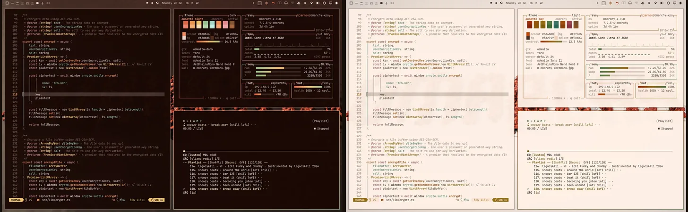](https://bjarneo.github.io/spice-themes/#annatto)

`16` · Signature palette · Origin: Tropical Americas · Folder: [`annatto/`](annatto/) · [Open on the site](https://bjarneo.github.io/spice-themes/#annatto)

Hard, brick-red seeds from a tropical shrub. They give a red-orange color to achiote paste, cheddar cheese and rice.

Botanical name: *Bixa orellana* · Part: seed · Flavor: earthy, peppery, nutty · Heat: none

| Variant | Theme name | `background` | `foreground` | `accent` | Icons |
| --- | --- | --- | --- | --- | --- |
| Night | [`annatto-night`](annatto/night/) | `#190804` | `#f3dbd5` | `#fd8f64` | `Yaru` |
| Day | [`annatto-day`](annatto/day/) | `#fef0e5` | `#3d2919` | `#bd4600` | `Yaru` |

<details>
<summary>All 16 ANSI colors of each variant</summary>

| Variant | Normal, 0 to 7 | Bright, 8 to 15 |
| --- | --- | --- |
| Night | `#2b150f` `#e2684a` `#99c68f` `#fac871` `#f08e54` `#e88d94` `#a8decf` `#ddc4bd` | `#896960` `#ee876e` `#b5daad` `#fee4b8` `#fdab7c` `#f5a9ae` `#c6f3e6` `#fdf5f2` |
| Day | `#f3dbc9` `#9a2501` `#4a7840` `#906709` `#9c4702` `#9b424d` `#377062` `#5c493a` | `#8c7767` `#7f1b00` `#37652c` `#7a5500` `#833a00` `#892f3c` `#225f51` `#201307` |

</details>

```bash
curl -fsSL https://bjarneo.github.io/spice-themes/install.sh | bash -s -- annatto --set
```

### Mahleb

[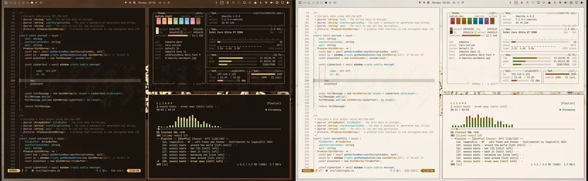](https://bjarneo.github.io/spice-themes/#mahleb)

`17` · Origin: Middle East and the Mediterranean · Folder: [`mahleb/`](mahleb/) · [Open on the site](https://bjarneo.github.io/spice-themes/#mahleb)

The kernel inside the pit of a wild cherry. It gives a bitter almond and cherry taste to Greek and Middle Eastern breads.

Botanical name: *Prunus mahaleb* · Part: seed kernel · Flavor: bitter almond, cherry, floral · Heat: none

| Variant | Theme name | `background` | `foreground` | `accent` | Icons |
| --- | --- | --- | --- | --- | --- |
| Night | [`mahleb-night`](mahleb/night/) | `#1a120c` | `#ebdfd5` | `#ebcc9d` | `Yaru-yellow` |
| Day | [`mahleb-day`](mahleb/day/) | `#f9f1e7` | `#362c1e` | `#876938` | `Yaru-yellow` |

<details>
<summary>All 16 ANSI colors of each variant</summary>

| Variant | Normal, 0 to 7 | Bright, 8 to 15 |
| --- | --- | --- |
| Night | `#2a2119` `#e1878c` `#a2bc7e` `#ebbf7b` `#7ab1dd` `#d693b8` `#6fc9c8` `#d5c8be` | `#807063` `#efa3a6` `#bad19e` `#fcd8a0` `#99c7eb` `#e6aecc` `#96dddb` `#fcf5f0` |
| Day | `#e9ded1` `#a24850` `#5c7635` `#91650e` `#2c6994` `#924f75` `#0b7b7b` `#564b3e` | `#84786a` `#90353e` `#4a631f` `#7a5405` `#145884` `#803d64` `#096666` `#1d140a` |

</details>

```bash
curl -fsSL https://bjarneo.github.io/spice-themes/install.sh | bash -s -- mahleb --set
```

### Wattleseed

[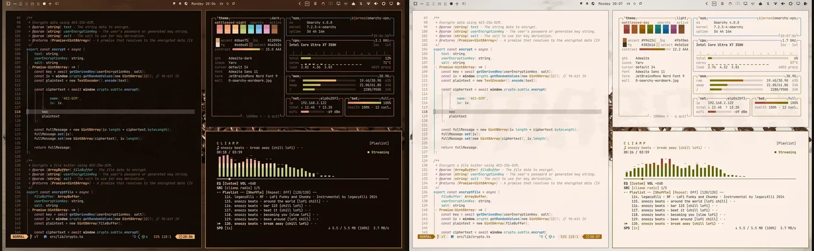](https://bjarneo.github.io/spice-themes/#wattleseed)

`18` · Origin: Australia · Folder: [`wattleseed/`](wattleseed/) · [Open on the site](https://bjarneo.github.io/spice-themes/#wattleseed)

Roasted seeds of the Australian wattle tree. They taste of coffee, chocolate and hazelnut.

Botanical name: *Acacia victoriae* · Part: seed · Flavor: coffee, chocolate, hazelnut · Heat: none

| Variant | Theme name | `background` | `foreground` | `accent` | Icons |
| --- | --- | --- | --- | --- | --- |
| Night | [`wattleseed-night`](wattleseed/night/) | `#120904` | `#edded5` | `#dba475` | `Yaru` |
| Day | [`wattleseed-day`](wattleseed/day/) | `#fbf0e6` | `#382b1d` | `#99622c` | `Yaru` |

<details>
<summary>All 16 ANSI colors of each variant</summary>

| Variant | Normal, 0 to 7 | Bright, 8 to 15 |
| --- | --- | --- |
| Night | `#221610` `#e4877c` `#afba5c` `#f9b971` `#6eb3e3` `#dc8fb9` `#61ccc7` `#d7c7be` | `#816d62` `#f1a399` `#c5cf84` `#fed6ad` `#91c8f0` `#ebaacd` `#8ddfdc` `#fdf5f1` |
| Day | `#ecdecf` `#a5483f` `#6c7404` `#9d6000` `#166a99` `#974b77` `#117a77` `#584a3d` | `#867769` `#93342d` `#585f01` `#824f00` `#015884` `#863866` `#0d6563` `#1e1409` |

</details>

```bash
curl -fsSL https://bjarneo.github.io/spice-themes/install.sh | bash -s -- wattleseed --set
```

### Kala Jeera

[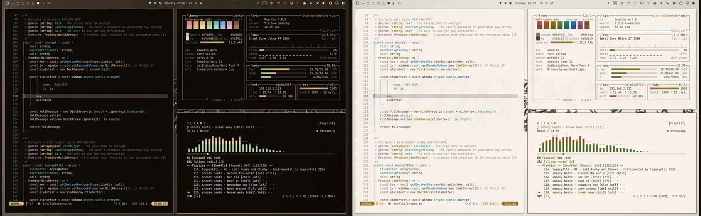](https://bjarneo.github.io/spice-themes/#kala-jeera)

`19` · Origin: Central Asia, Iran and Kashmir · Folder: [`kala-jeera/`](kala-jeera/) · [Open on the site](https://bjarneo.github.io/spice-themes/#kala-jeera)

Thin, dark, curved seeds, also called black cumin. They taste sweeter and smokier than cumin and flavor Kashmiri rice dishes.

Botanical name: *Bunium persicum* · Part: seed · Flavor: smoky, earthy, sweet · Heat: none

| Variant | Theme name | `background` | `foreground` | `accent` | Icons |
| --- | --- | --- | --- | --- | --- |
| Night | [`kala-jeera-night`](kala-jeera/night/) | `#0d0805` | `#e9dfd8` | `#d7b894` | `Yaru-yellow` |
| Day | [`kala-jeera-day`](kala-jeera/day/) | `#f8f1ea` | `#352c22` | `#896944` | `Yaru-yellow` |

<details>
<summary>All 16 ANSI colors of each variant</summary>

| Variant | Normal, 0 to 7 | Bright, 8 to 15 |
| --- | --- | --- |
| Night | `#1b1612` `#dc8c83` `#a0bc81` `#e7c27a` `#7ab2dc` `#d693b7` `#71c9c5` `#d3c8c0` | `#7b6f65` `#eba79f` `#b9d19f` `#f9daa0` `#9ac7eb` `#e6aecb` `#97ddd9` `#fcf5f0` |
| Day | `#e7dfd4` `#9e4e47` `#5b7638` `#8d680a` `#2c6993` `#925074` `#137b79` `#544c41` | `#82796e` `#8c3b35` `#486422` `#775602` `#145882` `#803e64` `#0d6562` `#1b150d` |

</details>

```bash
curl -fsSL https://bjarneo.github.io/spice-themes/install.sh | bash -s -- kala-jeera --set
```

### Tonka Bean

[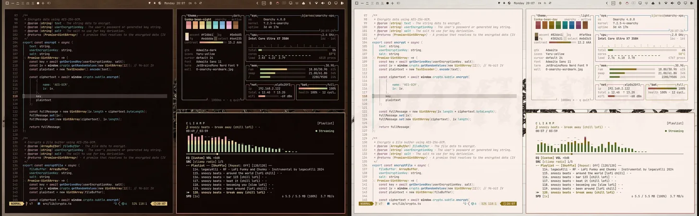](https://bjarneo.github.io/spice-themes/#tonka-bean)

`20` · Origin: Northern South America · Folder: [`tonka-bean/`](tonka-bean/) · [Open on the site](https://bjarneo.github.io/spice-themes/#tonka-bean)

Wrinkled black seeds that smell of vanilla, almond and cherry. Pastry chefs in Europe grate them like nutmeg.

Botanical name: *Dipteryx odorata* · Part: seed · Flavor: vanilla, almond, cherry · Heat: none

| Variant | Theme name | `background` | `foreground` | `accent` | Icons |
| --- | --- | --- | --- | --- | --- |
| Night | [`tonka-bean-night`](tonka-bean/night/) | `#0e0605` | `#edddda` | `#f2dbb1` | `Yaru-yellow` |
| Day | [`tonka-bean-day`](tonka-bean/day/) | `#faf0ea` | `#382b21` | `#826b41` | `Yaru-yellow` |

<details>
<summary>All 16 ANSI colors of each variant</summary>

| Variant | Normal, 0 to 7 | Bright, 8 to 15 |
| --- | --- | --- |
| Night | `#1d1311` `#dc8b8c` `#9ebd82` `#e4c379` `#7ab2dc` `#e09cc1` `#71c9c9` `#d7c6c3` | `#806c69` `#eba6a6` `#b8d2a1` `#f6db9f` `#99c7eb` `#f0b7d5` `#97dddd` `#fdf4f3` |
| Day | `#ebddd4` `#9e4c50` `#59773a` `#8a6908` `#2b6993` `#88476c` `#117b7c` `#584a40` | `#86776d` `#8c3a3e` `#466424` `#745700` `#125882` `#76355c` `#0f6667` `#1e140c` |

</details>

```bash
curl -fsSL https://bjarneo.github.io/spice-themes/install.sh | bash -s -- tonka-bean --set
```

## Peppercorns

### Black Pepper

[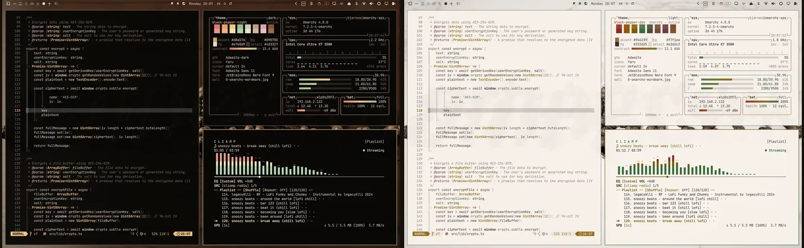](https://bjarneo.github.io/spice-themes/#black-pepper)

`21` · Signature palette · Origin: Malabar Coast, India · Folder: [`black-pepper/`](black-pepper/) · [Open on the site](https://bjarneo.github.io/spice-themes/#black-pepper)

The dried, unripe fruit of a climbing vine. It is the most traded spice in the world.

Botanical name: *Piper nigrum* · Part: fruit · Flavor: sharp, woody, piney · Heat: warm

| Variant | Theme name | `background` | `foreground` | `accent` | Icons |
| --- | --- | --- | --- | --- | --- |
| Night | [`black-pepper-night`](black-pepper/night/) | `#090705` | `#e7e0d9` | `#d8a57e` | `Yaru` |
| Day | [`black-pepper-day`](black-pepper/day/) | `#f7f1ea` | `#332d25` | `#966239` | `Yaru` |

<details>
<summary>All 16 ANSI colors of each variant</summary>

| Variant | Normal, 0 to 7 | Bright, 8 to 15 |
| --- | --- | --- |
| Night | `#171412` `#df8071` `#98c598` `#f4ca84` `#c3a48c` `#e3a8b0` `#d5d2bc` `#d1c9c1` | `#797068` `#ec9c8f` `#b4d9b4` `#fee4ba` `#d6bba7` `#f3c2c8` `#ebe9d6` `#fcf6f0` |
| Day | `#e7dfd4` `#98392d` `#49774a` `#90670e` `#7a5c44` `#7a434c` `#595641` `#524c44` | `#807970` `#862419` `#366638` `#785402` `#694b32` `#69323c` `#494631` `#1a150f` |

</details>

```bash
curl -fsSL https://bjarneo.github.io/spice-themes/install.sh | bash -s -- black-pepper --set
```

### White Pepper

[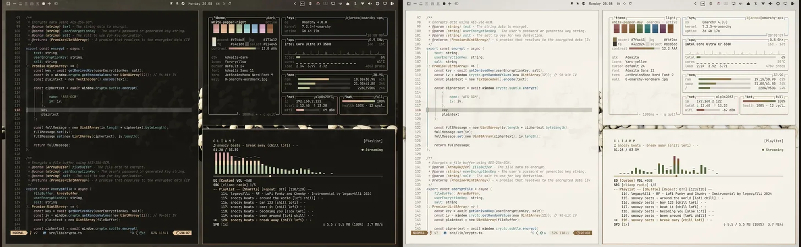](https://bjarneo.github.io/spice-themes/#white-pepper)

`22` · Origin: India and Southeast Asia · Folder: [`white-pepper/`](white-pepper/) · [Open on the site](https://bjarneo.github.io/spice-themes/#white-pepper)

Ripe peppercorns soaked to remove the skin. They give heat to pale sauces and have an earthy, musky smell.

Botanical name: *Piper nigrum* · Part: seed · Flavor: earthy, musky, hot · Heat: warm

| Variant | Theme name | `background` | `foreground` | `accent` | Icons |
| --- | --- | --- | --- | --- | --- |
| Night | [`white-pepper-night`](white-pepper/night/) | `#171612` | `#e4e1d8` | `#e7ddc8` | `Yaru-yellow` |
| Day | [`white-pepper-day`](white-pepper/day/) | `#f6f2ea` | `#322d24` | `#7f6c45` | `Yaru-yellow` |

<details>
<summary>All 16 ANSI colors of each variant</summary>

| Variant | Normal, 0 to 7 | Bright, 8 to 15 |
| --- | --- | --- |
| Night | `#272520` `#cc9490` `#a6b990` `#e4c195` `#8ab0ce` `#d3a4be` `#8ac4c3` `#cecac0` | `#777367` `#dcada9` `#beceac` `#f6d9b5` `#a6c5df` `#e4bdd3` `#a9d8d8` `#f9f7ef` |
| Day | `#e5e0d4` `#8f5854` `#62754b` `#8a673b` `#416885` `#734861` `#397877` `#514d43` | `#7f7a6f` `#7e4643` `#4e6136` `#775425` `#2f5775` `#623751` `#216565` `#19160e` |

</details>

```bash
curl -fsSL https://bjarneo.github.io/spice-themes/install.sh | bash -s -- white-pepper --set
```

### Green Peppercorn

[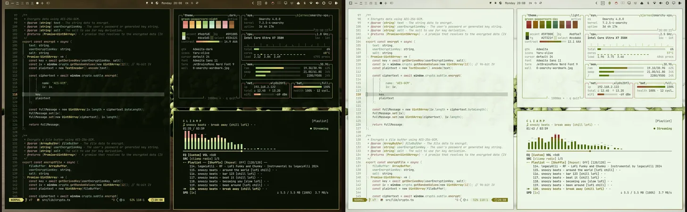](https://bjarneo.github.io/spice-themes/#green-peppercorn)

`23` · Signature palette · Origin: India · Folder: [`green-peppercorn/`](green-peppercorn/) · [Open on the site](https://bjarneo.github.io/spice-themes/#green-peppercorn)

Unripe peppercorns dried at a low heat, so they stay green. They taste milder and fresher than black pepper.

Botanical name: *Piper nigrum* · Part: fruit · Flavor: fresh, bright, herbal · Heat: mild

| Variant | Theme name | `background` | `foreground` | `accent` | Icons |
| --- | --- | --- | --- | --- | --- |
| Night | [`green-peppercorn-night`](green-peppercorn/night/) | `#091005` | `#dce5d5` | `#9ebf68` | `Yaru-olive` |
| Day | [`green-peppercorn-day`](green-peppercorn/day/) | `#edf6e7` | `#27321f` | `#597808` | `Yaru-olive` |

<details>
<summary>All 16 ANSI colors of each variant</summary>

| Variant | Normal, 0 to 7 | Bright, 8 to 15 |
| --- | --- | --- |
| Night | `#171f11` `#df8071` `#9cc86c` `#e4dc71` `#c2a678` `#df9da1` `#b1dfb9` `#c4cebd` | `#6a7661` `#ec9c8f` `#b7dc91` `#f8f39d` `#d4bd97` `#efb7ba` `#cef4d4` `#f4f8f1` |
| Day | `#d9e5d0` `#98392d` `#4e7902` `#78710d` `#7a5e2d` `#915157` `#4b7955` `#47513f` | `#737f6b` `#862419` `#416600` `#655e00` `#694d17` `#803f45` `#376642` `#11190b` |

</details>

```bash
curl -fsSL https://bjarneo.github.io/spice-themes/install.sh | bash -s -- green-peppercorn --set
```

### Pink Peppercorn

[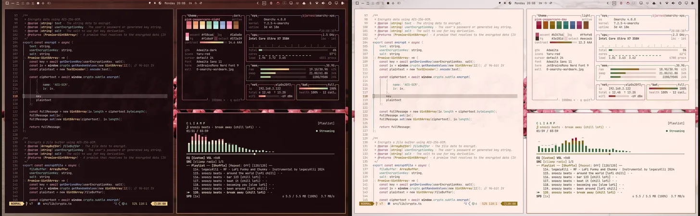](https://bjarneo.github.io/spice-themes/#pink-peppercorn)

`24` · Signature palette · Origin: South America · Folder: [`pink-peppercorn/`](pink-peppercorn/) · [Open on the site](https://bjarneo.github.io/spice-themes/#pink-peppercorn)

Papery pink berries from a South American tree. They are not true pepper, and they taste sweet, fruity and of pine.

Botanical name: *Schinus terebinthifolia* · Part: fruit · Flavor: sweet, resinous, fruity · Heat: mild

| Variant | Theme name | `background` | `foreground` | `accent` | Icons |
| --- | --- | --- | --- | --- | --- |
| Night | [`pink-peppercorn-night`](pink-peppercorn/night/) | `#1a0a0e` | `#f1dbdf` | `#f58ca6` | `Yaru-red` |
| Day | [`pink-peppercorn-day`](pink-peppercorn/day/) | `#ffefe8` | `#3e281d` | `#b34766` | `Yaru-red` |

<details>
<summary>All 16 ANSI colors of each variant</summary>

| Variant | Normal, 0 to 7 | Bright, 8 to 15 |
| --- | --- | --- |
| Night | `#2b181c` `#e1707c` `#98c598` `#fad18a` `#91acd8` `#f18db5` `#a4deda` `#dbc4c8` | `#86686e` `#ed8f96` `#b4d9b4` `#feecd0` `#acc2e7` `#ffaacb` `#c3f3ef` `#fdf4f6` |
| Day | `#f6dacd` `#9b273d` `#49774a` `#8f660c` `#4a648e` `#a13d6b` `#397773` `#5e473d` | `#8d7469` `#89072c` `#366638` `#785503` `#39537e` `#8f285a` `#206561` `#21110a` |

</details>

```bash
curl -fsSL https://bjarneo.github.io/spice-themes/install.sh | bash -s -- pink-peppercorn --set
```

### Long Pepper

[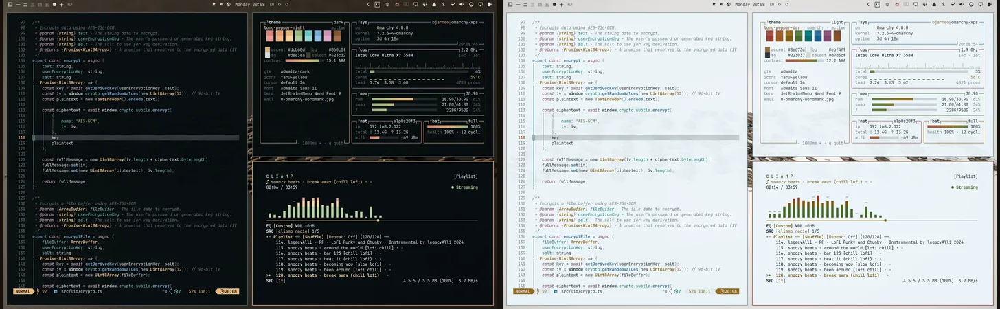](https://bjarneo.github.io/spice-themes/#long-pepper)

`25` · Origin: India · Folder: [`long-pepper/`](long-pepper/) · [Open on the site](https://bjarneo.github.io/spice-themes/#long-pepper)

Small spikes packed with tiny fruits. It is hotter and sweeter than black pepper and was common in ancient Rome.

Botanical name: *Piper longum* · Part: fruit spike · Flavor: hot, sweet, earthy · Heat: hot

| Variant | Theme name | `background` | `foreground` | `accent` | Icons |
| --- | --- | --- | --- | --- | --- |
| Night | [`long-pepper-night`](long-pepper/night/) | `#060c0f` | `#d8e3ea` | `#dcb68d` | `Yaru-yellow` |
| Day | [`long-pepper-day`](long-pepper/day/) | `#ebf4f9` | `#223037` | `#8e673c` | `Yaru-yellow` |

<details>
<summary>All 16 ANSI colors of each variant</summary>

| Variant | Normal, 0 to 7 | Bright, 8 to 15 |
| --- | --- | --- |
| Night | `#131b1e` `#e1897c` `#9bbe82` `#eebe7c` `#79b1de` `#d393bd` `#6dc9ca` `#c0cdd4` | `#65747c` `#efa599` `#b6d2a1` `#ffd7a1` `#99c6ec` `#e3add0` `#94dddd` `#f0f8fc` |
| Day | `#d6e3e9` `#a24a3f` `#56783a` `#946614` `#2b6895` `#8f507b` `#017b7d` `#424f56` | `#6e7d84` `#90372c` `#436525` `#7c5308` `#125784` `#7e3e6a` `#026668` `#0d181d` |

</details>

```bash
curl -fsSL https://bjarneo.github.io/spice-themes/install.sh | bash -s -- long-pepper --set
```

### Cubeb

[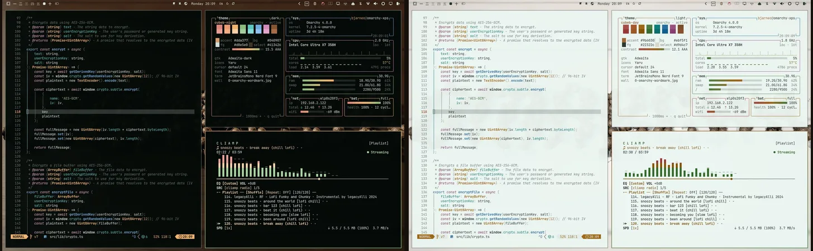](https://bjarneo.github.io/spice-themes/#cubeb)

`26` · Origin: Java, Indonesia · Folder: [`cubeb/`](cubeb/) · [Open on the site](https://bjarneo.github.io/spice-themes/#cubeb)

Peppercorns with a short tail, from Java. They taste of pine and allspice with a bitter finish.

Botanical name: *Piper cubeba* · Part: fruit · Flavor: piney, peppery, bitter · Heat: warm

| Variant | Theme name | `background` | `foreground` | `accent` | Icons |
| --- | --- | --- | --- | --- | --- |
| Night | [`cubeb-night`](cubeb/night/) | `#040907` | `#d8e5e0` | `#dda377` | `Yaru` |
| Day | [`cubeb-day`](cubeb/day/) | `#ebf5f1` | `#22322c` | `#9b6030` | `Yaru` |

<details>
<summary>All 16 ANSI colors of each variant</summary>

| Variant | Normal, 0 to 7 | Bright, 8 to 15 |
| --- | --- | --- |
| Night | `#0f1714` `#e4877f` `#8cc283` `#f9b971` `#72b1e7` `#da8fbf` `#5cccc8` `#c0cec9` | `#65766f` `#f2a39b` `#a9d6a1` `#fdd6ac` `#93c7f4` `#e9aad2` `#89dfdc` `#f1f9f6` |
| Day | `#d6e4de` `#a54742` `#447b3b` `#9b620c` `#1f689e` `#954b7d` `#037c79` `#42514b` | `#6d7d77` `#933330` `#2f6825` `#824f00` `#05578a` `#84386c` `#026765` `#0d1915` |

</details>

```bash
curl -fsSL https://bjarneo.github.io/spice-themes/install.sh | bash -s -- cubeb --set
```

### Sichuan Pepper

[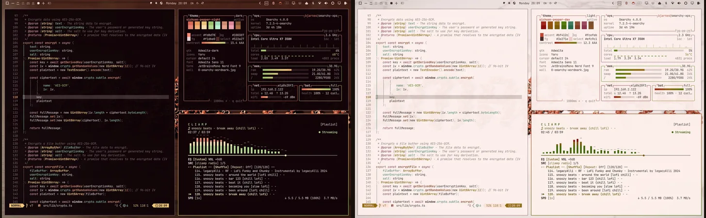](https://bjarneo.github.io/spice-themes/#sichuan-pepper)

`27` · Signature palette · Origin: Sichuan, China · Folder: [`sichuan-pepper/`](sichuan-pepper/) · [Open on the site](https://bjarneo.github.io/spice-themes/#sichuan-pepper)

Split, red husks from a prickly ash tree. They make the mouth tingle and go numb.

Botanical name: *Zanthoxylum bungeanum* · Part: fruit husk · Flavor: citrus, numbing, woody · Heat: warm

| Variant | Theme name | `background` | `foreground` | `accent` | Icons |
| --- | --- | --- | --- | --- | --- |
| Night | [`sichuan-pepper-night`](sichuan-pepper/night/) | `#100307` | `#f1dbe0` | `#fd8d78` | `Yaru` |
| Day | [`sichuan-pepper-day`](sichuan-pepper/day/) | `#fcefeb` | `#3e271e` | `#bf412c` | `Yaru` |

<details>
<summary>All 16 ANSI colors of each variant</summary>

| Variant | Normal, 0 to 7 | Bright, 8 to 15 |
| --- | --- | --- |
| Night | `#200f14` `#df6a59` `#9cc86c` `#f7c97b` `#da8f74` `#e58da1` `#a3e2bf` `#dbc4ca` | `#856870` `#eb8979` `#b7dc91` `#ffe4b7` `#e9a993` `#f4a9b9` `#c3f6d9` `#fdf4f6` |
| Day | `#f6d9ce` `#9c1f14` `#4e7902` `#90670b` `#92482d` `#99425a` `#377a59` `#5e473e` | `#8d746a` `#860500` `#416406` `#795502` `#813519` `#872e49` `#1e6747` `#21110b` |

</details>

```bash
curl -fsSL https://bjarneo.github.io/spice-themes/install.sh | bash -s -- sichuan-pepper --set
```

### Sansho

[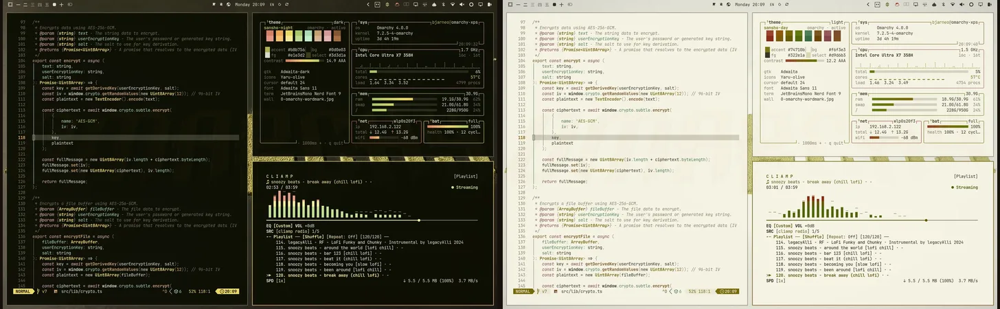](https://bjarneo.github.io/spice-themes/#sansho)

`28` · Signature palette · Origin: Japan · Folder: [`sansho/`](sansho/) · [Open on the site](https://bjarneo.github.io/spice-themes/#sansho)

The Japanese prickly ash. Its ground husks have a lemony, numbing taste and go on grilled eel.

Botanical name: *Zanthoxylum piperitum* · Part: fruit husk · Flavor: lemon, numbing, bright · Heat: mild

| Variant | Theme name | `background` | `foreground` | `accent` | Icons |
| --- | --- | --- | --- | --- | --- |
| Night | [`sansho-night`](sansho/night/) | `#0d0e03` | `#e1e3d2` | `#b8b756` | `Yaru-olive` |
| Day | [`sansho-day`](sansho/day/) | `#f6f3e3` | `#322e1a` | `#74710b` | `Yaru-olive` |

<details>
<summary>All 16 ANSI colors of each variant</summary>

| Variant | Normal, 0 to 7 | Bright, 8 to 15 |
| --- | --- | --- |
| Night | `#1c1d0e` `#de826a` `#abcc6b` `#f4e06a` `#cca273` `#df9da1` `#ace0b6` `#caccbb` | `#72745d` `#ec9e8a` `#c4e193` `#fff19d` `#ddba93` `#efb7ba` `#c9f5d1` `#f7f8f0` |
| Day | `#e5e1cb` `#973b24` `#5b7808` `#736500` `#79511c` `#915157` `#457a51` `#514e3a` | `#7f7b66` `#85260d` `#4b6403` `#605401` `#684000` `#803f45` `#30673e` `#191607` |

</details>

```bash
curl -fsSL https://bjarneo.github.io/spice-themes/install.sh | bash -s -- sansho --set
```

### Grains of Paradise

[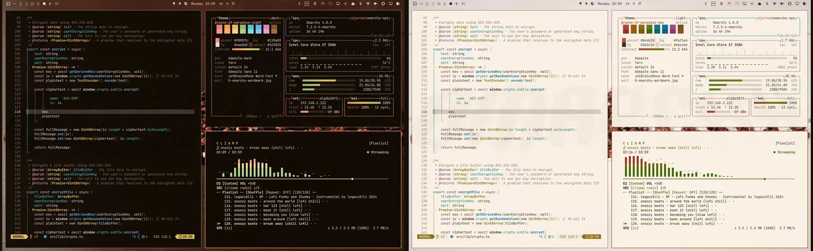](https://bjarneo.github.io/spice-themes/#grains-of-paradise)

`29` · Origin: West Africa · Folder: [`grains-of-paradise/`](grains-of-paradise/) · [Open on the site](https://bjarneo.github.io/spice-themes/#grains-of-paradise)

Small, glossy, red-brown seeds from the ginger family. They taste of pepper with notes of citrus and cardamom.

Botanical name: *Aframomum melegueta* · Part: seed · Flavor: peppery, citrus, floral · Heat: warm

| Variant | Theme name | `background` | `foreground` | `accent` | Icons |
| --- | --- | --- | --- | --- | --- |
| Night | [`grains-of-paradise-night`](grains-of-paradise/night/) | `#110a03` | `#eae0d2` | `#f8907c` | `Yaru` |
| Day | [`grains-of-paradise-day`](grains-of-paradise/day/) | `#faf1e4` | `#362c1b` | `#b64b38` | `Yaru` |

<details>
<summary>All 16 ANSI colors of each variant</summary>

| Variant | Normal, 0 to 7 | Bright, 8 to 15 |
| --- | --- | --- |
| Night | `#20180c` `#ec8276` `#96c171` `#e9c358` `#65b3ed` `#e18abd` `#48cecc` `#d4c9ba` | `#7d6f5d` `#f99f94` `#b1d594` `#fbdb88` `#8ac9f9` `#f0a6d0` `#7ee1df` `#fbf6f0` |
| Day | `#eadfcc` `#ac4038` `#507a21` `#876b09` `#0569a0` `#9c457b` `#087a78` `#564c3b` | `#847967` `#992a25` `#3c6502` `#705808` `#065786` `#8a316a` `#036564` `#1c1507` |

</details>

```bash
curl -fsSL https://bjarneo.github.io/spice-themes/install.sh | bash -s -- grains-of-paradise --set
```

### Tasmanian Pepperberry

[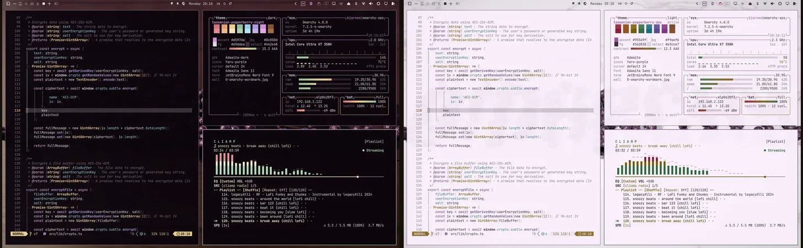](https://bjarneo.github.io/spice-themes/#tasmanian-pepperberry)

`30` · Signature palette · Origin: Tasmania, Australia · Folder: [`tasmanian-pepperberry/`](tasmanian-pepperberry/) · [Open on the site](https://bjarneo.github.io/spice-themes/#tasmanian-pepperberry)

Shiny, black-purple berries from a Tasmanian shrub. A sweet, fruity taste comes first, then a slow heat.

Botanical name: *Tasmannia lanceolata* · Part: fruit · Flavor: hot, fruity, juniper · Heat: hot

| Variant | Theme name | `background` | `foreground` | `accent` | Icons |
| --- | --- | --- | --- | --- | --- |
| Night | [`tasmanian-pepperberry-night`](tasmanian-pepperberry/night/) | `#0c050d` | `#e9ddea` | `#d597de` | `Yaru-purple` |
| Day | [`tasmanian-pepperberry-day`](tasmanian-pepperberry/day/) | `#f9eefb` | `#362838` | `#95549f` | `Yaru-purple` |

<details>
<summary>All 16 ANSI colors of each variant</summary>

| Variant | Normal, 0 to 7 | Bright, 8 to 15 |
| --- | --- | --- |
| Night | `#1b111c` `#dc747e` `#93c69d` `#f3d392` `#af9ee4` `#db93de` `#97d6ea` `#d2c6d4` | `#7b6b7e` `#e99198` `#b0dab7` `#ffecc6` `#c4b7f1` `#ebafee` `#b8ebfc` `#faf5fb` |
| Day | `#eadaec` `#972e3f` `#43784f` `#88691f` `#68559a` `#8d4592` `#30768a` `#554857` | `#837585` `#85152e` `#2e663c` `#745603` `#584389` `#7c3181` `#146378` `#1c121e` |

</details>

```bash
curl -fsSL https://bjarneo.github.io/spice-themes/install.sh | bash -s -- tasmanian-pepperberry --set
```

### Grains of Selim

[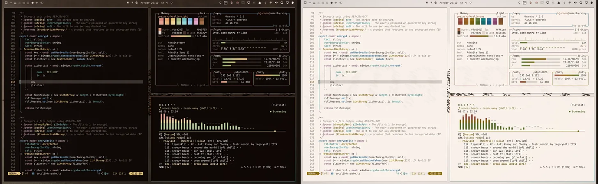](https://bjarneo.github.io/spice-themes/#grains-of-selim)

`31` · Origin: West Africa · Folder: [`grains-of-selim/`](grains-of-selim/) · [Open on the site](https://bjarneo.github.io/spice-themes/#grains-of-selim)

Thin, knobbly pods from a West African tree. Cooks smoke them for soups and for Senegalese café Touba.

Botanical name: *Xylopia aethiopica* · Part: fruit pod · Flavor: musky, smoky, bitter · Heat: mild

| Variant | Theme name | `background` | `foreground` | `accent` | Icons |
| --- | --- | --- | --- | --- | --- |
| Night | [`grains-of-selim-night`](grains-of-selim/night/) | `#0e0705` | `#ebded8` | `#dca285` | `Yaru` |
| Day | [`grains-of-selim-day`](grains-of-selim/day/) | `#f9f1ea` | `#372b21` | `#9a6041` | `Yaru` |

<details>
<summary>All 16 ANSI colors of each variant</summary>

| Variant | Normal, 0 to 7 | Bright, 8 to 15 |
| --- | --- | --- |
| Night | `#1d1511` `#dc8d7c` `#a2bc7f` `#e5c379` `#7ab2dc` `#d494bb` `#71c9c9` `#d6c7c1` | `#7e6d66` `#eaa899` `#bbd19e` `#f7db9f` `#9ac7eb` `#e4aecf` `#97dddd` `#fdf5f1` |
| Day | `#e9ded4` `#9d4f3f` `#5d7636` `#8b6909` `#2c6993` `#905079` `#117b7c` `#564b40` | `#84786d` `#8b3c2c` `#4b6320` `#755701` `#145882` `#7e3e68` `#0f6667` `#1d140c` |

</details>

```bash
curl -fsSL https://bjarneo.github.io/spice-themes/install.sh | bash -s -- grains-of-selim --set
```

## Chilies

### Cayenne

[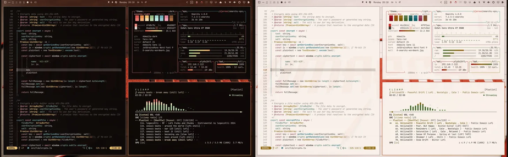](https://bjarneo.github.io/spice-themes/#cayenne)

`32` · Signature palette · Origin: Central and South America · Folder: [`cayenne/`](cayenne/) · [Open on the site](https://bjarneo.github.io/spice-themes/#cayenne)

Thin, red chilies, usually sold ground. The powder gives a clean heat to sauces, eggs and Cajun food.

Botanical name: *Capsicum annuum* · Part: fruit · Flavor: hot, sharp, fruity · Heat: very hot, 30,000–50,000 Scoville heat units

| Variant | Theme name | `background` | `foreground` | `accent` | Icons |
| --- | --- | --- | --- | --- | --- |
| Night | [`cayenne-night`](cayenne/night/) | `#0d0807` | `#eadeda` | `#fd8c7b` | `Yaru-red` |
| Day | [`cayenne-day`](cayenne/day/) | `#f9f1ea` | `#352c24` | `#cc2b1c` | `Yaru-red` |

<details>
<summary>All 16 ANSI colors of each variant</summary>

| Variant | Normal, 0 to 7 | Bright, 8 to 15 |
| --- | --- | --- |
| Night | `#1c1614` `#e45d53` `#9fc58a` `#fac871` `#74b7c3` `#ea89a1` `#a5ded6` `#d4c7c3` | `#7c6e69` `#ef7f74` `#bad9a9` `#fee4b8` `#95cbd5` `#f7a6b8` `#c4f3ec` `#fdf5f2` |
| Day | `#e9ded5` `#a00611` `#51763b` `#906709` `#206f7b` `#9d3d59` `#1f5e58` `#554b43` | `#83786f` `#84030b` `#3f6527` `#7a5500` `#0a5d69` `#8b2948` `#004e47` `#1c140e` |

</details>

```bash
curl -fsSL https://bjarneo.github.io/spice-themes/install.sh | bash -s -- cayenne --set
```

### Sweet Paprika

[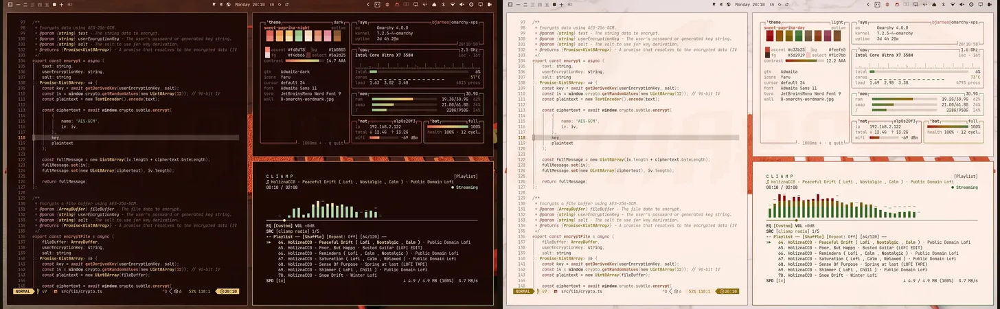](https://bjarneo.github.io/spice-themes/#sweet-paprika)

`33` · Signature palette · Origin: Hungary and Spain · Folder: [`sweet-paprika/`](sweet-paprika/) · [Open on the site](https://bjarneo.github.io/spice-themes/#sweet-paprika)

Ground, dried sweet peppers with a fruity taste and a bright red color. It is the main flavor of Hungarian goulash.

Botanical name: *Capsicum annuum* · Part: fruit · Flavor: sweet, fruity, mild · Heat: none, 100–500 Scoville heat units

| Variant | Theme name | `background` | `foreground` | `accent` | Icons |
| --- | --- | --- | --- | --- | --- |
| Night | [`sweet-paprika-night`](sweet-paprika/night/) | `#1b0805` | `#f4dbd6` | `#fd8d78` | `Yaru` |
| Day | [`sweet-paprika-day`](sweet-paprika/day/) | `#feefe5` | `#3d2919` | `#c33b25` | `Yaru` |

<details>
<summary>All 16 ANSI colors of each variant</summary>

| Variant | Normal, 0 to 7 | Bright, 8 to 15 |
| --- | --- | --- |
| Night | `#2d1512` `#e36558` `#95c78a` `#f5cb70` `#df8d6d` `#e58da1` `#f4d9bb` `#dec4bf` | `#8b6862` `#ef8578` `#b1dba8` `#ffe5b0` `#eda88d` `#f4a9b9` `#ffebd5` `#fdf4f3` |
| Day | `#f4dbc9` `#a01413` `#46793a` `#8c6905` `#964523` `#99425a` `#7b6144` `#5c493a` | `#8b7666` `#870206` `#326625` `#735606` `#843209` `#872e49` `#6a5032` `#201208` |

</details>

```bash
curl -fsSL https://bjarneo.github.io/spice-themes/install.sh | bash -s -- sweet-paprika --set
```

### Smoked Paprika

[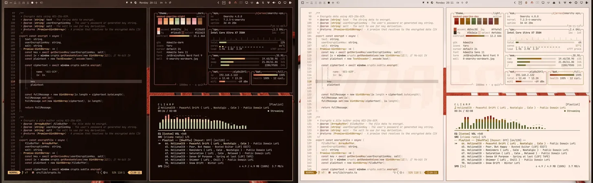](https://bjarneo.github.io/spice-themes/#smoked-paprika)

`34` · Signature palette · Origin: La Vera, Spain · Folder: [`smoked-paprika/`](smoked-paprika/) · [Open on the site](https://bjarneo.github.io/spice-themes/#smoked-paprika)

Peppers dried over oak smoke in La Vera, Spain, then ground. It gives chorizo its smoky taste.

Botanical name: *Capsicum annuum* · Part: fruit · Flavor: smoky, sweet, earthy · Heat: mild, 100–1,000 Scoville heat units

| Variant | Theme name | `background` | `foreground` | `accent` | Icons |
| --- | --- | --- | --- | --- | --- |
| Night | [`smoked-paprika-night`](smoked-paprika/night/) | `#120603` | `#f1dcd5` | `#f89276` | `Yaru` |
| Day | [`smoked-paprika-day`](smoked-paprika/day/) | `#ffefe3` | `#3b2a1a` | `#b54c30` | `Yaru` |

<details>
<summary>All 16 ANSI colors of each variant</summary>

| Variant | Normal, 0 to 7 | Bright, 8 to 15 |
| --- | --- | --- |
| Night | `#23120d` `#da6e5a` `#abb886` `#f7bf77` `#cf9679` `#e89da2` `#f3d8c4` `#dbc5be` | `#856b61` `#e78c7a` `#c2cda4` `#ffdbae` `#dfaf97` `#f7b8bb` `#fdebdc` `#fdf5f2` |
| Day | `#f1dcca` `#982815` `#616d3a` `#986309` `#875032` `#7f3941` `#826956` `#5b493a` | `#897666` `#840f00` `#505c26` `#7d5108` `#763e1f` `#6e2731` `#6f5643` `#201307` |

</details>

```bash
curl -fsSL https://bjarneo.github.io/spice-themes/install.sh | bash -s -- smoked-paprika --set
```

### Chipotle

[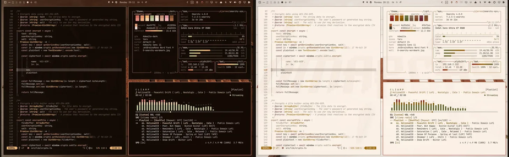](https://bjarneo.github.io/spice-themes/#chipotle)

`35` · Signature palette · Origin: Mexico · Folder: [`chipotle/`](chipotle/) · [Open on the site](https://bjarneo.github.io/spice-themes/#chipotle)

Ripe jalapeños dried in smoke until they are brown and leathery. They taste of smoke, tobacco and chocolate.

Botanical name: *Capsicum annuum* · Part: fruit · Flavor: smoky, sweet, earthy · Heat: hot, 2,500–8,000 Scoville heat units

| Variant | Theme name | `background` | `foreground` | `accent` | Icons |
| --- | --- | --- | --- | --- | --- |
| Night | [`chipotle-night`](chipotle/night/) | `#120904` | `#edded5` | `#e49f75` | `Yaru` |
| Day | [`chipotle-day`](chipotle/day/) | `#fbf1e6` | `#382b1d` | `#a35d2e` | `Yaru` |

<details>
<summary>All 16 ANSI colors of each variant</summary>

| Variant | Normal, 0 to 7 | Bright, 8 to 15 |
| --- | --- | --- |
| Night | `#22170f` `#d97464` `#afb784` `#f9be78` `#ce9677` `#e89da2` `#f8d7be` `#d7c7bd` | `#806d61` `#e69183` `#c6cca2` `#fedbb3` `#deaf95` `#f7b8bb` `#ffeada` `#fcf5f1` |
| Day | `#ecdecf` `#962f23` `#656c37` `#9b6200` `#875030` `#763139` `#886950` `#574b3d` | `#857869` `#84170c` `#555b23` `#815000` `#753f1d` `#651f29` `#74553c` `#1e1409` |

</details>

```bash
curl -fsSL https://bjarneo.github.io/spice-themes/install.sh | bash -s -- chipotle --set
```

### Ancho

[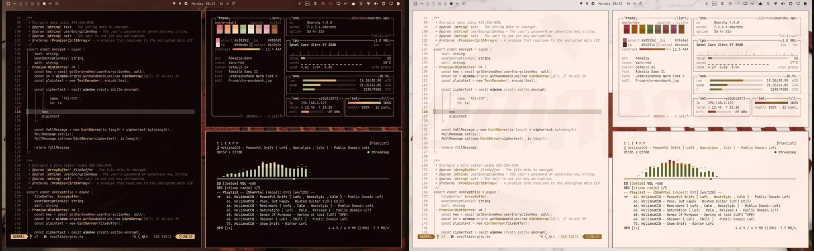](https://bjarneo.github.io/spice-themes/#ancho)

`36` · Signature palette · Origin: Puebla, Mexico · Folder: [`ancho/`](ancho/) · [Open on the site](https://bjarneo.github.io/spice-themes/#ancho)

Dried poblano peppers. They are wide, dark and wrinkled, and their sweet, raisin taste is a base for mole sauces.

Botanical name: *Capsicum annuum* · Part: fruit · Flavor: raisin, sweet, mild · Heat: mild, 1,000–2,000 Scoville heat units

| Variant | Theme name | `background` | `foreground` | `accent` | Icons |
| --- | --- | --- | --- | --- | --- |
| Night | [`ancho-night`](ancho/night/) | `#0f0405` | `#f0dcdc` | `#e39191` | `Yaru-red` |
| Day | [`ancho-day`](ancho/day/) | `#ffefe6` | `#3c291e` | `#a85556` | `Yaru-red` |

<details>
<summary>All 16 ANSI colors of each variant</summary>

| Variant | Normal, 0 to 7 | Bright, 8 to 15 |
| --- | --- | --- |
| Night | `#1f1010` `#d57573` `#abb886` `#f3c080` `#cc9684` `#e49cb2` `#f3d8c4` `#dac5c4` | `#846a6a` `#e2918f` `#c2cda4` `#fddbb1` `#dcaf9f` `#f4b7c8` `#fdebdc` `#fef4f4` |
| Day | `#f1dbcf` `#923235` `#616d3a` `#966417` `#84513e` `#8f4a61` `#826956` `#5b493e` | `#8a766a` `#801c24` `#505c26` `#7f5100` `#733f2d` `#7e3850` `#6f5643` `#20120a` |

</details>

```bash
curl -fsSL https://bjarneo.github.io/spice-themes/install.sh | bash -s -- ancho --set
```

### Guajillo

[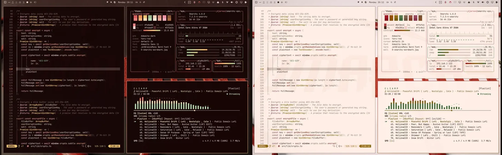](https://bjarneo.github.io/spice-themes/#guajillo)

`37` · Signature palette · Origin: Mexico · Folder: [`guajillo/`](guajillo/) · [Open on the site](https://bjarneo.github.io/spice-themes/#guajillo)

Long, smooth, glossy chilies with a tangy, berry taste. They color and flavor many Mexican salsas and stews.

Botanical name: *Capsicum annuum* · Part: fruit · Flavor: berry, tangy, tea · Heat: warm, 2,500–5,000 Scoville heat units

| Variant | Theme name | `background` | `foreground` | `accent` | Icons |
| --- | --- | --- | --- | --- | --- |
| Night | [`guajillo-night`](guajillo/night/) | `#160505` | `#f4dad9` | `#fe8a88` | `Yaru-red` |
| Day | [`guajillo-day`](guajillo/day/) | `#ffefe6` | `#3e281a` | `#bf3e43` | `Yaru-red` |

<details>
<summary>All 16 ANSI colors of each variant</summary>

| Variant | Normal, 0 to 7 | Bright, 8 to 15 |
| --- | --- | --- |
| Night | `#271110` `#e0615c` `#9dc494` `#fac871` `#db8e7a` `#f096ab` `#f6d8bc` `#dec3c2` | `#896866` `#ec827a` `#b7d9b0` `#fee4b8` `#eaa897` `#feb2c3` `#feebd9` `#fef4f4` |
| Day | `#f5daca` `#9e0f1b` `#4e7646` `#906709` `#934633` `#99425a` `#7c6045` `#5d483b` | `#8c7567` `#830312` `#3c6533` `#775409` `#813421` `#872e49` `#6b4f33` `#211209` |

</details>

```bash
curl -fsSL https://bjarneo.github.io/spice-themes/install.sh | bash -s -- guajillo --set
```

### Pasilla

[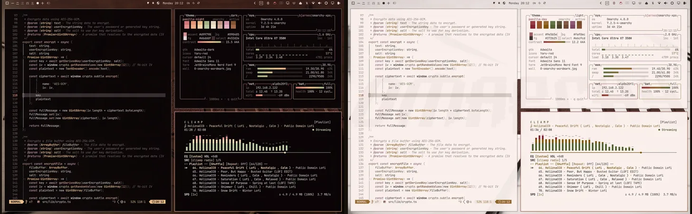](https://bjarneo.github.io/spice-themes/#pasilla)

`38` · Signature palette · Origin: Mexico · Folder: [`pasilla/`](pasilla/) · [Open on the site](https://bjarneo.github.io/spice-themes/#pasilla)

Long, wrinkled, almost black chilies. The name means little raisin, and they taste of dried fruit and cocoa.

Botanical name: *Capsicum annuum* · Part: fruit · Flavor: raisin, cocoa, earthy · Heat: warm, 1,000–2,500 Scoville heat units

| Variant | Theme name | `background` | `foreground` | `accent` | Icons |
| --- | --- | --- | --- | --- | --- |
| Night | [`pasilla-night`](pasilla/night/) | `#090405` | `#ebdddf` | `#d99798` | `Yaru-red` |
| Day | [`pasilla-day`](pasilla/day/) | `#faf0ec` | `#372b25` | `#9e5b5e` | `Yaru-red` |

<details>
<summary>All 16 ANSI colors of each variant</summary>

| Variant | Normal, 0 to 7 | Bright, 8 to 15 |
| --- | --- | --- |
| Night | `#181011` `#d87879` `#a7b989` `#f1c189` `#c59986` `#d99cb8` `#ecdcc1` `#d5c6c8` | `#7d6d6f` `#e59494` `#becea6` `#fedbb4` `#d6b1a1` `#e9b6cd` `#faedd6` `#fdf4f5` |
| Day | `#eaddd7` `#94343a` `#5d6e3d` `#946528` `#7f5441` `#8c516e` `#594a31` `#574a44` | `#857770` `#821e29` `#4c5d2a` `#805005` `#6e432f` `#7a405d` `#493a20` `#1d140f` |

</details>

```bash
curl -fsSL https://bjarneo.github.io/spice-themes/install.sh | bash -s -- pasilla --set
```

### Chile de Árbol

[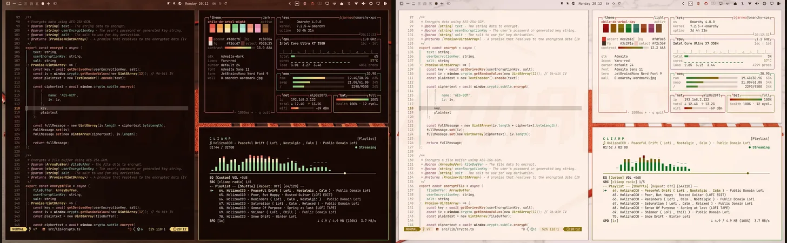](https://bjarneo.github.io/spice-themes/#chile-de-arbol)

`39` · Signature palette · Origin: Mexico · Folder: [`chile-de-arbol/`](chile-de-arbol/) · [Open on the site](https://bjarneo.github.io/spice-themes/#chile-de-arbol)

Thin, bright red chilies that keep their color when dried. They give a clean, strong heat to salsas and chili oils.

Botanical name: *Capsicum annuum* · Part: fruit · Flavor: hot, grassy, nutty · Heat: very hot, 15,000–30,000 Scoville heat units

| Variant | Theme name | `background` | `foreground` | `accent` | Icons |
| --- | --- | --- | --- | --- | --- |
| Night | [`chile-de-arbol-night`](chile-de-arbol/night/) | `#150704` | `#f2dcd7` | `#fd8c7b` | `Yaru-red` |
| Day | [`chile-de-arbol-day`](chile-de-arbol/day/) | `#fdf0e5` | `#3c291a` | `#cc2b1c` | `Yaru-red` |

<details>
<summary>All 16 ANSI colors of each variant</summary>

| Variant | Normal, 0 to 7 | Bright, 8 to 15 |
| --- | --- | --- |
| Night | `#261410` `#e65849` `#80cd82` `#f6d476` `#eb9070` `#ed90b5` `#a3e0ca` `#dcc5c0` | `#876a63` `#f47e6f` `#a1e0a2` `#ffedbe` `#f9ac91` `#fbadcb` `#c2f5e2` `#fdf4f3` |
| Day | `#f3dbca` `#9e0202` `#277e31` `#876b02` `#9e4422` `#9d426a` `#377964` `#5c493a` | `#8b7666` `#820000` `#006b18` `#6f5804` `#8c3005` `#8b2e59` `#1e6652` `#201208` |

</details>

```bash
curl -fsSL https://bjarneo.github.io/spice-themes/install.sh | bash -s -- chile-de-arbol --set
```

### Kashmiri Chili

[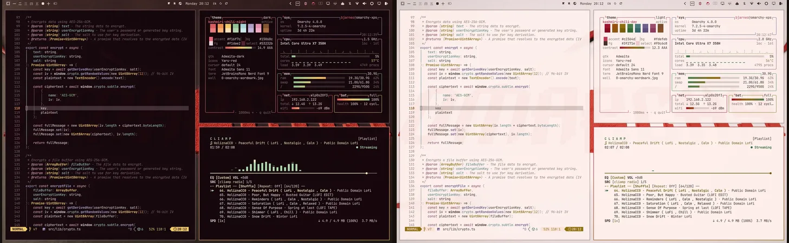](https://bjarneo.github.io/spice-themes/#kashmiri-chili)

`40` · Signature palette · Origin: Kashmir, India · Folder: [`kashmiri-chili/`](kashmiri-chili/) · [Open on the site](https://bjarneo.github.io/spice-themes/#kashmiri-chili)

Wrinkled, deep red chilies with a mild heat. They give rogan josh and tandoori chicken their red color.

Botanical name: *Capsicum annuum* · Part: fruit · Flavor: fruity, mild, earthy · Heat: mild, 1,000–2,000 Scoville heat units

| Variant | Theme name | `background` | `foreground` | `accent` | Icons |
| --- | --- | --- | --- | --- | --- |
| Night | [`kashmiri-chili-night`](kashmiri-chili/night/) | `#15060c` | `#f1dae2` | `#f16f7c` | `Yaru-red` |
| Day | [`kashmiri-chili-day`](kashmiri-chili/day/) | `#fdefeb` | `#3f271e` | `#c2364d` | `Yaru-red` |

<details>
<summary>All 16 ANSI colors of each variant</summary>

| Variant | Normal, 0 to 7 | Bright, 8 to 15 |
| --- | --- | --- |
| Night | `#26121a` `#e06062` `#93c794` `#fbcd68` `#b1a1d1` `#e893b5` `#abdbde` `#dbc3cb` | `#866873` `#eb817f` `#b0dbb0` `#fee8bc` `#c6b9e1` `#f7afca` `#c9f0f2` `#fdf4f7` |
| Day | `#f7d9cf` `#9e0d24` `#437946` `#8d6903` `#6a5988` `#9a466a` `#447679` `#5e473f` | `#8d746b` `#83021a` `#2f6632` `#745603` `#594877` `#883359` `#2e6265` `#22110b` |

</details>

```bash
curl -fsSL https://bjarneo.github.io/spice-themes/install.sh | bash -s -- kashmiri-chili --set
```

### Bird's Eye Chili

[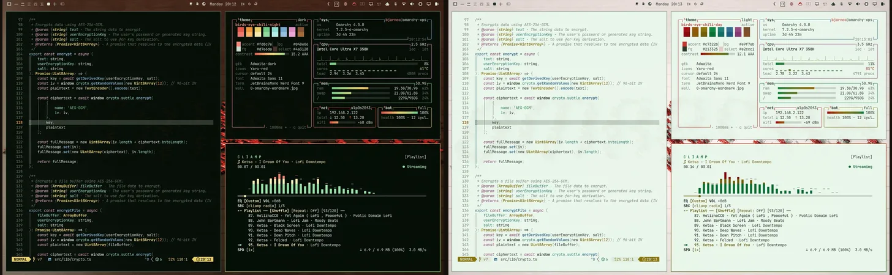](https://bjarneo.github.io/spice-themes/#birds-eye-chili)

`41` · Signature palette · Origin: Southeast Asia · Folder: [`birds-eye-chili/`](birds-eye-chili/) · [Open on the site](https://bjarneo.github.io/spice-themes/#birds-eye-chili)

Small, thin chilies with a strong heat. They are common in Thai, Vietnamese and Indonesian food.

Botanical name: *Capsicum annuum* · Part: fruit · Flavor: hot, sharp, fruity · Heat: very hot, 50,000–100,000 Scoville heat units

| Variant | Theme name | `background` | `foreground` | `accent` | Icons |
| --- | --- | --- | --- | --- | --- |
| Night | [`birds-eye-chili-night`](birds-eye-chili/night/) | `#040e06` | `#d7e6da` | `#fd8c7e` | `Yaru-red` |
| Day | [`birds-eye-chili-day`](birds-eye-chili/day/) | `#e9f7eb` | `#213325` | `#c7322b` | `Yaru-red` |

<details>
<summary>All 16 ANSI colors of each variant</summary>

| Variant | Normal, 0 to 7 | Bright, 8 to 15 |
| --- | --- | --- |
| Night | `#101d13` `#e8594d` `#6fd087` `#f2d76c` `#7bb2d9` `#e492c9` `#93e3d8` `#c0cfc2` | `#647767` `#f57e71` `#95e3a6` `#feefb4` `#9bc7e7` `#f3aedb` `#b7f7ee` `#f2f9f3` |
| Day | `#d3e6d6` `#a0060b` `#0a803a` `#846e04` `#2e698f` `#95457e` `#1b7c73` `#415244` | `#6e8071` `#840206` `#006b2e` `#6d5a04` `#16587e` `#84316d` `#0a685f` `#0c1a0f` |

</details>

```bash
curl -fsSL https://bjarneo.github.io/spice-themes/install.sh | bash -s -- birds-eye-chili --set
```

### Habanero

[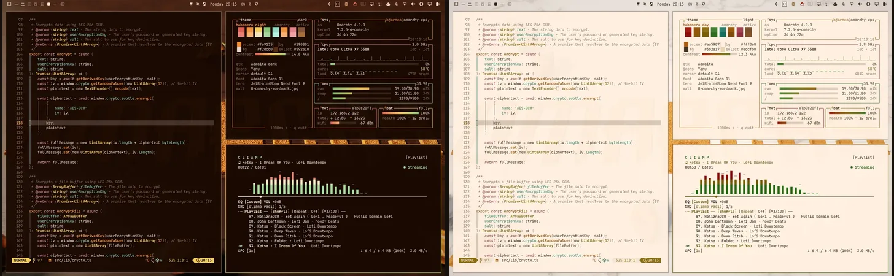](https://bjarneo.github.io/spice-themes/#habanero)

`42` · Signature palette · Origin: Yucatán, Mexico and the Caribbean · Folder: [`habanero/`](habanero/) · [Open on the site](https://bjarneo.github.io/spice-themes/#habanero)

Lantern-shaped, orange chilies with a fruity, floral smell. They are among the hottest common chilies.

Botanical name: *Capsicum chinense* · Part: fruit · Flavor: fruity, floral, very hot · Heat: fiery, 100,000–350,000 Scoville heat units

| Variant | Theme name | `background` | `foreground` | `accent` | Icons |
| --- | --- | --- | --- | --- | --- |
| Night | [`habanero-night`](habanero/night/) | `#190801` | `#f2dcd0` | `#fe9135` | `Yaru` |
| Day | [`habanero-day`](habanero/day/) | `#fff0e0` | `#3b2a17` | `#aa5907` | `Yaru` |

<details>
<summary>All 16 ANSI colors of each variant</summary>

| Variant | Normal, 0 to 7 | Bright, 8 to 15 |
| --- | --- | --- |
| Night | `#2a1609` `#e36654` `#8dca80` `#fed25f` `#f59740` `#ec8a92` `#98e3ce` `#dbc6b9` | `#886a59` `#ef8676` `#abdea0` `#ffedc3` `#fdb57a` `#faa7ac` `#bbf7e6` `#fdf5f1` |
| Day | `#f1dcc7` `#a0150a` `#3c7b2d` `#886a0b` `#965308` `#9f3e4b` `#257b68` `#5a4a38` | `#887764` `#870300` `#256813` `#735800` `#7e4506` `#8d293a` `#096856` `#1f1306` |

</details>

```bash
curl -fsSL https://bjarneo.github.io/spice-themes/install.sh | bash -s -- habanero --set
```

### Ghost Pepper

[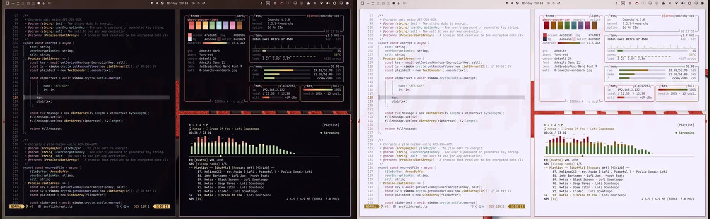](https://bjarneo.github.io/spice-themes/#ghost-pepper)

`43` · Signature palette · Origin: Northeast India · Folder: [`ghost-pepper/`](ghost-pepper/) · [Open on the site](https://bjarneo.github.io/spice-themes/#ghost-pepper)

Bhut jolokia from Northeast India. In 2007 it was the hottest chili in the world, at more than 1 million Scoville units.

Botanical name: *Capsicum chinense* · Part: fruit · Flavor: smoky, fruity, extreme heat · Heat: fiery, 855,000–1,041,000 Scoville heat units

| Variant | Theme name | `background` | `foreground` | `accent` | Icons |
| --- | --- | --- | --- | --- | --- |
| Night | [`ghost-pepper-night`](ghost-pepper/night/) | `#08050e` | `#e3deee` | `#fe8b83` | `Yaru-red` |
| Day | [`ghost-pepper-day`](ghost-pepper/day/) | `#f4f0ff` | `#302a3d` | `#c33839` | `Yaru-red` |

<details>
<summary>All 16 ANSI colors of each variant</summary>

| Variant | Normal, 0 to 7 | Bright, 8 to 15 |
| --- | --- | --- |
| Night | `#16111e` `#e15955` `#98be84` `#fac871` `#b1a1d1` `#e38ab5` `#acdbe3` `#cdc7d9` | `#746d83` `#ee7d76` `#b3d2a2` `#fee4b8` `#c6b9e1` `#f2a6c9` `#caf0f7` `#f8f5fd` |
| Day | `#e3dcf1` `#9e0016` `#4d7337` `#906709` `#6a5988` `#973f6e` `#45757e` `#4f495c` | `#7d768a` `#820010` `#3c6224` `#775409` `#594877` `#852b5d` `#30636b` `#181321` |

</details>

```bash
curl -fsSL https://bjarneo.github.io/spice-themes/install.sh | bash -s -- ghost-pepper --set
```

### Cascabel

[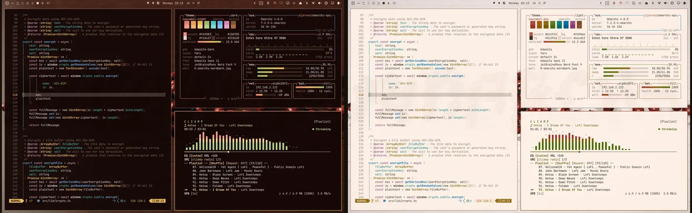](https://bjarneo.github.io/spice-themes/#cascabel)

`44` · Origin: Mexico · Folder: [`cascabel/`](cascabel/) · [Open on the site](https://bjarneo.github.io/spice-themes/#cascabel)

Small, round chilies. The loose seeds rattle inside, and the name means little bell.

Botanical name: *Capsicum annuum* · Part: fruit · Flavor: nutty, woody, smoky · Heat: warm, 1,000–3,000 Scoville heat units

| Variant | Theme name | `background` | `foreground` | `accent` | Icons |
| --- | --- | --- | --- | --- | --- |
| Night | [`cascabel-night`](cascabel/night/) | `#150705` | `#f1dcd7` | `#f49383` | `Yaru` |
| Day | [`cascabel-day`](cascabel/day/) | `#fdf0e6` | `#3c291a` | `#b14f41` | `Yaru` |

<details>
<summary>All 16 ANSI colors of each variant</summary>

| Variant | Normal, 0 to 7 | Bright, 8 to 15 |
| --- | --- | --- |
| Night | `#261410` `#ec8373` `#9dbf6c` `#f1bf59` `#67b3ec` `#e08bbf` `#4dcec8` `#dbc5bf` | `#866a63` `#f9a092` `#b7d390` `#fed992` `#8cc8f8` `#efa7d2` `#81e1db` `#fdf5f2` |
| Day | `#f2dccb` `#ac4134` `#587819` `#8d680c` `#0069a2` `#9b457d` `#017c78` `#5b493b` | `#8b7768` `#9a2c20` `#476501` `#775600` `#025788` `#89326c` `#006764` `#201308` |

</details>

```bash
curl -fsSL https://bjarneo.github.io/spice-themes/install.sh | bash -s -- cascabel --set
```

### Aleppo Pepper

[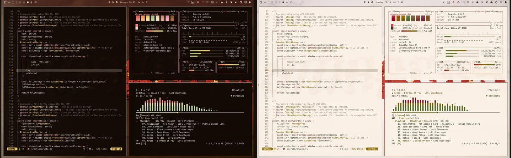](https://bjarneo.github.io/spice-themes/#aleppo-pepper)

`45` · Signature palette · Origin: Aleppo, Syria and southern Turkey · Folder: [`aleppo-pepper/`](aleppo-pepper/) · [Open on the site](https://bjarneo.github.io/spice-themes/#aleppo-pepper)

Coarse, oily, deep red flakes with a moderate heat. They taste fruity, like sun-dried tomato.

Botanical name: *Capsicum annuum* · Part: fruit · Flavor: fruity, tangy, oily · Heat: warm, about 10,000 Scoville heat units

| Variant | Theme name | `background` | `foreground` | `accent` | Icons |
| --- | --- | --- | --- | --- | --- |
| Night | [`aleppo-pepper-night`](aleppo-pepper/night/) | `#110904` | `#ecdfd4` | `#fd8a8f` | `Yaru-red` |
| Day | [`aleppo-pepper-day`](aleppo-pepper/day/) | `#faf1e5` | `#372c1c` | `#ba434e` | `Yaru-red` |

<details>
<summary>All 16 ANSI colors of each variant</summary>

| Variant | Normal, 0 to 7 | Bright, 8 to 15 |
| --- | --- | --- |
| Night | `#21170e` `#df6768` `#acc188` `#f5cb70` `#d7907e` `#eb99ac` `#f2daba` `#d6c8bc` | `#7f6e5f` `#eb8784` `#c4d6a7` `#ffe5b0` `#e6aa9b` `#fab5c3` `#fdecd4` `#fcf5f0` |
| Day | `#ebdece` `#9c1c29` `#5f7339` `#8c6905` `#8e4a38` `#81354a` `#796243` `#574b3c` | `#857868` `#86001a` `#4e6225` `#735606` `#7d3827` `#70223a` `#685131` `#1d1408` |

</details>

```bash
curl -fsSL https://bjarneo.github.io/spice-themes/install.sh | bash -s -- aleppo-pepper --set
```

### Urfa Biber

[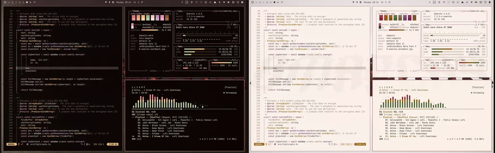](https://bjarneo.github.io/spice-themes/#urfa-biber)

`46` · Signature palette · Origin: Şanlıurfa, Turkey · Folder: [`urfa-biber/`](urfa-biber/) · [Open on the site](https://bjarneo.github.io/spice-themes/#urfa-biber)

Turkish chilies dried in the sun by day and wrapped at night, so they turn purple-black. The flakes taste of raisins and smoke.

Botanical name: *Capsicum annuum* · Part: fruit · Flavor: smoky, raisin, chocolate · Heat: warm, about 7,500 Scoville heat units

| Variant | Theme name | `background` | `foreground` | `accent` | Icons |
| --- | --- | --- | --- | --- | --- |
| Night | [`urfa-biber-night`](urfa-biber/night/) | `#0b0403` | `#eedddb` | `#e496b4` | `Yaru-magenta` |
| Day | [`urfa-biber-day`](urfa-biber/day/) | `#fbf0e9` | `#392a21` | `#a35475` | `Yaru-magenta` |

<details>
<summary>All 16 ANSI colors of each variant</summary>

| Variant | Normal, 0 to 7 | Bright, 8 to 15 |
| --- | --- | --- |
| Night | `#1b0f0e` `#d87879` `#a5b991` `#f1c17f` `#c293bd` `#ec96b8` `#f4cfbb` `#d8c6c4` | `#816c69` `#e59494` `#bdcead` `#fedbac` `#d4accf` `#fab2cd` `#feeadf` `#fef4f3` |
| Day | `#ecddd3` `#94343a` `#5a6e46` `#936412` `#7b4d77` `#823156` `#8a6754` `#584a40` | `#87776c` `#821e29` `#495d34` `#7c5308` `#6a3c66` `#711d45` `#76533f` `#1e130c` |

</details>

```bash
curl -fsSL https://bjarneo.github.io/spice-themes/install.sh | bash -s -- urfa-biber --set
```

### Gochugaru

[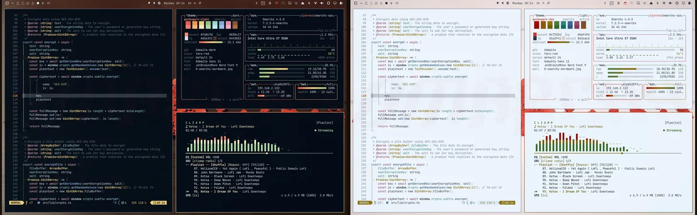](https://bjarneo.github.io/spice-themes/#gochugaru)

`47` · Signature palette · Origin: Korea · Folder: [`gochugaru/`](gochugaru/) · [Open on the site](https://bjarneo.github.io/spice-themes/#gochugaru)

Korean chili flakes, dried in the sun and without seeds. They give kimchi its red color and a sweet, mild heat.

Botanical name: *Capsicum annuum* · Part: fruit · Flavor: sweet, smoky, fruity · Heat: warm, 4,000–8,000 Scoville heat units

| Variant | Theme name | `background` | `foreground` | `accent` | Icons |
| --- | --- | --- | --- | --- | --- |
| Night | [`gochugaru-night`](gochugaru/night/) | `#030c17` | `#d5e3f2` | `#fd8c7b` | `Yaru-red` |
| Day | [`gochugaru-day`](gochugaru/day/) | `#ebf4fd` | `#1e2f41` | `#c73324` | `Yaru-red` |

<details>
<summary>All 16 ANSI colors of each variant</summary>

| Variant | Normal, 0 to 7 | Bright, 8 to 15 |
| --- | --- | --- |
| Night | `#0e1a28` `#e76250` `#95c78a` `#f4d580` `#84afdc` `#ea93ae` `#9be0db` `#beccdc` | `#617488` `#f28372` `#b1dba8` `#feeec1` `#a1c5ea` `#f9afc5` `#bcf5f0` `#f2f7fd` |
| Day | `#cfe3f8` `#a40500` `#46793a` `#886c08` `#3a6693` `#9b4664` `#2c7a76` `#3f4f60` | `#6b7c8f` `#870200` `#326625` `#705909` `#275582` `#8a3253` `#086763` `#0b1723` |

</details>

```bash
curl -fsSL https://bjarneo.github.io/spice-themes/install.sh | bash -s -- gochugaru --set
```

### Espelette Pepper

[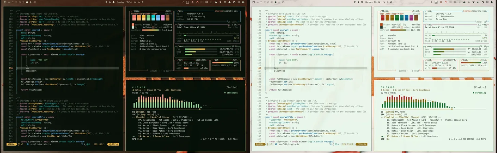](https://bjarneo.github.io/spice-themes/#espelette-pepper)

`48` · Origin: Basque Country, France · Folder: [`espelette-pepper/`](espelette-pepper/) · [Open on the site](https://bjarneo.github.io/spice-themes/#espelette-pepper)

A Basque chili with a protected name. Villages dry it on strings on house walls, and the powder has a mild, fruity heat.

Botanical name: *Capsicum annuum* · Part: fruit · Flavor: fruity, sweet, gentle heat · Heat: warm, about 4,000 Scoville heat units

| Variant | Theme name | `background` | `foreground` | `accent` | Icons |
| --- | --- | --- | --- | --- | --- |
| Night | [`espelette-pepper-night`](espelette-pepper/night/) | `#061008` | `#d7e6da` | `#fd8e67` | `Yaru` |
| Day | [`espelette-pepper-day`](espelette-pepper/day/) | `#e9f7eb` | `#213325` | `#bd4510` | `Yaru` |

<details>
<summary>All 16 ANSI colors of each variant</summary>

| Variant | Normal, 0 to 7 | Bright, 8 to 15 |
| --- | --- | --- |
| Night | `#131f15` `#f47c6d` `#74c87c` `#f6bd43` `#56b4f7` `#e785c2` `#03d1d5` `#c0cfc2` | `#647767` `#fd9d8f` `#97db9c` `#fed893` `#84c9ff` `#f5a3d5` `#6be4e6` `#f2f9f3` |
| Day | `#d3e6d6` `#b3372d` `#1c7f30` `#8f6908` `#0769a0` `#a13e80` `#0b7b7d` `#415244` | `#6e8071` `#a11d17` `#076a22` `#775605` `#065786` `#8f286f` `#036668` `#0c1a0f` |

</details>

```bash
curl -fsSL https://bjarneo.github.io/spice-themes/install.sh | bash -s -- espelette-pepper --set
```

### Ají Amarillo

[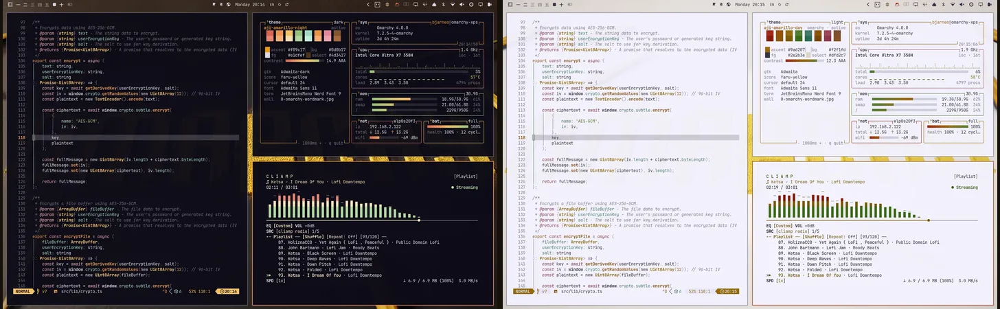](https://bjarneo.github.io/spice-themes/#aji-amarillo)

`49` · Signature palette · Origin: Peru · Folder: [`aji-amarillo/`](aji-amarillo/) · [Open on the site](https://bjarneo.github.io/spice-themes/#aji-amarillo)

The yellow chili of Peru, with a fruity heat. Dried, it is called ají mirasol and flavors many Peruvian sauces.

Botanical name: *Capsicum baccatum* · Part: fruit · Flavor: fruity, bright, hot · Heat: hot, 30,000–50,000 Scoville heat units

| Variant | Theme name | `background` | `foreground` | `accent` | Icons |
| --- | --- | --- | --- | --- | --- |
| Night | [`aji-amarillo-night`](aji-amarillo/night/) | `#0d0b17` | `#e1dfef` | `#f09c17` | `Yaru-yellow` |
| Day | [`aji-amarillo-day`](aji-amarillo/day/) | `#f2f1fd` | `#2e2b3e` | `#9a6207` | `Yaru-yellow` |

<details>
<summary>All 16 ANSI colors of each variant</summary>

| Variant | Normal, 0 to 7 | Bright, 8 to 15 |
| --- | --- | --- |
| Night | `#1c1a27` `#df6a55` `#99c77f` `#fec766` `#f19a4b` `#e78d9b` `#a6e0c6` `#cac8da` | `#726e84` `#eb8976` `#b4dba0` `#fee4ba` `#feb579` `#f5a9b4` `#c5f5de` `#f7f6fd` |
| Day | `#e0ddf3` `#9c200b` `#4a792c` `#916600` `#8b4d05` `#9a4254` `#3d7a61` `#4d4a5d` | `#7a778c` `#831301` `#376612` `#795500` `#743f05` `#882e43` `#24664d` `#161422` |

</details>

```bash
curl -fsSL https://bjarneo.github.io/spice-themes/install.sh | bash -s -- aji-amarillo --set
```

## Barks and roots

### Ceylon Cinnamon

[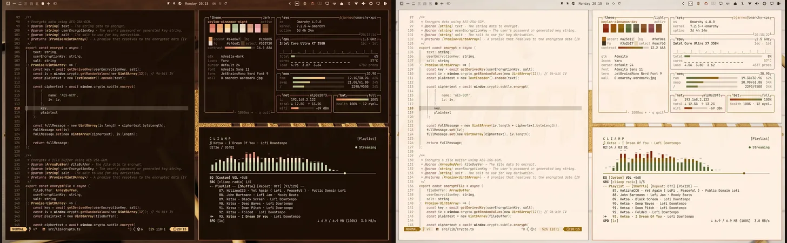](https://bjarneo.github.io/spice-themes/#ceylon-cinnamon)

`50` · Signature palette · Origin: Sri Lanka · Folder: [`ceylon-cinnamon/`](ceylon-cinnamon/) · [Open on the site](https://bjarneo.github.io/spice-themes/#ceylon-cinnamon)

Thin layers of inner bark rolled into soft, brittle quills. It is true cinnamon, sweeter and milder than cassia.

Botanical name: *Cinnamomum verum* · Part: inner bark · Flavor: sweet, delicate, citrus · Heat: none

| Variant | Theme name | `background` | `foreground` | `accent` | Icons |
| --- | --- | --- | --- | --- | --- |
| Night | [`ceylon-cinnamon-night`](ceylon-cinnamon/night/) | `#1b0e05` | `#efded1` | `#e4a067` | `Yaru` |
| Day | [`ceylon-cinnamon-day`](ceylon-cinnamon/day/) | `#fef0e1` | `#3a2b17` | `#a25c12` | `Yaru` |

<details>
<summary>All 16 ANSI colors of each variant</summary>

| Variant | Normal, 0 to 7 | Bright, 8 to 15 |
| --- | --- | --- |
| Night | `#2c1d11` `#dc785f` `#adc08f` `#fbc77c` `#d99b76` `#efa3a8` `#ecdcc1` `#d9c7ba` | `#836c5b` `#e9957f` `#c5d5ac` `#fee3c0` `#e8b496` `#febec2` `#faedd6` `#fcf5f0` |
| Day | `#f0ddc8` `#973219` `#607240` `#956402` `#8e522a` `#964d54` `#6b5c42` `#594a38` | `#887764` `#831e01` `#4f612d` `#7d5306` `#7d4013` `#843b43` `#5b4b31` `#1e1406` |

</details>

```bash
curl -fsSL https://bjarneo.github.io/spice-themes/install.sh | bash -s -- ceylon-cinnamon --set
```

### Cassia

[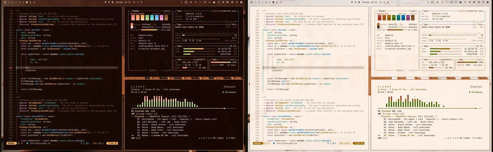](https://bjarneo.github.io/spice-themes/#cassia)

`51` · Origin: Southern China · Folder: [`cassia/`](cassia/) · [Open on the site](https://bjarneo.github.io/spice-themes/#cassia)

Thick, hard rolls of bark. Most cinnamon sold in North America is cassia, with a stronger and hotter taste.

Botanical name: *Cinnamomum cassia* · Part: bark · Flavor: strong, sweet, spicy · Heat: mild

| Variant | Theme name | `background` | `foreground` | `accent` | Icons |
| --- | --- | --- | --- | --- | --- |
| Night | [`cassia-night`](cassia/night/) | `#160602` | `#f2dcd3` | `#f6946d` | `Yaru` |
| Day | [`cassia-day`](cassia/day/) | `#fdf0e4` | `#3c2918` | `#b44f23` | `Yaru` |

<details>
<summary>All 16 ANSI colors of each variant</summary>

| Variant | Normal, 0 to 7 | Bright, 8 to 15 |
| --- | --- | --- |
| Night | `#27140c` `#eb836f` `#99c071` `#fdb85f` `#68b3eb` `#e08bbe` `#50cec9` `#dcc5bc` | `#886a5e` `#f8a08f` `#b4d493` `#fdd7a9` `#8dc8f7` `#efa7d1` `#83e1dd` `#fdf5f2` |
| Day | `#f2dcc8` `#ab4230` `#547921` `#9a6200` `#0369a1` `#9b467c` `#067a77` `#5b4939` | `#8a7665` `#992c1b` `#406402` `#7f5000` `#055786` `#89326b` `#026563` `#201307` |

</details>

```bash
curl -fsSL https://bjarneo.github.io/spice-themes/install.sh | bash -s -- cassia --set
```

### Ginger

[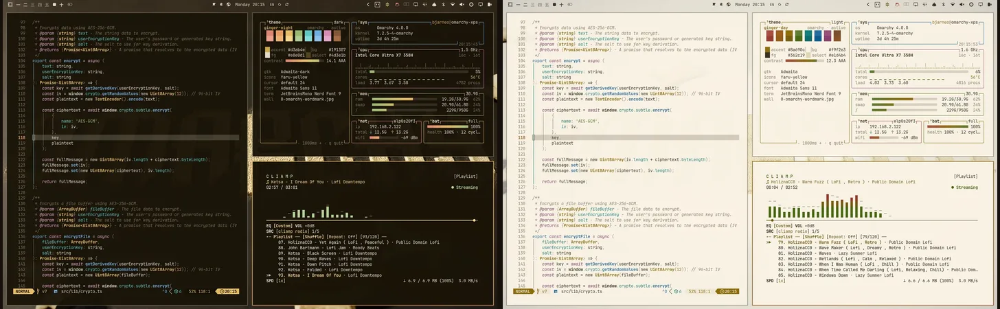](https://bjarneo.github.io/spice-themes/#ginger)

`52` · Origin: Maritime Southeast Asia · Folder: [`ginger/`](ginger/) · [Open on the site](https://bjarneo.github.io/spice-themes/#ginger)

Dried pieces of the ginger rhizome. Its warm, pungent taste is in gingerbread, ginger beer and curries.

Botanical name: *Zingiber officinale* · Part: rhizome · Flavor: pungent, warm, citrus · Heat: warm

| Variant | Theme name | `background` | `foreground` | `accent` | Icons |
| --- | --- | --- | --- | --- | --- |
| Night | [`ginger-night`](ginger/night/) | `#191307` | `#e8e0d1` | `#d3ab4e` | `Yaru-yellow` |
| Day | [`ginger-day`](ginger/day/) | `#f9f2e3` | `#362c19` | `#8a690c` | `Yaru-yellow` |

<details>
<summary>All 16 ANSI colors of each variant</summary>

| Variant | Normal, 0 to 7 | Bright, 8 to 15 |
| --- | --- | --- |
| Night | `#292214` `#e48876` `#9dbe77` `#ebc166` `#72b2e6` `#db8fbd` `#5eccc9` `#d2cab9` | `#7d725d` `#f1a495` `#b6d398` `#fcda91` `#94c7f3` `#eaabd0` `#8bdfdd` `#faf6ef` |
| Day | `#e9dfcb` `#a54939` `#57782b` `#8b6903` `#20689c` `#964b7a` `#0c7c7a` `#554c3a` | `#837966` `#933526` `#45650f` `#745708` `#065689` `#84386a` `#066665` `#1c1507` |

</details>

```bash
curl -fsSL https://bjarneo.github.io/spice-themes/install.sh | bash -s -- ginger --set
```

### Turmeric

[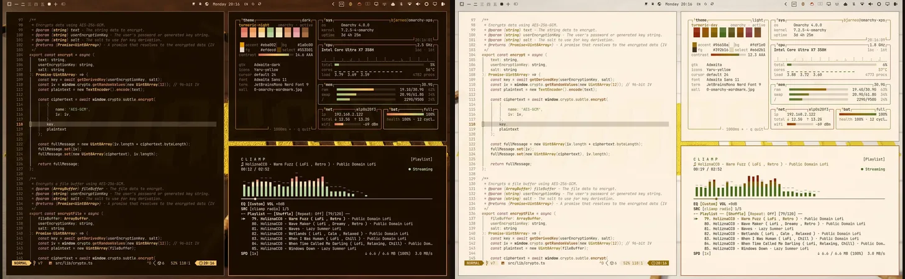](https://bjarneo.github.io/spice-themes/#turmeric)

`53` · Signature palette · Origin: South Asia · Folder: [`turmeric/`](turmeric/) · [Open on the site](https://bjarneo.github.io/spice-themes/#turmeric)

A rhizome with a bright orange inside. Ground turmeric gives curry its yellow color and an earthy, bitter taste.

Botanical name: *Curcuma longa* · Part: rhizome · Flavor: earthy, bitter, peppery · Heat: none

| Variant | Theme name | `background` | `foreground` | `accent` | Icons |
| --- | --- | --- | --- | --- | --- |
| Night | [`turmeric-night`](turmeric/night/) | `#1a0c00` | `#efdecd` | `#eba002` | `Yaru-yellow` |
| Day | [`turmeric-day`](turmeric/day/) | `#fdf1e0` | `#392b16` | `#96650a` | `Yaru-yellow` |

<details>
<summary>All 16 ANSI colors of each variant</summary>

| Variant | Normal, 0 to 7 | Bright, 8 to 15 |
| --- | --- | --- |
| Night | `#2b1a07` `#e1755a` `#a2c580` `#fec766` `#da915f` `#e39096` `#ecdeaa` `#d8c7b6` | `#846d54` `#ed937c` `#bcd9a1` `#fee4ba` `#e8ab82` `#f1acb0` `#faefc4` `#fbf6f0` |
| Day | `#eedec6` `#9b2d0f` `#55762d` `#916600` `#914a04` `#97464f` `#695b25` `#584b38` | `#867863` `#841d00` `#446516` `#795500` `#793d05` `#85333e` `#594a0d` `#1e1406` |

</details>

```bash
curl -fsSL https://bjarneo.github.io/spice-themes/install.sh | bash -s -- turmeric --set
```

### Galangal

[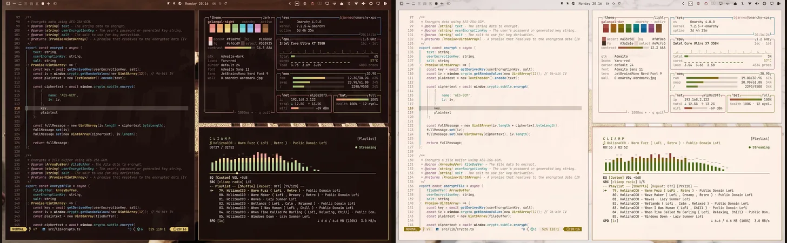](https://bjarneo.github.io/spice-themes/#galangal)

`54` · Origin: Southeast Asia · Folder: [`galangal/`](galangal/) · [Open on the site](https://bjarneo.github.io/spice-themes/#galangal)

A firm, ringed rhizome related to ginger. It tastes of pine and citrus and is a key flavor of Thai tom kha soup.

Botanical name: *Alpinia galanga* · Part: rhizome · Flavor: piney, citrus, peppery · Heat: mild

| Variant | Theme name | `background` | `foreground` | `accent` | Icons |
| --- | --- | --- | --- | --- | --- |
| Night | [`galangal-night`](galangal/night/) | `#1a0e0c` | `#efdcd9` | `#f2a89d` | `Yaru-red` |
| Day | [`galangal-day`](galangal/day/) | `#fdf0e6` | `#3a2a1e` | `#a35950` | `Yaru-red` |

<details>
<summary>All 16 ANSI colors of each variant</summary>

| Variant | Normal, 0 to 7 | Bright, 8 to 15 |
| --- | --- | --- |
| Night | `#2b1c19` `#e4877b` `#9bbf77` `#e2c56a` `#6fb2e6` `#db8fbd` `#5bcccd` `#d9c5c2` | `#846b66` `#f1a398` `#b5d398` `#f4dd94` `#91c7f3` `#ebaad0` `#89dfe0` `#fdf4f3` |
| Day | `#efdccf` `#a5483e` `#55782c` `#866c01` `#19699d` `#964a7a` `#007b7d` `#5a493d` | `#887669` `#93342c` `#426510` `#6e5904` `#065787` `#843769` `#006668` `#1f130a` |

</details>

```bash
curl -fsSL https://bjarneo.github.io/spice-themes/install.sh | bash -s -- galangal --set
```

### Licorice Root

[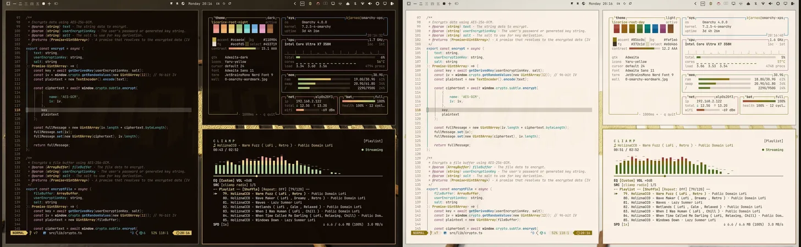](https://bjarneo.github.io/spice-themes/#licorice-root)

`55` · Origin: Southern Europe and Western Asia · Folder: [`licorice-root/`](licorice-root/) · [Open on the site](https://bjarneo.github.io/spice-themes/#licorice-root)

Woody root sticks with a yellow inside. Its glycyrrhizin is 30 to 50 times sweeter than sugar.

Botanical name: *Glycyrrhiza glabra* · Part: root · Flavor: sweet, anise, bitter · Heat: none

| Variant | Theme name | `background` | `foreground` | `accent` | Icons |
| --- | --- | --- | --- | --- | --- |
| Night | [`licorice-root-night`](licorice-root/night/) | `#110904` | `#ecdfd5` | `#ccae4e` | `Yaru-yellow` |
| Day | [`licorice-root-day`](licorice-root/day/) | `#faf1e6` | `#372c1d` | `#856c0c` | `Yaru-yellow` |

<details>
<summary>All 16 ANSI colors of each variant</summary>

| Variant | Normal, 0 to 7 | Bright, 8 to 15 |
| --- | --- | --- |
| Night | `#21170f` `#e48879` `#9abf7a` `#e6c465` `#71b2e4` `#dc8fb9` `#61ccc7` `#d6c8bd` | `#7f6e61` `#f2a497` `#b5d39a` `#f8dc91` `#93c7f1` `#ecaacd` `#8ddfdb` `#fcf5f0` |
| Day | `#eaded0` `#a5483c` `#55782f` `#886b02` `#1e699b` `#974a76` `#007c79` `#564b3d` | `#847869` `#933429` `#426516` `#705805` `#025888` `#853765` `#006765` `#1d1409` |

</details>

```bash
curl -fsSL https://bjarneo.github.io/spice-themes/install.sh | bash -s -- licorice-root --set
```

### Orris Root

[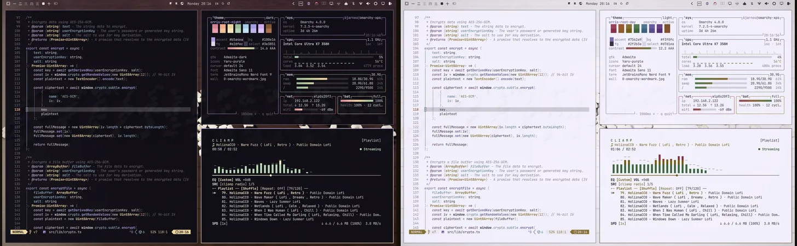](https://bjarneo.github.io/spice-themes/#orris-root)

`56` · Signature palette · Origin: Tuscany, Italy · Folder: [`orris-root/`](orris-root/) · [Open on the site](https://bjarneo.github.io/spice-themes/#orris-root)

The dried rhizome of the iris. It smells of violets and is a rare part of ras el hanout and of gin.

Botanical name: *Iris pallida* · Part: rhizome · Flavor: violet, floral, earthy · Heat: none

| Variant | Theme name | `background` | `foreground` | `accent` | Icons |
| --- | --- | --- | --- | --- | --- |
| Night | [`orris-root-night`](orris-root/night/) | `#100e16` | `#e2dfec` | `#b5a4ea` | `Yaru-purple` |
| Day | [`orris-root-day`](orris-root/day/) | `#f3f0fc` | `#2f2b3a` | `#7562a9` | `Yaru-purple` |

<details>
<summary>All 16 ANSI colors of each variant</summary>

| Variant | Normal, 0 to 7 | Bright, 8 to 15 |
| --- | --- | --- |
| Night | `#1f1c26` `#df879b` `#9cc49c` `#f4dca1` `#aaa0e6` `#d7adf7` `#a8d1ee` `#ccc8d7` | `#736e80` `#eda3b3` `#b7d8b7` `#feedc5` `#c0b9f3` `#e7cafd` `#c8e6fd` `#f7f5fd` |
| Day | `#e2deed` `#953e57` `#4e764f` `#826a2c` `#63579c` `#643b81` `#49728f` `#4e4a59` | `#7c7788` `#832b46` `#3a643c` `#705710` `#53458b` `#542870` `#355f7c` `#17141f` |

</details>

```bash
curl -fsSL https://bjarneo.github.io/spice-themes/install.sh | bash -s -- orris-root --set
```

### Horseradish

[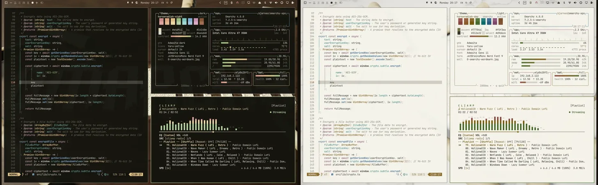](https://bjarneo.github.io/spice-themes/#horseradish)

`57` · Origin: Southeastern Europe and Western Asia · Folder: [`horseradish/`](horseradish/) · [Open on the site](https://bjarneo.github.io/spice-themes/#horseradish)

A white root with a sharp heat that rises to the nose. Dried and ground, it makes a fast horseradish sauce.

Botanical name: *Armoracia rusticana* · Part: root · Flavor: sharp, pungent, mustard · Heat: hot

| Variant | Theme name | `background` | `foreground` | `accent` | Icons |
| --- | --- | --- | --- | --- | --- |
| Night | [`horseradish-night`](horseradish/night/) | `#14140e` | `#e2e2d7` | `#e4dfc1` | `Yaru-yellow` |
| Day | [`horseradish-day`](horseradish/day/) | `#f5f3ea` | `#312e22` | `#777046` | `Yaru-yellow` |

<details>
<summary>All 16 ANSI colors of each variant</summary>

| Variant | Normal, 0 to 7 | Bright, 8 to 15 |
| --- | --- | --- |
| Night | `#24231c` `#d49089` `#9cbe82` `#e2c388` `#83b0d8` `#cf97b9` `#7cc7c4` `#cccbbf` | `#737264` `#e3aaa3` `#b6d2a1` `#f5dbaa` `#a0c6e7` `#e0b1cd` `#9fdbd8` `#f8f7f0` |
| Day | `#e4e0d4` `#96534c` `#56773a` `#896929` `#38688f` `#8b5477` `#217a78` `#504d41` | `#7e7a6d` `#84413b` `#436524` `#76560a` `#25577e` `#794366` `#016765` `#19160c` |

</details>

```bash
curl -fsSL https://bjarneo.github.io/spice-themes/install.sh | bash -s -- horseradish --set
```

### Wasabi

[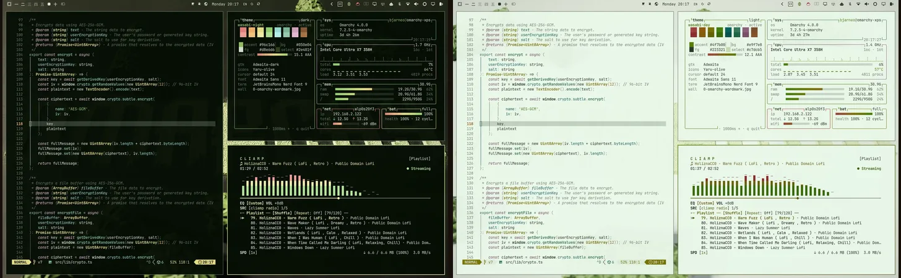](https://bjarneo.github.io/spice-themes/#wasabi)

`58` · Signature palette · Origin: Japan · Folder: [`wasabi/`](wasabi/) · [Open on the site](https://bjarneo.github.io/spice-themes/#wasabi)

A green rhizome from Japanese mountain streams. Real wasabi is rare, so most wasabi powder is horseradish and mustard with a green color.

Botanical name: *Eutrema japonicum* · Part: rhizome · Flavor: sharp, sweet, green · Heat: hot

| Variant | Theme name | `background` | `foreground` | `accent` | Icons |
| --- | --- | --- | --- | --- | --- |
| Night | [`wasabi-night`](wasabi/night/) | `#050e04` | `#d8e6d6` | `#96c166` | `Yaru-olive` |
| Day | [`wasabi-day`](wasabi/day/) | `#e9f7e8` | `#223321` | `#4f7b00` | `Yaru-olive` |

<details>
<summary>All 16 ANSI colors of each variant</summary>

| Variant | Normal, 0 to 7 | Bright, 8 to 15 |
| --- | --- | --- |
| Night | `#111d0f` `#e6857e` `#96d273` `#e9e38a` `#7dbb9a` `#d7a6c6` `#9be0db` `#c1cfbf` | `#657863` `#f3a29a` `#b4e699` `#f7f3ab` `#9dcfb3` `#e8c0da` `#bcf5f0` `#f3f9f2` |
| Day | `#d4e7d1` `#9c3c38` `#407c06` `#787000` `#2f7252` `#875978` `#015f5c` `#425240` | `#6d7e6b` `#8a2727` `#346704` `#635d04` `#166141` `#764767` `#054d49` `#0e190d` |

</details>

```bash
curl -fsSL https://bjarneo.github.io/spice-themes/install.sh | bash -s -- wasabi --set
```

## Flowers, buds and leaves

### Saffron

[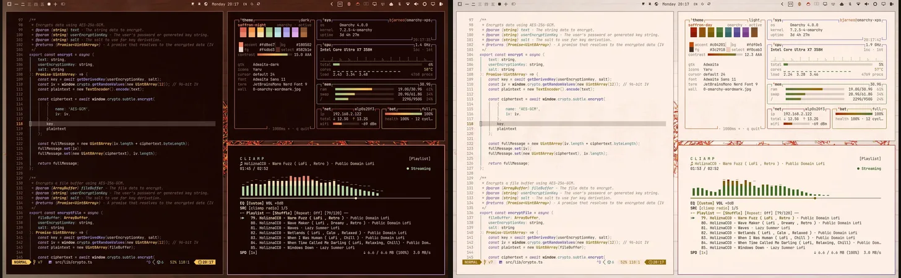](https://bjarneo.github.io/spice-themes/#saffron)

`59` · Signature palette · Origin: Iran and the Eastern Mediterranean · Folder: [`saffron/`](saffron/) · [Open on the site](https://bjarneo.github.io/spice-themes/#saffron)

The red stigmas of a crocus, picked by hand. About 150 flowers make 1 gram, so it is the most expensive spice.

Botanical name: *Crocus sativus* · Part: stigma · Flavor: honey, hay, floral · Heat: none

| Variant | Theme name | `background` | `foreground` | `accent` | Icons |
| --- | --- | --- | --- | --- | --- |
| Night | [`saffron-night`](saffron/night/) | `#180502` | `#f4dbd3` | `#fd8e67` | `Yaru` |
| Day | [`saffron-day`](saffron/day/) | `#fdf0e5` | `#3c2918` | `#c04201` | `Yaru` |

<details>
<summary>All 16 ANSI colors of each variant</summary>

| Variant | Normal, 0 to 7 | Bright, 8 to 15 |
| --- | --- | --- |
| Night | `#29120b` `#e36650` `#9cc685` `#ffc75a` `#a498e5` `#d198e3` `#a5d5d7` `#ddc4bd` | `#8a685e` `#ee8672` `#b7daa4` `#ffe4b5` `#b9b1f1` `#e2b3f1` `#c3eaec` `#fdf5f2` |
| Day | `#f3dbc8` `#a01700` `#4e7834` `#8f6700` `#60529e` `#854b96` `#447578` `#5b493a` | `#8a7666` `#831200` `#3b651e` `#765400` `#50408d` `#743885` `#2e6365` `#201307` |

</details>

```bash
curl -fsSL https://bjarneo.github.io/spice-themes/install.sh | bash -s -- saffron --set
```

### Clove

[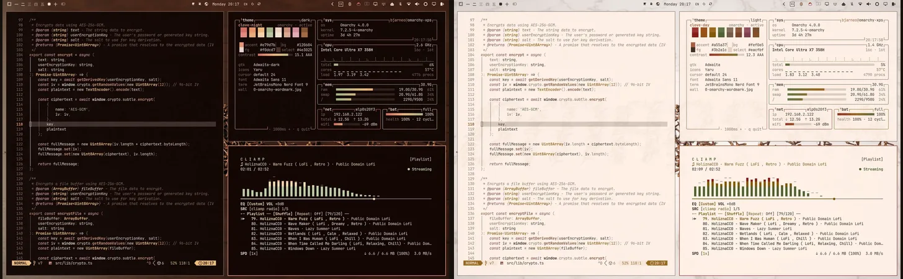](https://bjarneo.github.io/spice-themes/#clove)

`60` · Signature palette · Origin: Maluku Islands, Indonesia · Folder: [`clove/`](clove/) · [Open on the site](https://bjarneo.github.io/spice-themes/#clove)

Dried flower buds shaped like small nails. Their strong, numbing taste flavors ham, mulled wine and garam masala.

Botanical name: *Syzygium aromaticum* · Part: flower bud · Flavor: warm, sweet, numbing · Heat: mild

| Variant | Theme name | `background` | `foreground` | `accent` | Icons |
| --- | --- | --- | --- | --- | --- |
| Night | [`clove-night`](clove/night/) | `#120604` | `#f0dcd7` | `#e79d7b` | `Yaru` |
| Day | [`clove-day`](clove/day/) | `#fef0e5` | `#3b2a1c` | `#a55a37` | `Yaru` |

<details>
<summary>All 16 ANSI colors of each variant</summary>

| Variant | Normal, 0 to 7 | Bright, 8 to 15 |
| --- | --- | --- |
| Night | `#22130f` `#d97367` `#a7b989` `#f3c080` `#cf957b` `#dc93a3` `#f3d8c4` `#dac5c0` | `#846b64` `#e69085` `#becea6` `#fddbb1` `#dfae98` `#ebaeba` `#fdebdc` `#fdf5f2` |
| Day | `#f0dccd` `#962e27` `#5d6e3d` `#966417` `#884f35` `#904a5c` `#826956` `#5a493c` | `#887668` `#841512` `#4c5d2a` `#805201` `#773d22` `#7f374b` `#6f5643` `#1f1308` |

</details>

```bash
curl -fsSL https://bjarneo.github.io/spice-themes/install.sh | bash -s -- clove --set
```

### Lavender

[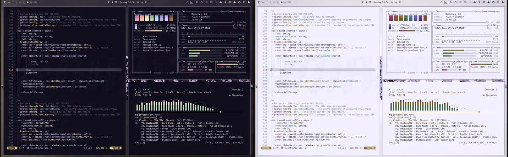](https://bjarneo.github.io/spice-themes/#lavender)

`61` · Signature palette · Origin: Mediterranean · Folder: [`lavender/`](lavender/) · [Open on the site](https://bjarneo.github.io/spice-themes/#lavender)

Dried buds of English lavender. A little gives a floral taste to herbes de Provence, honey and shortbread.

Botanical name: *Lavandula angustifolia* · Part: flower bud · Flavor: floral, camphor, sweet · Heat: none

| Variant | Theme name | `background` | `foreground` | `accent` | Icons |
| --- | --- | --- | --- | --- | --- |
| Night | [`lavender-night`](lavender/night/) | `#100d1b` | `#e2def1` | `#b7a1f5` | `Yaru-purple` |
| Day | [`lavender-day`](lavender/day/) | `#f3f0ff` | `#2f2a3f` | `#785fb6` | `Yaru-purple` |

<details>
<summary>All 16 ANSI colors of each variant</summary>

| Variant | Normal, 0 to 7 | Bright, 8 to 15 |
| --- | --- | --- |
| Night | `#1f1b2c` `#e183a1` `#9cc49c` `#f0d49b` `#a4a2e8` `#d3adff` `#a8cff7` `#cbc7db` | `#736d86` `#efa0b8` `#b7d8b7` `#feedc9` `#bbbaf5` `#e2cdfd` `#cde4fd` `#f7f6fd` |
| Day | `#e1dcf6` `#973a5d` `#4e764f` `#856a2d` `#5e599e` `#623989` `#4a7098` `#4e495f` | `#7b778d` `#85254c` `#3a643c` `#735712` `#4e478d` `#522778` `#365d85` `#171322` |

</details>

```bash
curl -fsSL https://bjarneo.github.io/spice-themes/install.sh | bash -s -- lavender --set
```

### Rose

[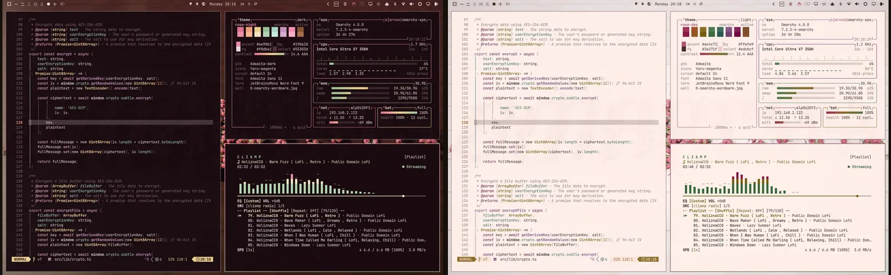](https://bjarneo.github.io/spice-themes/#rose)

`62` · Signature palette · Origin: Iran and the Middle East · Folder: [`rose/`](rose/) · [Open on the site](https://bjarneo.github.io/spice-themes/#rose)

Dried buds and petals of the damask rose. They flavor Persian rice, ras el hanout and Turkish delight.

Botanical name: *Rosa × damascena* · Part: flower · Flavor: floral, sweet, fruity · Heat: none

| Variant | Theme name | `background` | `foreground` | `accent` | Icons |
| --- | --- | --- | --- | --- | --- |
| Night | [`rose-night`](rose/night/) | `#190a10` | `#f0dbe2` | `#ee90b1` | `Yaru-magenta` |
| Day | [`rose-day`](rose/day/) | `#ffefe9` | `#3e271f` | `#ac4c71` | `Yaru-magenta` |

<details>
<summary>All 16 ANSI colors of each variant</summary>

| Variant | Normal, 0 to 7 | Bright, 8 to 15 |
| --- | --- | --- |
| Night | `#29181f` `#e57693` `#98c598` `#f3d392` `#cc96c6` `#f893bc` `#aedcd2` `#dac4cb` | `#846973` `#f294aa` `#b4d9b4` `#ffecc6` `#ddb0d8` `#ffb5d1` `#cbf1e8` `#fdf4f7` |
| Day | `#f5dad0` `#9d2b51` `#49774a` `#88691f` `#824e7d` `#7d1a4c` `#36655c` `#5e473f` | `#8e756d` `#8b0f40` `#366638` `#745603` `#713c6d` `#6a003c` `#22544c` `#22110b` |

</details>

```bash
curl -fsSL https://bjarneo.github.io/spice-themes/install.sh | bash -s -- rose --set
```

### Hibiscus

[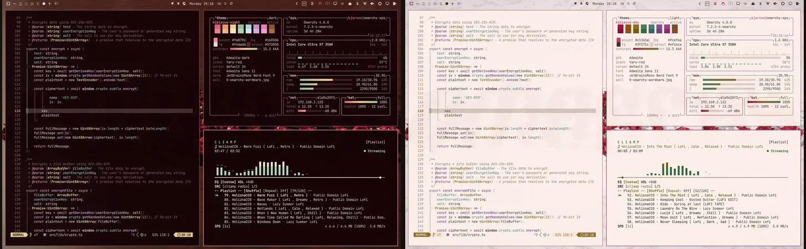](https://bjarneo.github.io/spice-themes/#hibiscus)

`63` · Signature palette · Origin: West Africa · Folder: [`hibiscus/`](hibiscus/) · [Open on the site](https://bjarneo.github.io/spice-themes/#hibiscus)

Dried, deep red calyxes of the roselle plant. They make tart, red drinks such as bissap and agua de jamaica.

Botanical name: *Hibiscus sabdariffa* · Part: calyx · Flavor: tart, cranberry, floral · Heat: none

| Variant | Theme name | `background` | `foreground` | `accent` | Icons |
| --- | --- | --- | --- | --- | --- |
| Night | [`hibiscus-night`](hibiscus/night/) | `#160306` | `#f4dadd` | `#fe879c` | `Yaru-red` |
| Day | [`hibiscus-day`](hibiscus/day/) | `#fcefea` | `#3f271c` | `#c1365a` | `Yaru-red` |

<details>
<summary>All 16 ANSI colors of each variant</summary>

| Variant | Normal, 0 to 7 | Bright, 8 to 15 |
| --- | --- | --- |
| Night | `#280e13` `#e1627c` `#93c69d` `#f3d392` `#c796d2` `#e885bf` `#abdbde` `#ddc3c7` | `#8c666c` `#ed8395` `#b0dab7` `#ffecc6` `#d9b0e2` `#f6a3d2` `#c9f0f2` `#fdf4f5` |
| Day | `#f6dacc` `#9e0e3f` `#43784f` `#88691f` `#7e4d89` `#9b3777` `#447679` `#5e473d` | `#8d7469` `#830432` `#2e663c` `#745603` `#6d3b78` `#892066` `#2e6265` `#21120a` |

</details>

```bash
curl -fsSL https://bjarneo.github.io/spice-themes/install.sh | bash -s -- hibiscus --set
```

### Safflower

[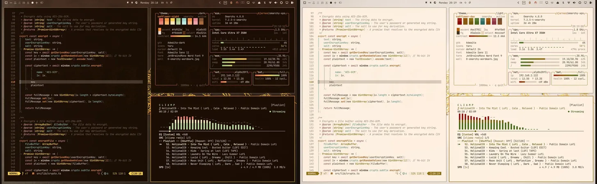](https://bjarneo.github.io/spice-themes/#safflower)

`64` · Signature palette · Origin: Western Asia · Folder: [`safflower/`](safflower/) · [Open on the site](https://bjarneo.github.io/spice-themes/#safflower)

Orange-red florets with a mild taste. Cooks use them for color, and some sellers call them false saffron.

Botanical name: *Carthamus tinctorius* · Part: floret · Flavor: earthy, floral, mild · Heat: none

| Variant | Theme name | `background` | `foreground` | `accent` | Icons |
| --- | --- | --- | --- | --- | --- |
| Night | [`safflower-night`](safflower/night/) | `#1a0c03` | `#f0ddd0` | `#fd923e` | `Yaru` |
| Day | [`safflower-day`](safflower/day/) | `#fef0e0` | `#3a2a16` | `#ac5701` | `Yaru` |

<details>
<summary>All 16 ANSI colors of each variant</summary>

| Variant | Normal, 0 to 7 | Bright, 8 to 15 |
| --- | --- | --- |
| Night | `#2b1a0d` `#df6a59` `#a2c580` `#fed252` `#f99549` `#e88d94` `#a6ded2` `#dac6b8` | `#856c5a` `#eb8979` `#bcd9a1` `#ffedbf` `#ffb583` `#f5a9ae` `#c5f3e9` `#fcf5f0` |
| Day | `#f0ddc7` `#9c1f14` `#55762d` `#876b0b` `#9c4f00` `#9b424d` `#3e796e` `#594a38` | `#887764` `#860500` `#446516` `#6f5808` `#844100` `#892f3c` `#25655a` `#1e1406` |

</details>

```bash
curl -fsSL https://bjarneo.github.io/spice-themes/install.sh | bash -s -- safflower --set
```

### Bay Leaf

[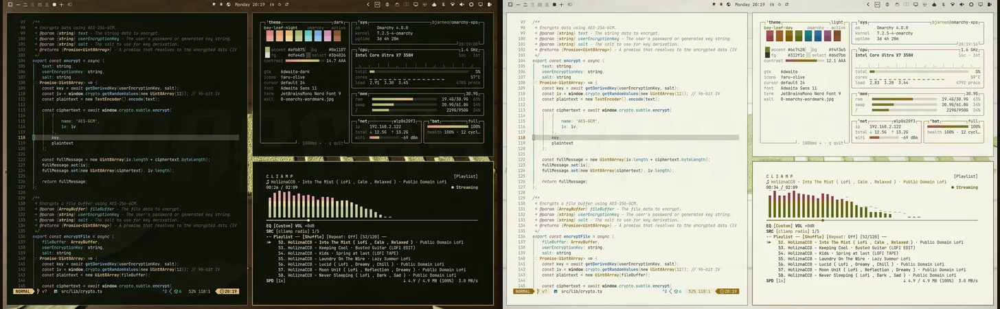](https://bjarneo.github.io/spice-themes/#bay-leaf)

`65` · Origin: Mediterranean · Folder: [`bay-leaf/`](bay-leaf/) · [Open on the site](https://bjarneo.github.io/spice-themes/#bay-leaf)

Dried leaves of the bay laurel. Cooks simmer a leaf or 2 in soups and stews, then remove them before serving.

Botanical name: *Laurus nobilis* · Part: leaf · Flavor: herbal, floral, bitter · Heat: none

| Variant | Theme name | `background` | `foreground` | `accent` | Icons |
| --- | --- | --- | --- | --- | --- |
| Night | [`bay-leaf-night`](bay-leaf/night/) | `#0e1107` | `#dfe4d5` | `#afb875` | `Yaru-olive` |
| Day | [`bay-leaf-day`](bay-leaf/day/) | `#f4f3e5` | `#312f1c` | `#6c7428` | `Yaru-olive` |

<details>
<summary>All 16 ANSI colors of each variant</summary>

| Variant | Normal, 0 to 7 | Bright, 8 to 15 |
| --- | --- | --- |
| Night | `#1d2013` `#dc8b86` `#abb976` `#e6c27a` `#7bb1e0` `#d693b9` `#6ccac8` `#c8cdbd` | `#6f7460` `#eaa6a1` `#c2ce97` `#f7da9f` `#9ac6ee` `#e6adcd` `#94dedc` `#f6f8f0` |
| Day | `#e3e1ce` `#9e4d4a` `#68752c` `#8c6809` `#2e6897` `#924f76` `#127b7b` `#504e3c` | `#7d7b68` `#8c3a39` `#55610e` `#755701` `#175786` `#803d66` `#0f6666` `#181708` |

</details>

```bash
curl -fsSL https://bjarneo.github.io/spice-themes/install.sh | bash -s -- bay-leaf --set
```

### Fennel Pollen

[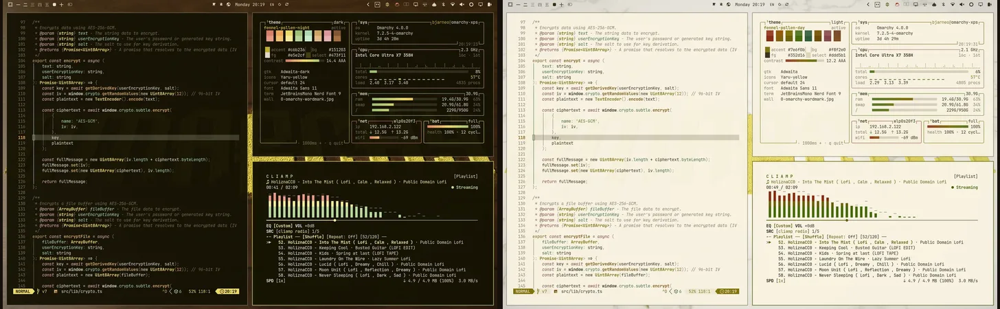](https://bjarneo.github.io/spice-themes/#fennel-pollen)

`66` · Signature palette · Origin: Tuscany, Italy · Folder: [`fennel-pollen/`](fennel-pollen/) · [Open on the site](https://bjarneo.github.io/spice-themes/#fennel-pollen)

Pollen from wild fennel flowers, collected by hand. Its sweet taste of licorice and honey is strong, so cooks use a pinch.

Botanical name: *Foeniculum vulgare* · Part: pollen · Flavor: licorice, honey, citrus · Heat: none

| Variant | Theme name | `background` | `foreground` | `accent` | Icons |
| --- | --- | --- | --- | --- | --- |
| Night | [`fennel-pollen-night`](fennel-pollen/night/) | `#151203` | `#e5e2cf` | `#c6b236` | `Yaru-yellow` |
| Day | [`fennel-pollen-day`](fennel-pollen/day/) | `#f8f2e0` | `#352d16` | `#7e6f0b` | `Yaru-yellow` |

<details>
<summary>All 16 ANSI colors of each variant</summary>

| Variant | Normal, 0 to 7 | Bright, 8 to 15 |
| --- | --- | --- |
| Night | `#24210e` `#de826a` `#a0c679` `#f4e06a` `#d6a866` `#df9da1` `#b1dfb9` `#cecbb7` | `#777258` `#ec9e8a` `#bbda9c` `#fff19d` `#e7c08b` `#efb7ba` `#cef4d4` `#f8f7f0` |
| Day | `#e8e0c6` `#973b24` `#537724` `#7d6e01` `#7e5509` `#915157` `#3a6744` `#544d37` | `#817a63` `#85260d` `#416603` `#685c03` `#694604` `#803f45` `#275633` `#1b1605` |

</details>

```bash
curl -fsSL https://bjarneo.github.io/spice-themes/install.sh | bash -s -- fennel-pollen --set
```

## Fruits and pods

### Green Cardamom

[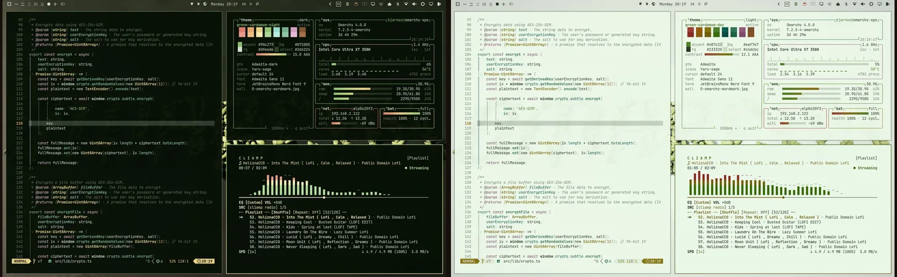](https://bjarneo.github.io/spice-themes/#green-cardamom)

`67` · Signature palette · Origin: Western Ghats, India · Folder: [`green-cardamom/`](green-cardamom/) · [Open on the site](https://bjarneo.github.io/spice-themes/#green-cardamom)

Small, green, three-sided pods full of black seeds. They flavor chai, Nordic buns and Arabic coffee.

Botanical name: *Elettaria cardamomum* · Part: fruit pod · Flavor: citrus, eucalyptus, floral · Heat: none

| Variant | Theme name | `background` | `foreground` | `accent` | Icons |
| --- | --- | --- | --- | --- | --- |
| Night | [`green-cardamom-night`](green-cardamom/night/) | `#071005` | `#d9e6d6` | `#90c273` | `Yaru-sage` |
| Day | [`green-cardamom-day`](green-cardamom/day/) | `#eaf7e7` | `#233320` | `#487c23` | `Yaru-sage` |

<details>
<summary>All 16 ANSI colors of each variant</summary>

| Variant | Normal, 0 to 7 | Bright, 8 to 15 |
| --- | --- | --- |
| Night | `#141f11` `#df8071` `#96c979` `#ecd78a` `#77b493` `#dba4c8` `#9ee1d3` `#c2cfbe` | `#667762` `#ec9c8f` `#b2dd9c` `#feefb4` `#96c8ac` `#ecbedc` `#bff5ea` `#f3f9f2` |
| Day | `#d4e7d0` `#98392d` `#477a23` `#826d09` `#2b6f4f` `#8b567a` `#00584c` `#435240` | `#6e7e6b` `#862419` `#336700` `#6d5b01` `#115e3e` `#7a4469` `#01463c` `#0f190c` |

</details>

```bash
curl -fsSL https://bjarneo.github.io/spice-themes/install.sh | bash -s -- green-cardamom --set
```

### Black Cardamom

[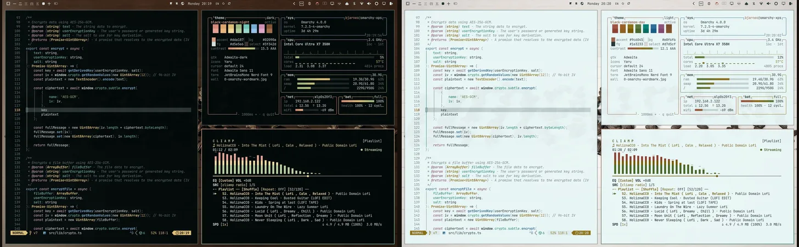](https://bjarneo.github.io/spice-themes/#black-cardamom)

`68` · Origin: Eastern Himalayas · Folder: [`black-cardamom/`](black-cardamom/) · [Open on the site](https://bjarneo.github.io/spice-themes/#black-cardamom)

Large, wrinkled pods dried over open fires. They give a smoky, camphor taste to biryani and pho.

Botanical name: *Amomum subulatum* · Part: fruit pod · Flavor: smoky, camphor, earthy · Heat: none

| Variant | Theme name | `background` | `foreground` | `accent` | Icons |
| --- | --- | --- | --- | --- | --- |
| Night | [`black-cardamom-night`](black-cardamom/night/) | `#02090a` | `#d5e5e6` | `#dda187` | `Yaru` |
| Day | [`black-cardamom-day`](black-cardamom/day/) | `#e8f6f6` | `#1e3233` | `#9c6045` | `Yaru` |

<details>
<summary>All 16 ANSI colors of each variant</summary>

| Variant | Normal, 0 to 7 | Bright, 8 to 15 |
| --- | --- | --- |
| Night | `#0b1718` `#dc8d7c` `#9cbd81` `#e3c479` `#79b2de` `#d493bd` `#72cabc` `#bdcfcf` | `#607677` `#eaa899` `#b6d1a0` `#f5dc9f` `#99c7ed` `#e4aed0` `#98ded2` `#f0f9f9` |
| Day | `#d2e5e5` `#9d4f3f` `#577739` `#8a6b0c` `#2a6995` `#8f507b` `#007d71` `#3e5152` | `#6a7f80` `#8b3c2c` `#446423` `#735800` `#115884` `#7e3e6a` `#00685d` `#09191a` |

</details>

```bash
curl -fsSL https://bjarneo.github.io/spice-themes/install.sh | bash -s -- black-cardamom --set
```

### Vanilla

[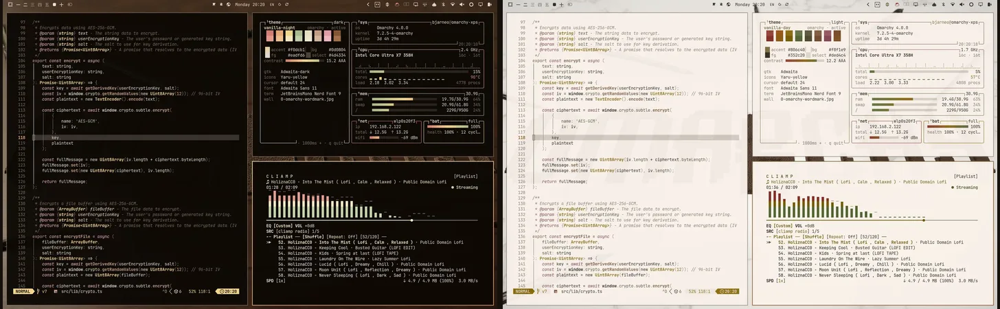](https://bjarneo.github.io/spice-themes/#vanilla)

`69` · Signature palette · Origin: Mexico · Folder: [`vanilla/`](vanilla/) · [Open on the site](https://bjarneo.github.io/spice-themes/#vanilla)

The cured pods of an orchid. Curing takes months, and it is the second most expensive spice after saffron.

Botanical name: *Vanilla planifolia* · Part: fruit pod · Flavor: sweet, creamy, floral · Heat: none

| Variant | Theme name | `background` | `foreground` | `accent` | Icons |
| --- | --- | --- | --- | --- | --- |
| Night | [`vanilla-night`](vanilla/night/) | `#0d0804` | `#eadfd6` | `#f0dcb1` | `Yaru-yellow` |
| Day | [`vanilla-day`](vanilla/day/) | `#f8f1e9` | `#352c20` | `#806c40` | `Yaru-yellow` |

<details>
<summary>All 16 ANSI colors of each variant</summary>

| Variant | Normal, 0 to 7 | Bright, 8 to 15 |
| --- | --- | --- |
| Night | `#1d1610` `#da8375` `#adc08f` `#fadb90` `#c9a187` `#e5a2ac` `#ede5c7` `#d4c8bf` | `#7c6f63` `#e89e92` `#c5d5ac` `#feedc4` `#dbb9a3` `#f5bcc4` `#f5efd6` `#fcf5f0` |
| Day | `#e8dfd4` `#943e32` `#607240` `#896a09` `#80593f` `#95545f` `#5c5539` `#554b40` | `#83796c` `#822a20` `#4f612d` `#735800` `#6f482d` `#83424e` `#4c4528` `#1c150b` |

</details>

```bash
curl -fsSL https://bjarneo.github.io/spice-themes/install.sh | bash -s -- vanilla --set
```

### Star Anise

[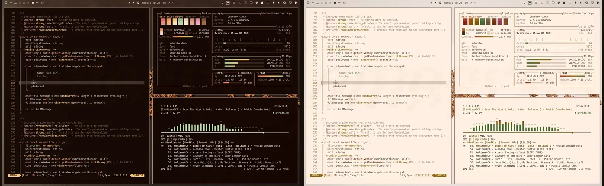](https://bjarneo.github.io/spice-themes/#star-anise)

`70` · Signature palette · Origin: Southern China and Vietnam · Folder: [`star-anise/`](star-anise/) · [Open on the site](https://bjarneo.github.io/spice-themes/#star-anise)

Star-shaped fruits with 8 points, each with a glossy seed. It is a main flavor of pho and Chinese five-spice.

Botanical name: *Illicium verum* · Part: fruit · Flavor: licorice, sweet, warm · Heat: none

| Variant | Theme name | `background` | `foreground` | `accent` | Icons |
| --- | --- | --- | --- | --- | --- |
| Night | [`star-anise-night`](star-anise/night/) | `#150703` | `#f1ddd4` | `#ee9a69` | `Yaru` |
| Day | [`star-anise-day`](star-anise/day/) | `#fff0e1` | `#3b2a18` | `#ad561b` | `Yaru` |

<details>
<summary>All 16 ANSI colors of each variant</summary>

| Variant | Normal, 0 to 7 | Bright, 8 to 15 |
| --- | --- | --- |
| Night | `#26150d` `#dd7767` `#a2c390` `#fcc771` `#d49375` `#e796a8` `#f4d9bb` `#dbc6bc` | `#856b5f` `#ea9486` `#bcd8ad` `#fee4bd` `#e4ac94` `#f6b1c0` `#ffebd5` `#fdf5f1` |
| Day | `#f1dcc8` `#983124` `#547541` `#92660b` `#793b1c` `#99495e` `#7b6144` `#5b4939` | `#897765` `#86190f` `#42642e` `#7a5300` `#682904` `#87374d` `#6a5032` `#1f1307` |

</details>

```bash
curl -fsSL https://bjarneo.github.io/spice-themes/install.sh | bash -s -- star-anise --set
```

### Allspice

[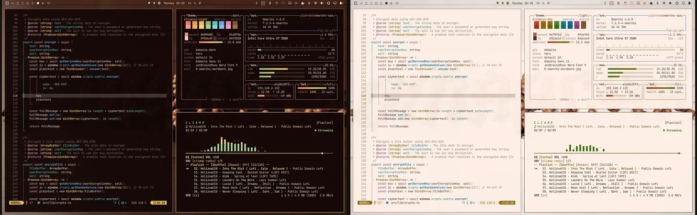](https://bjarneo.github.io/spice-themes/#allspice)

`71` · Origin: Jamaica and Central America · Folder: [`allspice/`](allspice/) · [Open on the site](https://bjarneo.github.io/spice-themes/#allspice)

Dried berries from Jamaica. They taste like clove, cinnamon and nutmeg together.

Botanical name: *Pimenta dioica* · Part: fruit · Flavor: clove, cinnamon, nutmeg · Heat: none

| Variant | Theme name | `background` | `foreground` | `accent` | Icons |
| --- | --- | --- | --- | --- | --- |
| Night | [`allspice-night`](allspice/night/) | `#140706` | `#f0dcd9` | `#e89b80` | `Yaru` |
| Day | [`allspice-day`](allspice/day/) | `#feefe5` | `#3b2a1d` | `#a7593d` | `Yaru` |

<details>
<summary>All 16 ANSI colors of each variant</summary>

| Variant | Normal, 0 to 7 | Bright, 8 to 15 |
| --- | --- | --- |
| Night | `#241512` `#eb846c` `#90c277` `#edc158` `#60b5e9` `#e28aba` `#4dcec9` `#dac5c1` | `#846b66` `#f8a18d` `#acd698` `#fdda88` `#87caf6` `#f1a6ce` `#81e1dd` `#fdf4f3` |
| Day | `#f0dcce` `#ab422c` `#497b2b` `#8a690a` `#006b9b` `#9d4578` `#127a77` `#5a493d` | `#897669` `#992d15` `#33670b` `#745700` `#065981` `#8b3167` `#0d6563` `#201309` |

</details>

```bash
curl -fsSL https://bjarneo.github.io/spice-themes/install.sh | bash -s -- allspice --set
```

### Juniper

[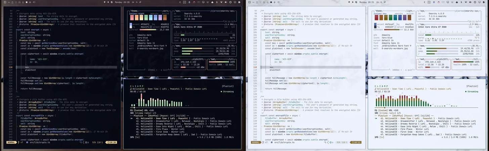](https://bjarneo.github.io/spice-themes/#juniper)

`72` · Signature palette · Origin: Northern Europe · Folder: [`juniper/`](juniper/) · [Open on the site](https://bjarneo.github.io/spice-themes/#juniper)

Blue-black berries with a dusty bloom. They give gin its pine taste and season game and sauerkraut.

Botanical name: *Juniperus communis* · Part: seed cone · Flavor: pine, citrus, resin · Heat: none

| Variant | Theme name | `background` | `foreground` | `accent` | Icons |
| --- | --- | --- | --- | --- | --- |
| Night | [`juniper-night`](juniper/night/) | `#060813` | `#dce1f1` | `#92b0f1` | `Yaru-blue` |
| Day | [`juniper-day`](juniper/day/) | `#eef2fe` | `#282d3f` | `#4f6caf` | `Yaru-blue` |

<details>
<summary>All 16 ANSI colors of each variant</summary>

| Variant | Normal, 0 to 7 | Bright, 8 to 15 |
| --- | --- | --- |
| Night | `#131623` `#e68485` `#88ca95` `#f0d49b` `#83a3ea` `#bea3df` `#8ed7ef` `#c5cadb` | `#6a7186` `#f3a1a0` `#a8deb2` `#feedc9` `#9ebaf5` `#d2bcee` `#b5ebfd` `#f4f7fe` |
| Day | `#d9e0f5` `#9c3b40` `#347b47` `#856a2d` `#3e5ca3` `#745793` `#20778e` `#474c5e` | `#747a8d` `#8a262f` `#1a6834` `#735712` `#2d4a92` `#634682` `#00647a` `#121523` |

</details>

```bash
curl -fsSL https://bjarneo.github.io/spice-themes/install.sh | bash -s -- juniper --set
```

### Sumac

[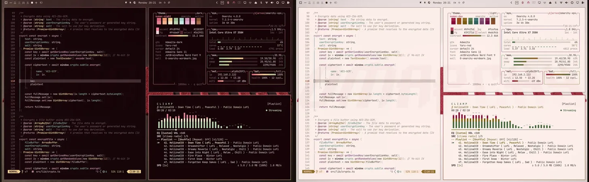](https://bjarneo.github.io/spice-themes/#sumac)

`73` · Signature palette · Origin: Middle East · Folder: [`sumac/`](sumac/) · [Open on the site](https://bjarneo.github.io/spice-themes/#sumac)

Ground, dried berries with a tart, lemony taste. It goes on fattoush, kebabs and onions, and it is part of za'atar.

Botanical name: *Rhus coriaria* · Part: fruit · Flavor: tart, lemon, fruity · Heat: none

| Variant | Theme name | `background` | `foreground` | `accent` | Icons |
| --- | --- | --- | --- | --- | --- |
| Night | [`sumac-night`](sumac/night/) | `#150307` | `#f4dadf` | `#fc899d` | `Yaru-red` |
| Day | [`sumac-day`](sumac/day/) | `#fcefea` | `#3f271d` | `#b9425d` | `Yaru-red` |

<details>
<summary>All 16 ANSI colors of each variant</summary>

| Variant | Normal, 0 to 7 | Bright, 8 to 15 |
| --- | --- | --- |
| Night | `#260f15` `#dd667d` `#a0c398` `#f7d293` `#d295bd` `#fa9cc1` `#acdcd8` `#ddc3c8` | `#8a666e` `#e98696` `#bbd8b4` `#feecce` `#e3afd0` `#febfd6` `#caf1ee` `#fdf4f6` |
| Day | `#f6d9cd` `#9a1a41` `#52754b` `#8c6721` `#874c75` `#7c224d` `#3d6e6b` `#5e473d` | `#8d746a` `#840032` `#416439` `#785506` `#763a64` `#6a093d` `#295d5a` `#21110a` |

</details>

```bash
curl -fsSL https://bjarneo.github.io/spice-themes/install.sh | bash -s -- sumac --set
```

### Tamarind

[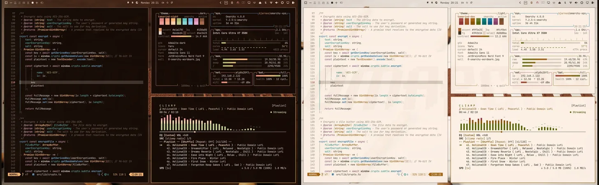](https://bjarneo.github.io/spice-themes/#tamarind)

`74` · Origin: Tropical Africa · Folder: [`tamarind/`](tamarind/) · [Open on the site](https://bjarneo.github.io/spice-themes/#tamarind)

Brown pods with a sticky, sour-sweet pulp. It gives the sour taste to pad thai, Worcestershire sauce and many chutneys.

Botanical name: *Tamarindus indica* · Part: fruit pod · Flavor: sour, sweet, fruity · Heat: none

| Variant | Theme name | `background` | `foreground` | `accent` | Icons |
| --- | --- | --- | --- | --- | --- |
| Night | [`tamarind-night`](tamarind/night/) | `#150a05` | `#eeded4` | `#e1a170` | `Yaru` |
| Day | [`tamarind-day`](tamarind/day/) | `#fcf0e4` | `#392b1b` | `#9f5e25` | `Yaru` |

<details>
<summary>All 16 ANSI colors of each variant</summary>

| Variant | Normal, 0 to 7 | Bright, 8 to 15 |
| --- | --- | --- |
| Night | `#261810` `#e48682` `#aaba70` `#fcb774` `#70b3e2` `#db8fb9` `#63cbc8` `#d8c7bc` | `#826c60` `#f1a29d` `#c1cf92` `#fed6b2` `#92c8f0` `#ebaacd` `#8edfdc` `#fdf5f1` |
| Day | `#eeddcc` `#a54745` `#657420` `#a05e0a` `#1a6a99` `#964b77` `#017a79` `#594a3b` | `#877767` `#933333` `#536104` `#884d00` `#095883` `#853866` `#016564` `#1e1408` |

</details>

```bash
curl -fsSL https://bjarneo.github.io/spice-themes/install.sh | bash -s -- tamarind --set
```

### Amchur

[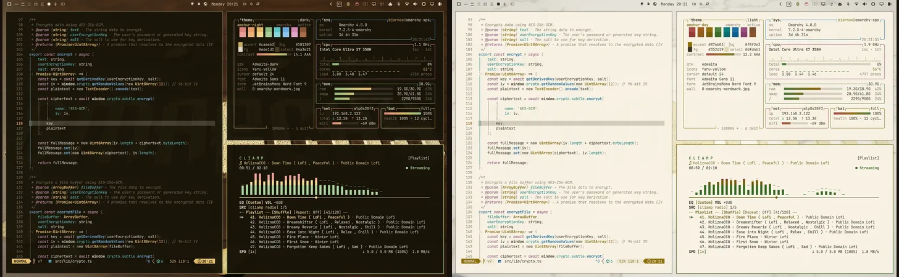](https://bjarneo.github.io/spice-themes/#amchur)

`75` · Origin: India · Folder: [`amchur/`](amchur/) · [Open on the site](https://bjarneo.github.io/spice-themes/#amchur)

Slices of unripe green mango, dried and ground. It gives a sour, fruity taste to chaat, chutneys and samosa fillings.

Botanical name: *Mangifera indica* · Part: fruit · Flavor: sour, fruity, tangy · Heat: none

| Variant | Theme name | `background` | `foreground` | `accent` | Icons |
| --- | --- | --- | --- | --- | --- |
| Night | [`amchur-night`](amchur/night/) | `#181307` | `#e6e1d1` | `#caae63` | `Yaru-yellow` |
| Day | [`amchur-day`](amchur/day/) | `#f8f2e3` | `#352d19` | `#876b01` | `Yaru-yellow` |

<details>
<summary>All 16 ANSI colors of each variant</summary>

| Variant | Normal, 0 to 7 | Bright, 8 to 15 |
| --- | --- | --- |
| Night | `#272314` `#e4877d` `#8fc181` `#e8c36a` `#6db3e6` `#db8fbd` `#5bcccb` `#d0cab9` | `#79715b` `#f2a39a` `#abd59f` `#fadb94` `#90c8f3` `#ebaad0` `#89dfde` `#f9f7ef` |
| Day | `#e8e0cb` `#a54741` `#477b38` `#8a6901` `#15699c` `#964a7b` `#017c7b` `#544c3a` | `#827a66` `#93332e` `#326720` `#735805` `#005886` `#84376a` `#006666` `#1b1507` |

</details>

```bash
curl -fsSL https://bjarneo.github.io/spice-themes/install.sh | bash -s -- amchur --set
```

### Dried Lime

[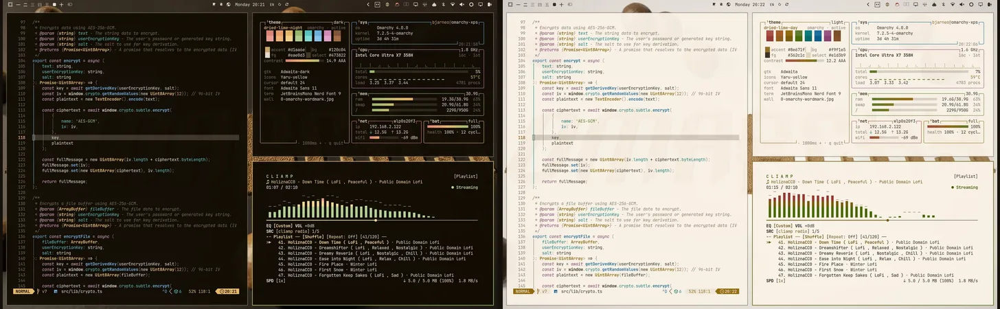](https://bjarneo.github.io/spice-themes/#dried-lime)

`76` · Origin: Oman and the Persian Gulf · Folder: [`dried-lime/`](dried-lime/) · [Open on the site](https://bjarneo.github.io/spice-themes/#dried-lime)

Whole limes boiled in brine and dried in the sun until they are hollow. They give a sour, earthy taste to Persian and Gulf stews.

Botanical name: *Citrus aurantiifolia* · Part: fruit · Flavor: sour, earthy, fermented · Heat: none

| Variant | Theme name | `background` | `foreground` | `accent` | Icons |
| --- | --- | --- | --- | --- | --- |
| Night | [`dried-lime-night`](dried-lime/night/) | `#120c04` | `#eae0d3` | `#d1aa6e` | `Yaru-yellow` |
| Day | [`dried-lime-day`](dried-lime/day/) | `#f9f1e5` | `#362c1c` | `#8e671f` | `Yaru-yellow` |

<details>
<summary>All 16 ANSI colors of each variant</summary>

| Variant | Normal, 0 to 7 | Bright, 8 to 15 |
| --- | --- | --- |
| Night | `#221a10` `#e4877b` `#9cbf72` `#eebf6b` `#6eb3e6` `#d98fc0` `#5cccca` `#d3c9bb` | `#7c6f5e` `#f1a398` `#b6d394` `#ffd894` `#91c8f3` `#e9aad2` `#89e0dd` `#fbf6f0` |
| Day | `#e9dfce` `#a5483e` `#577823` `#8f6604` `#15699c` `#954b7d` `#007a79` `#554c3c` | `#837968` `#93342c` `#446500` `#775508` `#005786` `#83386d` `#006564` `#1c1508` |

</details>

```bash
curl -fsSL https://bjarneo.github.io/spice-themes/install.sh | bash -s -- dried-lime --set
```

### Nutmeg

[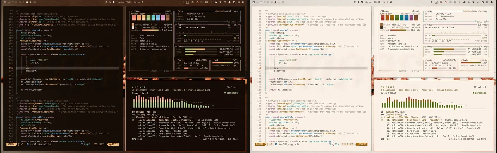](https://bjarneo.github.io/spice-themes/#nutmeg)

`77` · Origin: Banda Islands, Indonesia · Folder: [`nutmeg/`](nutmeg/) · [Open on the site](https://bjarneo.github.io/spice-themes/#nutmeg)

The seed of a tropical evergreen tree. Grate it fresh into béchamel, eggnog and mashed potatoes.

Botanical name: *Myristica fragrans* · Part: seed · Flavor: warm, sweet, nutty · Heat: none

| Variant | Theme name | `background` | `foreground` | `accent` | Icons |
| --- | --- | --- | --- | --- | --- |
| Night | [`nutmeg-night`](nutmeg/night/) | `#140b05` | `#ecded5` | `#dba475` | `Yaru` |
| Day | [`nutmeg-day`](nutmeg/day/) | `#faf1e6` | `#372b1d` | `#99622c` | `Yaru` |

<details>
<summary>All 16 ANSI colors of each variant</summary>

| Variant | Normal, 0 to 7 | Bright, 8 to 15 |
| --- | --- | --- |
| Night | `#241911` `#ef806f` `#9fbd76` `#f9b971` `#71b2e4` `#d990bf` `#61ccc7` `#d6c7bd` | `#806e61` `#fb9e8f` `#b8d297` `#fed6ad` `#93c7f1` `#e9abd2` `#8ddfdb` `#fcf5f0` |
| Day | `#ebdecf` `#af3d30` `#5a772a` `#9d6000` `#1d699b` `#944b7c` `#007c79` `#574b3d` | `#857869` `#9d261b` `#48640d` `#835000` `#015888` `#82386b` `#006765` `#1d1409` |

</details>

```bash
curl -fsSL https://bjarneo.github.io/spice-themes/install.sh | bash -s -- nutmeg --set
```

### Mace

[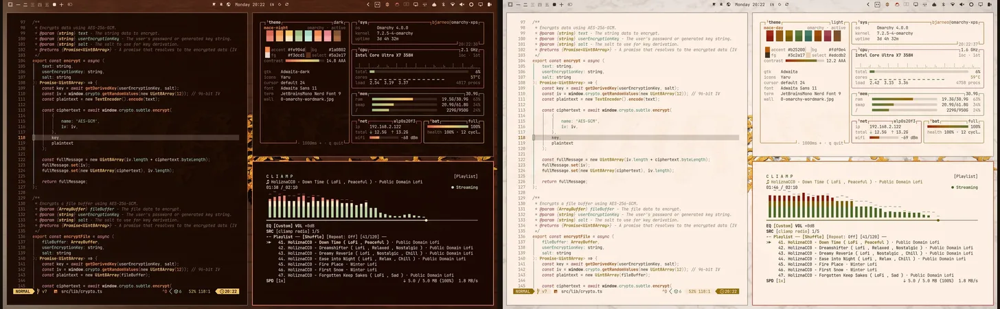](https://bjarneo.github.io/spice-themes/#mace)

`78` · Signature palette · Origin: Banda Islands, Indonesia · Folder: [`mace/`](mace/) · [Open on the site](https://bjarneo.github.io/spice-themes/#mace)

The lacy red cover around the nutmeg seed. Dried, it turns orange and tastes like a lighter, sharper nutmeg.

Botanical name: *Myristica fragrans* · Part: aril · Flavor: warm, peppery, citrus · Heat: none

| Variant | Theme name | `background` | `foreground` | `accent` | Icons |
| --- | --- | --- | --- | --- | --- |
| Night | [`mace-night`](mace/night/) | `#1a0802` | `#f3dcd1` | `#fe904d` | `Yaru` |
| Day | [`mace-day`](mace/day/) | `#fdf0e4` | `#3c2a17` | `#b25200` | `Yaru` |

<details>
<summary>All 16 ANSI colors of each variant</summary>

| Variant | Normal, 0 to 7 | Bright, 8 to 15 |
| --- | --- | --- |
| Night | `#2b150b` `#df6a55` `#a4c386` `#ffcc69` `#f88f4f` `#ec8a92` `#aadecb` `#dcc5bb` | `#89695b` `#eb8976` `#bed8a5` `#fee9c3` `#fdb084` `#faa7ac` `#c8f3e3` `#fdf5f1` |
| Day | `#f2dcc8` `#9c200b` `#577535` `#8f6802` `#9e4904` `#9f3e4b` `#417765` `#5b4939` | `#897765` `#831301` `#466421` `#765502` `#863c00` `#8d293a` `#2c6553` `#1f1307` |

</details>

```bash
curl -fsSL https://bjarneo.github.io/spice-themes/install.sh | bash -s -- mace --set
```

### Anardana

[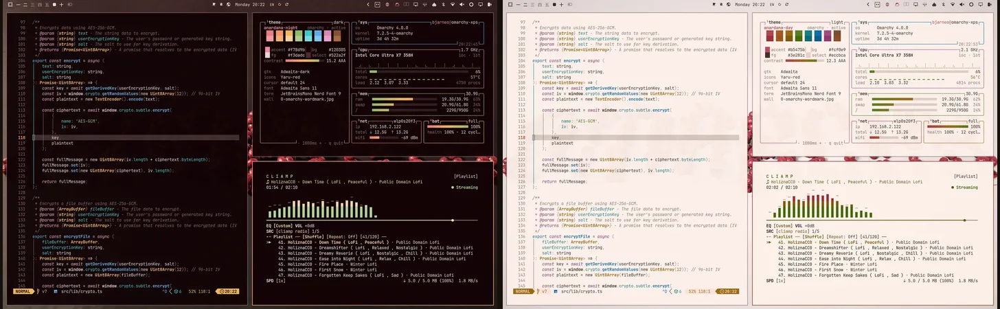](https://bjarneo.github.io/spice-themes/#anardana)

`79` · Origin: India and Iran · Folder: [`anardana/`](anardana/) · [Open on the site](https://bjarneo.github.io/spice-themes/#anardana)

Dried seeds of wild pomegranates. They give a sour, fruity taste to Punjabi chole and chutneys.

Botanical name: *Punica granatum* · Part: seed · Flavor: sour, fruity, tangy · Heat: none

| Variant | Theme name | `background` | `foreground` | `accent` | Icons |
| --- | --- | --- | --- | --- | --- |
| Night | [`anardana-night`](anardana/night/) | `#120305` | `#f3dadc` | `#f78d9b` | `Yaru-red` |
| Day | [`anardana-day`](anardana/day/) | `#fcf0e9` | `#3e281c` | `#b5475b` | `Yaru-red` |

<details>
<summary>All 16 ANSI colors of each variant</summary>

| Variant | Normal, 0 to 7 | Bright, 8 to 15 |
| --- | --- | --- |
| Night | `#220e11` `#ec8082` `#96c16d` `#f9ba5c` `#62b3ef` `#e28abe` `#3fcfd0` `#ddc3c5` | `#88686b` `#f89e9e` `#b1d591` `#ffd7a0` `#88c9fb` `#f1a7d2` `#7ae2e3` `#fdf4f5` |
| Day | `#f6dacc` `#ac3f46` `#517a1b` `#966508` `#0769a0` `#9c447c` `#0d7b7c` `#5d483c` | `#8c7568` `#9a2934` `#406603` `#7c5306` `#075786` `#8a306b` `#076667` `#21120a` |

</details>

```bash
curl -fsSL https://bjarneo.github.io/spice-themes/install.sh | bash -s -- anardana --set
```

### Chenpi

[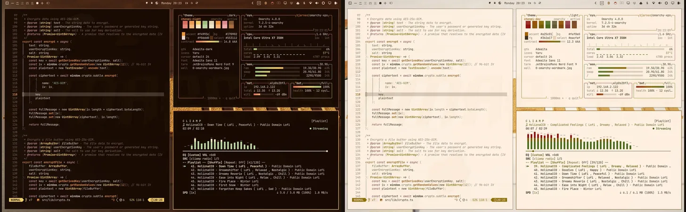](https://bjarneo.github.io/spice-themes/#chenpi)

`80` · Signature palette · Origin: Guangdong, China · Folder: [`chenpi/`](chenpi/) · [Open on the site](https://bjarneo.github.io/spice-themes/#chenpi)

Sun-dried tangerine peel that people age for years. It flavors Cantonese soups, braises and sweet red bean soup.

Botanical name: *Citrus reticulata* · Part: fruit peel · Flavor: bitter, sweet, citrus · Heat: none

| Variant | Theme name | `background` | `foreground` | `accent` | Icons |
| --- | --- | --- | --- | --- | --- |
| Night | [`chenpi-night`](chenpi/night/) | `#170902` | `#f0ddd0` | `#f4993c` | `Yaru` |
| Day | [`chenpi-day`](chenpi/day/) | `#fef0e0` | `#3b2a17` | `#a25c01` | `Yaru` |

<details>
<summary>All 16 ANSI colors of each variant</summary>

| Variant | Normal, 0 to 7 | Bright, 8 to 15 |
| --- | --- | --- |
| Night | `#28170b` `#de7060` `#a2c580` `#fbd26b` `#f59740` `#e39096` `#e8deb9` `#dac6b9` | `#856c5a` `#ea8e7f` `#bcd9a1` `#feedc4` `#fdb57a` `#f1acb0` `#f7efd0` `#fcf5f0` |
| Day | `#f0ddc7` `#9a291d` `#55762d` `#896a00` `#965308` `#97464f` `#6e6440` `#5a4a38` | `#887764` `#880b02` `#446516` `#715701` `#7e4506` `#85333e` `#5d532e` `#1f1406` |

</details>

```bash
curl -fsSL https://bjarneo.github.io/spice-themes/install.sh | bash -s -- chenpi --set
```

### Barberry

[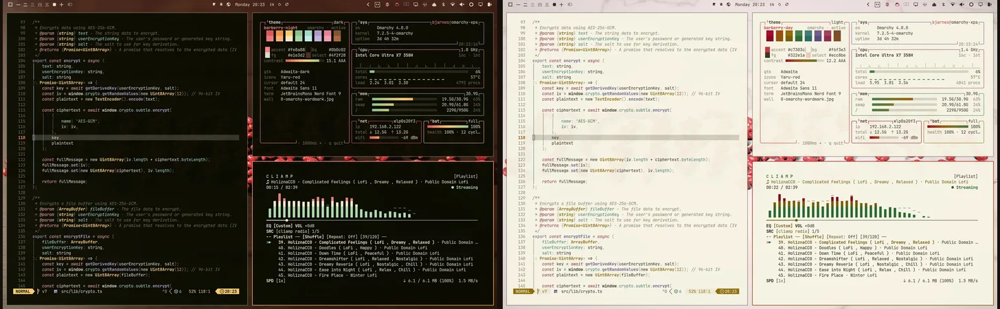](https://bjarneo.github.io/spice-themes/#barberry)

`81` · Signature palette · Origin: Iran · Folder: [`barberry/`](barberry/) · [Open on the site](https://bjarneo.github.io/spice-themes/#barberry)

Small, tart, red berries called zereshk in Iran. Cooks fry them with butter and sugar for jeweled rice.

Botanical name: *Berberis vulgaris* · Part: fruit · Flavor: sour, tart, fruity · Heat: none

| Variant | Theme name | `background` | `foreground` | `accent` | Icons |
| --- | --- | --- | --- | --- | --- |
| Night | [`barberry-night`](barberry/night/) | `#0b0c02` | `#e1e3d2` | `#fe8a88` | `Yaru-red` |
| Day | [`barberry-day`](barberry/day/) | `#f6f3e3` | `#322e1a` | `#c7303c` | `Yaru-red` |

<details>
<summary>All 16 ANSI colors of each variant</summary>

| Variant | Normal, 0 to 7 | Bright, 8 to 15 |
| --- | --- | --- |
| Night | `#1a1b0c` `#e45c5e` `#8fc990` `#ffd16b` `#b1a1d1` `#ef86a0` `#a5ded6` `#caccbb` | `#72745d` `#f1807e` `#adddad` `#ffedc8` `#c6b9e1` `#fca4b8` `#c4f3ec` `#f7f8f0` |
| Day | `#e5e1cb` `#a00222` `#3d7a41` `#8c6800` `#6a5988` `#a13958` `#3c7971` `#514e3a` | `#7f7b66` `#84001a` `#27672d` `#745704` `#594877` `#8f2348` `#24665f` `#191607` |

</details>

```bash
curl -fsSL https://bjarneo.github.io/spice-themes/install.sh | bash -s -- barberry --set
```

### Kokum

[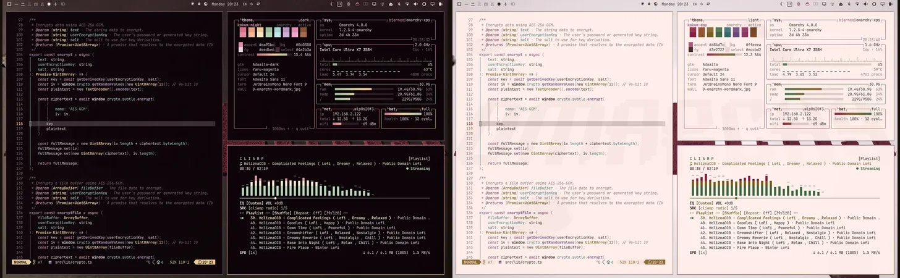](https://bjarneo.github.io/spice-themes/#kokum)

`82` · Signature palette · Origin: Konkan coast, India · Folder: [`kokum/`](kokum/) · [Open on the site](https://bjarneo.github.io/spice-themes/#kokum)

The dried, purple-black rind of a fruit from the Konkan coast of India. It gives a sour taste and a pink color to fish curries.

Botanical name: *Garcinia indica* · Part: fruit rind · Flavor: sour, fruity, sweet · Heat: none

| Variant | Theme name | `background` | `foreground` | `accent` | Icons |
| --- | --- | --- | --- | --- | --- |
| Night | [`kokum-night`](kokum/night/) | `#0c0308` | `#eedbe6` | `#ea91bc` | `Yaru-magenta` |
| Day | [`kokum-day`](kokum/day/) | `#ffeeea` | `#3e2722` | `#a84d7c` | `Yaru-magenta` |

<details>
<summary>All 16 ANSI colors of each variant</summary>

| Variant | Normal, 0 to 7 | Bright, 8 to 15 |
| --- | --- | --- |
| Night | `#1c0d16` `#da748d` `#9cc49c` `#f4d29b` `#c29bcb` `#ea91bc` `#abdbde` `#d7c4cf` | `#826978` `#e791a5` `#b7d8b7` `#ffeccd` `#d5b4dc` `#f9add0` `#c9f0f2` `#fcf4f9` |
| Day | `#f6d9d2` `#952d4e` `#4e764f` `#89682e` `#795282` `#9b4371` `#447679` `#5e4741` | `#8d736d` `#83153e` `#3a643c` `#765513` `#684171` `#892f60` `#2e6265` `#22110d` |

</details>

```bash
curl -fsSL https://bjarneo.github.io/spice-themes/install.sh | bash -s -- kokum --set
```

## Resins

### Asafoetida

[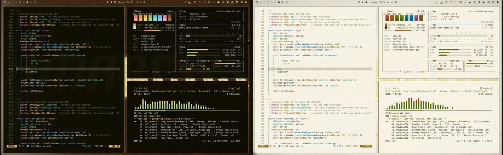](https://bjarneo.github.io/spice-themes/#asafoetida)

`83` · Origin: Iran and Afghanistan · Folder: [`asafoetida/`](asafoetida/) · [Open on the site](https://bjarneo.github.io/spice-themes/#asafoetida)

The dried resin of a giant fennel. Raw, it has a strong smell, but fried in oil it tastes of onion and garlic.

Botanical name: *Ferula assa-foetida* · Part: resin · Flavor: sulfur, onion, garlic · Heat: none

| Variant | Theme name | `background` | `foreground` | `accent` | Icons |
| --- | --- | --- | --- | --- | --- |
| Night | [`asafoetida-night`](asafoetida/night/) | `#0e0c03` | `#e4e2d2` | `#d1ac4e` | `Yaru-yellow` |
| Day | [`asafoetida-day`](asafoetida/day/) | `#f7f2e4` | `#332d1b` | `#896a0b` | `Yaru-yellow` |

<details>
<summary>All 16 ANSI colors of each variant</summary>

| Variant | Normal, 0 to 7 | Bright, 8 to 15 |
| --- | --- | --- |
| Night | `#1d1b0d` `#eb836e` `#9ac06d` `#e9c358` `#67b2ee` `#e28abc` `#49cec9` `#cecbba` | `#76725d` `#f8a08d` `#b4d491` `#fadb88` `#8bc8f9` `#f1a7cf` `#7fe1dc` `#f8f7f0` |
| Day | `#e6e0cc` `#ab422e` `#55791b` `#876b09` `#0069a4` `#9c457a` `#0a7a77` `#534d3b` | `#807a67` `#992c18` `#446503` `#6f5808` `#02578a` `#8b3169` `#056562` `#1a1607` |

</details>

```bash
curl -fsSL https://bjarneo.github.io/spice-themes/install.sh | bash -s -- asafoetida --set
```

### Mastic

[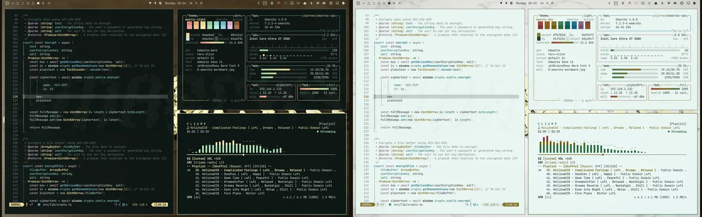](https://bjarneo.github.io/spice-themes/#mastic)

`84` · Signature palette · Origin: Chios, Greece · Folder: [`mastic/`](mastic/) · [Open on the site](https://bjarneo.github.io/spice-themes/#mastic)

Pale resin tears from trees on the Greek island of Chios. Ground mastic gives a pine taste to breads, ice cream and liqueur.

Botanical name: *Pistacia lentiscus* · Part: resin · Flavor: pine, cedar, fresh · Heat: none

| Variant | Theme name | `background` | `foreground` | `accent` | Icons |
| --- | --- | --- | --- | --- | --- |
| Night | [`mastic-night`](mastic/night/) | `#0c1614` | `#d6e5e2` | `#eae0a2` | `Yaru-olive` |
| Day | [`mastic-day`](mastic/day/) | `#e9f6f3` | `#1f322e` | `#7b702d` | `Yaru-olive` |

<details>
<summary>All 16 ANSI colors of each variant</summary>

| Variant | Normal, 0 to 7 | Bright, 8 to 15 |
| --- | --- | --- |
| Night | `#1a2623` `#e18881` `#94cf9f` `#f0de99` `#74bdd4` `#d8aed3` `#93e3d8` `#becfcb` | `#627772` `#efa49d` `#b3e3bb` `#feefb6` `#97d2e5` `#ebc7e6` `#b7f7ee` `#f0f9f7` |
| Day | `#d3e5e1` `#98403c` `#3e7c4d` `#816e20` `#187289` `#875d82` `#066961` `#3f524d` | `#6c7f7b` `#862c2b` `#266839` `#6c5a03` `#0a6075` `#754c71` `#07564f` `#0a1916` |

</details>

```bash
curl -fsSL https://bjarneo.github.io/spice-themes/install.sh | bash -s -- mastic --set
```

## Blends

### Garam Masala

[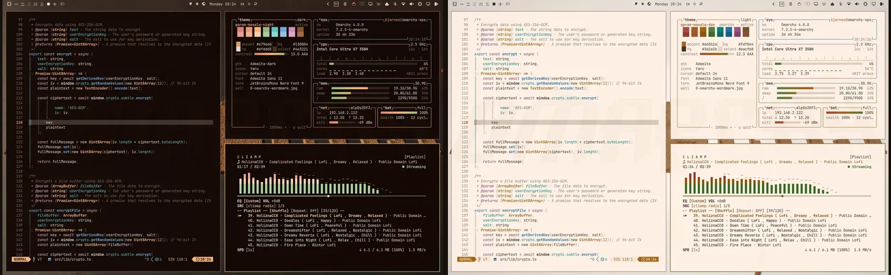](https://bjarneo.github.io/spice-themes/#garam-masala)

`85` · Origin: North India · Folder: [`garam-masala/`](garam-masala/) · [Open on the site](https://bjarneo.github.io/spice-themes/#garam-masala)

A warm North Indian blend of toasted cardamom, cinnamon, clove, cumin, coriander and black pepper. Cooks add it near the end.

Parts: green cardamom, cassia, clove, cumin, coriander seed, black pepper · Part: blend · Flavor: warm, sweet, aromatic · Heat: mild

| Variant | Theme name | `background` | `foreground` | `accent` | Icons |
| --- | --- | --- | --- | --- | --- |
| Night | [`garam-masala-night`](garam-masala/night/) | `#130804` | `#efddd5` | `#e79e6b` | `Yaru` |
| Day | [`garam-masala-day`](garam-masala/day/) | `#fdf0e4` | `#3a2a1b` | `#a65b1e` | `Yaru` |

<details>
<summary>All 16 ANSI colors of each variant</summary>

| Variant | Normal, 0 to 7 | Bright, 8 to 15 |
| --- | --- | --- |
| Night | `#24160f` `#e4877a` `#92c082` `#feb676` `#73b2e3` `#d990be` `#63cbc9` `#d9c6bd` | `#836c61` `#f1a397` `#add4a0` `#ffd5b3` `#94c8f1` `#e9abd1` `#8edfdc` `#fdf5f1` |
| Day | `#eeddcc` `#a5483d` `#4b7a39` `#a45d06` `#20699a` `#954c7b` `#017a79` `#594a3b` | `#877767` `#93342a` `#356622` `#884c02` `#065887` `#83396b` `#016564` `#1f1308` |

</details>

```bash
curl -fsSL https://bjarneo.github.io/spice-themes/install.sh | bash -s -- garam-masala --set
```

### Ras el Hanout

[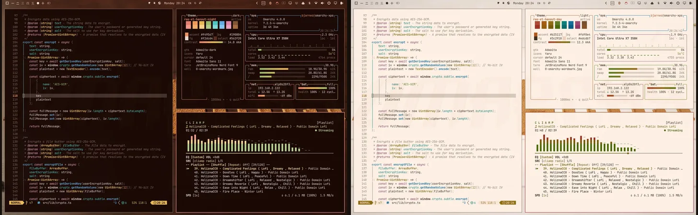](https://bjarneo.github.io/spice-themes/#ras-el-hanout)

`86` · Origin: Morocco · Folder: [`ras-el-hanout/`](ras-el-hanout/) · [Open on the site](https://bjarneo.github.io/spice-themes/#ras-el-hanout)

The name is Arabic for head of the shop, the best blend of a spice seller. It can hold more than 20 spices, often with rose petals.

Parts: cumin, coriander seed, rose, cassia, green cardamom, allspice · Part: blend · Flavor: warm, floral, complex · Heat: mild

| Variant | Theme name | `background` | `foreground` | `accent` | Icons |
| --- | --- | --- | --- | --- | --- |
| Night | [`ras-el-hanout-night`](ras-el-hanout/night/) | `#190804` | `#f2dcd4` | `#f49567` | `Yaru` |
| Day | [`ras-el-hanout-day`](ras-el-hanout/day/) | `#fdf0e4` | `#3c2918` | `#b25117` | `Yaru` |

<details>
<summary>All 16 ANSI colors of each variant</summary>

| Variant | Normal, 0 to 7 | Bright, 8 to 15 |
| --- | --- | --- |
| Night | `#2a160f` `#eb8370` `#9cbf6d` `#f1bf59` `#63b4ea` `#e589b3` `#4dcec8` `#dcc5bd` | `#886a5f` `#f8a08f` `#b6d390` `#fed992` `#89c9f7` `#f3a6c7` `#81e1dc` `#fdf5f2` |
| Day | `#f3dcc8` `#ab4231` `#57791b` `#8d680c` `#0a6a9c` `#9f4471` `#017c78` `#5b4939` | `#8a7665` `#992c1b` `#466504` `#775600` `#005884` `#8d3060` `#006764` `#201307` |

</details>

```bash
curl -fsSL https://bjarneo.github.io/spice-themes/install.sh | bash -s -- ras-el-hanout --set
```

### Za'atar

[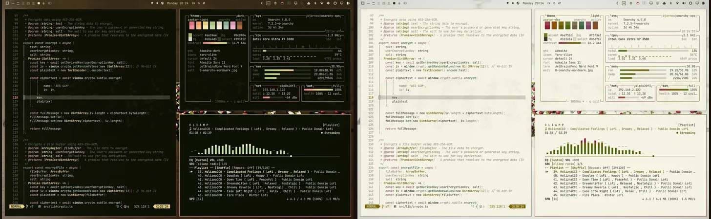](https://bjarneo.github.io/spice-themes/#zaatar)

`87` · Signature palette · Origin: The Levant · Folder: [`zaatar/`](zaatar/) · [Open on the site](https://bjarneo.github.io/spice-themes/#zaatar)

A Levantine blend of dried wild thyme, sumac and toasted sesame. People eat it on bread with olive oil.

Parts: wild thyme, sumac, white sesame · Part: blend · Flavor: herbal, tangy, nutty · Heat: none

| Variant | Theme name | `background` | `foreground` | `accent` | Icons |
| --- | --- | --- | --- | --- | --- |
| Night | [`zaatar-night`](zaatar/night/) | `#0c0f04` | `#e0e4d3` | `#aeb96e` | `Yaru-olive` |
| Day | [`zaatar-day`](zaatar/day/) | `#f5f3e3` | `#312e1a` | `#6a751c` | `Yaru-olive` |

<details>
<summary>All 16 ANSI colors of each variant</summary>

| Variant | Normal, 0 to 7 | Bright, 8 to 15 |
| --- | --- | --- |
| Night | `#1b1d0f` `#e37a84` `#afc981` `#ecd78a` `#90b697` `#e4a0bf` `#ecdcc1` `#c9cdbb` | `#6f755e` `#f0979e` `#c7dea3` `#feefb4` `#abcab0` `#f4bbd5` `#faedd6` `#f6f8f0` |
| Day | `#e4e1cb` `#9b3142` `#5e7729` `#786405` `#486e50` `#935172` `#7c6d52` `#504e3a` | `#7e7b66` `#891931` `#4a6309` `#655300` `#365d3f` `#823f61` `#69593e` `#191607` |

</details>

```bash
curl -fsSL https://bjarneo.github.io/spice-themes/install.sh | bash -s -- zaatar --set
```

### Berbere

[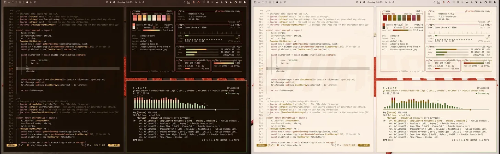](https://bjarneo.github.io/spice-themes/#berbere)

`88` · Signature palette · Origin: Ethiopia and Eritrea · Folder: [`berbere/`](berbere/) · [Open on the site](https://bjarneo.github.io/spice-themes/#berbere)

A hot, red Ethiopian blend of chili, fenugreek, ginger and korarima. It is the base of the chicken stew doro wat.

Parts: kashmiri chili, fenugreek, black cardamom, clove, ginger · Part: blend · Flavor: hot, earthy, sweet · Heat: hot

| Variant | Theme name | `background` | `foreground` | `accent` | Icons |
| --- | --- | --- | --- | --- | --- |
| Night | [`berbere-night`](berbere/night/) | `#170d04` | `#edded2` | `#ff8c72` | `Yaru` |
| Day | [`berbere-day`](berbere/day/) | `#fcf1e2` | `#392b19` | `#be4226` | `Yaru` |

<details>
<summary>All 16 ANSI colors of each variant</summary>

| Variant | Normal, 0 to 7 | Bright, 8 to 15 |
| --- | --- | --- |
| Night | `#281b10` `#e06255` `#a7c28c` `#fcc771` `#de8e69` `#e78d9b` `#f4d9bb` `#d7c7ba` | `#816d5d` `#ef8679` `#c0d7aa` `#fee4bd` `#eca98b` `#f5a9b4` `#ffebd5` `#fcf5f0` |
| Day | `#eddeca` `#9e1111` `#59743d` `#92660b` `#95461d` `#9a4254` `#7b6144` `#584b3a` | `#867865` `#850004` `#486329` `#7a5300` `#833300` `#882e43` `#6a5032` `#1e1406` |

</details>

```bash
curl -fsSL https://bjarneo.github.io/spice-themes/install.sh | bash -s -- berbere --set
```

### Chinese Five-Spice

[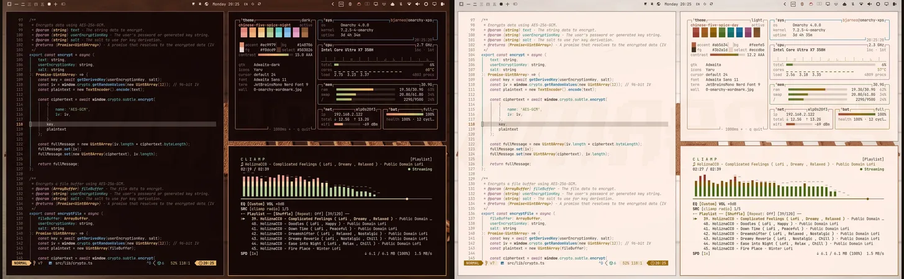](https://bjarneo.github.io/spice-themes/#chinese-five-spice)

`89` · Origin: China · Folder: [`chinese-five-spice/`](chinese-five-spice/) · [Open on the site](https://bjarneo.github.io/spice-themes/#chinese-five-spice)

Star anise, clove, cassia, Sichuan pepper and fennel seed. It seasons roast pork, duck and red-braised dishes.

Parts: star anise, clove, cassia, sichuan pepper, fennel seed · Part: blend · Flavor: licorice, sweet, warm · Heat: mild

| Variant | Theme name | `background` | `foreground` | `accent` | Icons |
| --- | --- | --- | --- | --- | --- |
| Night | [`chinese-five-spice-night`](chinese-five-spice/night/) | `#140706` | `#f0dcd9` | `#ec9979` | `Yaru` |
| Day | [`chinese-five-spice-day`](chinese-five-spice/day/) | `#feefe5` | `#3b2a1d` | `#ab5634` | `Yaru` |

<details>
<summary>All 16 ANSI colors of each variant</summary>

| Variant | Normal, 0 to 7 | Bright, 8 to 15 |
| --- | --- | --- |
| Night | `#241512` `#e48877` `#9dbe78` `#f4bc6d` `#6eb3e3` `#dc8fb9` `#61ccc7` `#dac5c1` | `#846b66` `#f1a495` `#b6d399` `#fed7a3` `#90c8f0` `#ecaacd` `#8ddfdb` `#fdf4f3` |
| Day | `#f0dcce` `#a54939` `#57782d` `#976400` `#156a99` `#974a77` `#117a76` `#5a493d` | `#897669` `#933526` `#436411` `#7d5201` `#015884` `#853765` `#0e6562` `#201309` |

</details>

```bash
curl -fsSL https://bjarneo.github.io/spice-themes/install.sh | bash -s -- chinese-five-spice --set
```

### Curry Powder

[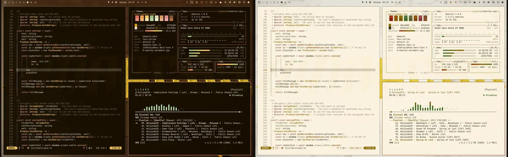](https://bjarneo.github.io/spice-themes/#curry-powder)

`90` · Signature palette · Origin: Britain and India · Folder: [`curry-powder/`](curry-powder/) · [Open on the site](https://bjarneo.github.io/spice-themes/#curry-powder)

A British blend based on Indian spice mixes. Turmeric makes it yellow, and coriander, cumin and fenugreek give the taste.

Parts: turmeric, coriander seed, cumin, fenugreek, cayenne · Part: blend · Flavor: earthy, warm, savory · Heat: warm

| Variant | Theme name | `background` | `foreground` | `accent` | Icons |
| --- | --- | --- | --- | --- | --- |
| Night | [`curry-powder-night`](curry-powder/night/) | `#170e00` | `#ebe0cb` | `#dea805` | `Yaru-yellow` |
| Day | [`curry-powder-day`](curry-powder/day/) | `#fbf2df` | `#372c15` | `#8c6800` | `Yaru-yellow` |

<details>
<summary>All 16 ANSI colors of each variant</summary>

| Variant | Normal, 0 to 7 | Bright, 8 to 15 |
| --- | --- | --- |
| Night | `#271c05` `#e1755a` `#9cc685` `#fecd5c` `#de9a60` `#e39191` `#e0e2b5` `#d4c9b5` | `#7f7052` `#ed937c` `#b7daa4` `#ffe9bc` `#edb486` `#f2acab` `#f0f2cc` `#faf6ef` |
| Day | `#ecdfc6` `#9b2d0f` `#4e7834` `#8d6900` `#915108` `#974749` `#67683b` `#564c37` | `#847963` `#841d00` `#3b651e` `#755600` `#7b4200` `#853438` `#565729` `#1c1506` |

</details>

```bash
curl -fsSL https://bjarneo.github.io/spice-themes/install.sh | bash -s -- curry-powder --set
```

### Shichimi Togarashi

[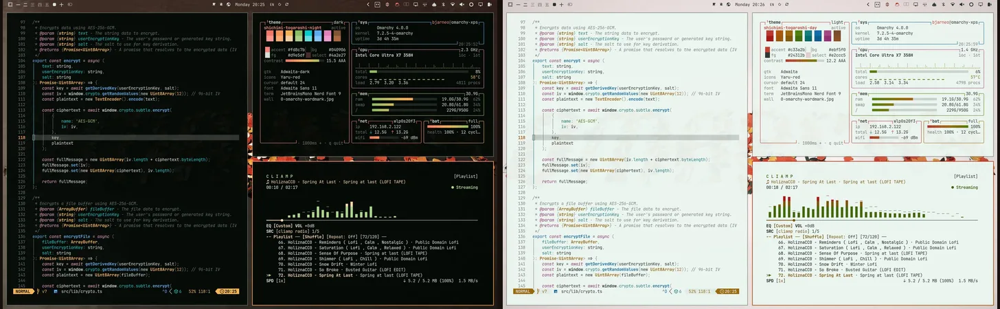](https://bjarneo.github.io/spice-themes/#shichimi-togarashi)

`91` · Origin: Japan · Folder: [`shichimi-togarashi/`](shichimi-togarashi/) · [Open on the site](https://bjarneo.github.io/spice-themes/#shichimi-togarashi)

A Japanese blend of 7 flavors: chili, sansho, orange peel, sesame, hemp seed, ginger and nori. People shake it on noodles and grilled meat.

Parts: chili flakes, black sesame, white sesame, orange peel, nori · Part: blend · Flavor: hot, citrus, nutty · Heat: hot

| Variant | Theme name | `background` | `foreground` | `accent` | Icons |
| --- | --- | --- | --- | --- | --- |
| Night | [`shichimi-togarashi-night`](shichimi-togarashi/night/) | `#040906` | `#d9e5df` | `#fd8c7b` | `Yaru-red` |
| Day | [`shichimi-togarashi-day`](shichimi-togarashi/day/) | `#ebf5f0` | `#24312b` | `#c33a2b` | `Yaru-red` |

<details>
<summary>All 16 ANSI colors of each variant</summary>

| Variant | Normal, 0 to 7 | Bright, 8 to 15 |
| --- | --- | --- |
| Night | `#0f1713` `#f9786b` `#90c365` `#feb857` `#5ab3f8` `#e785c1` `#04d1d4` `#c1cec8` | `#66766e` `#ff9c90` `#acd78b` `#fed7a6` `#8ac8fd` `#f5a3d4` `#6be4e6` `#f1f9f5` |
| Day | `#d7e4dd` `#b8312b` `#4a7c04` `#986404` `#0768a4` `#a13e7f` `#0b7b7d` `#43514a` | `#707e77` `#a51114` `#3d6706` `#7e5202` `#05578a` `#8f286e` `#006566` `#0e1914` |

</details>

```bash
curl -fsSL https://bjarneo.github.io/spice-themes/install.sh | bash -s -- shichimi-togarashi --set
```

### Baharat

[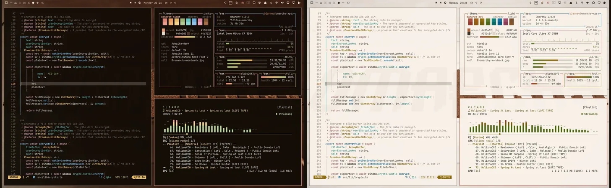](https://bjarneo.github.io/spice-themes/#baharat)

`92` · Origin: Middle East · Folder: [`baharat/`](baharat/) · [Open on the site](https://bjarneo.github.io/spice-themes/#baharat)

Baharat means spices in Arabic. This blend of black pepper, allspice, cinnamon and clove seasons lamb, rice and soups.

Parts: black pepper, allspice, cassia, clove · Part: blend · Flavor: warm, peppery, sweet · Heat: mild

| Variant | Theme name | `background` | `foreground` | `accent` | Icons |
| --- | --- | --- | --- | --- | --- |
| Night | [`baharat-night`](baharat/night/) | `#130d07` | `#e9e0d5` | `#e69e79` | `Yaru` |
| Day | [`baharat-day`](baharat/day/) | `#f8f1e8` | `#352c1f` | `#a35a32` | `Yaru` |

<details>
<summary>All 16 ANSI colors of each variant</summary>

| Variant | Normal, 0 to 7 | Bright, 8 to 15 |
| --- | --- | --- |
| Night | `#221c14` `#e48877` `#a0bd77` `#ebc16a` `#6db4e1` `#e28ea9` `#64cbc5` `#d3c9bd` | `#7c6f61` `#f1a495` `#b9d298` `#fcd994` `#90c9ef` `#f1aac0` `#8edfd9` `#fbf6f0` |
| Day | `#e8dfd2` `#a54939` `#5a772c` `#8c6802` `#116b97` `#9c4967` `#097c77` `#554c3f` | `#82796b` `#933526` `#486410` `#755706` `#005982` `#8a3656` `#036662` `#1c150a` |

</details>

```bash
curl -fsSL https://bjarneo.github.io/spice-themes/install.sh | bash -s -- baharat --set
```

### Dukkah

[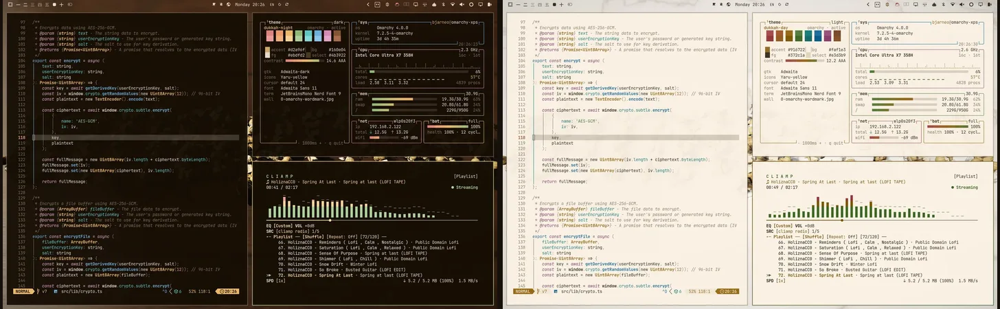](https://bjarneo.github.io/spice-themes/#dukkah)

`93` · Origin: Egypt · Folder: [`dukkah/`](dukkah/) · [Open on the site](https://bjarneo.github.io/spice-themes/#dukkah)

An Egyptian mix of crushed, toasted nuts with sesame, coriander and cumin. People dip bread in olive oil, then in dukkah.

Parts: hazelnuts, white sesame, coriander seed, cumin · Part: blend · Flavor: nutty, toasty, earthy · Heat: none

| Variant | Theme name | `background` | `foreground` | `accent` | Icons |
| --- | --- | --- | --- | --- | --- |
| Night | [`dukkah-night`](dukkah/night/) | `#160e04` | `#ebdfd2` | `#d2a96f` | `Yaru-yellow` |
| Day | [`dukkah-day`](dukkah/day/) | `#faf1e3` | `#372c1a` | `#916722` | `Yaru-yellow` |

<details>
<summary>All 16 ANSI colors of each variant</summary>

| Variant | Normal, 0 to 7 | Bright, 8 to 15 |
| --- | --- | --- |
| Night | `#261c10` `#e48682` `#93c07f` `#f2bd6c` `#6eb3e3` `#db8fbb` `#60cbca` `#d5c8ba` | `#7e6f5c` `#f1a29e` `#afd49e` `#fed79e` `#90c8f0` `#eaaacf` `#8cdfdd` `#fbf6f0` |
| Day | `#ebdecb` `#a54746` `#4d7a36` `#94660d` `#156a99` `#964b79` `#137b7b` `#564b3a` | `#857866` `#933334` `#38661f` `#7b5300` `#005884` `#843868` `#0f6666` `#1d1407` |

</details>

```bash
curl -fsSL https://bjarneo.github.io/spice-themes/install.sh | bash -s -- dukkah --set
```

### Panch Phoron

[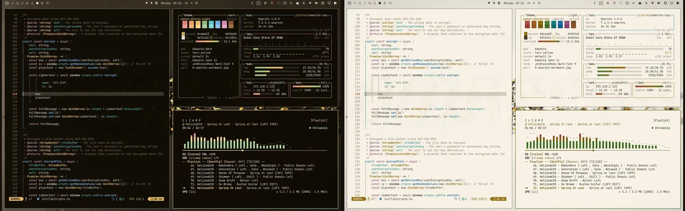](https://bjarneo.github.io/spice-themes/#panch-phoron)

`94` · Origin: Bengal · Folder: [`panch-phoron/`](panch-phoron/) · [Open on the site](https://bjarneo.github.io/spice-themes/#panch-phoron)

A Bengali mix of 5 whole seeds: fenugreek, nigella, cumin, mustard and fennel. The seeds pop in hot oil at the start of a dish.

Parts: fenugreek, nigella, cumin, brown mustard seed, fennel seed · Part: blend · Flavor: bitter, sweet, pungent · Heat: none

| Variant | Theme name | `background` | `foreground` | `accent` | Icons |
| --- | --- | --- | --- | --- | --- |
| Night | [`panch-phoron-night`](panch-phoron/night/) | `#0f0a03` | `#e7e1d2` | `#cdad63` | `Yaru-yellow` |
| Day | [`panch-phoron-day`](panch-phoron/day/) | `#f8f2e5` | `#352d1c` | `#8c6a05` | `Yaru-yellow` |

<details>
<summary>All 16 ANSI colors of each variant</summary>

| Variant | Normal, 0 to 7 | Bright, 8 to 15 |
| --- | --- | --- |
| Night | `#1e190d` `#e4877c` `#93c07e` `#ecc06a` `#72b2e6` `#da8fbd` `#5dcbcd` `#d1caba` | `#7a715d` `#f1a399` `#afd49d` `#fdd994` `#94c7f3` `#eaaad0` `#8adfdf` `#faf6ef` |
| Day | `#e8dfce` `#a5483f` `#4d7a35` `#8e6703` `#20689c` `#954b7b` `#0a7b7d` `#544c3c` | `#827968` `#93342d` `#39671e` `#765607` `#055789` `#84386a` `#076668` `#1b1508` |

</details>

```bash
curl -fsSL https://bjarneo.github.io/spice-themes/install.sh | bash -s -- panch-phoron --set
```

### Quatre Épices

[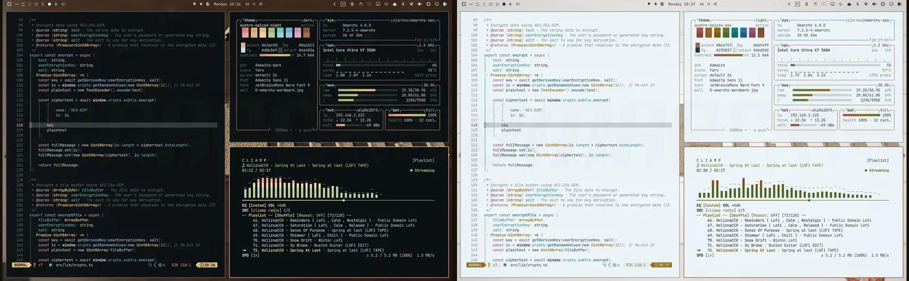](https://bjarneo.github.io/spice-themes/#quatre-epices)

`95` · Origin: France · Folder: [`quatre-epices/`](quatre-epices/) · [Open on the site](https://bjarneo.github.io/spice-themes/#quatre-epices)

French for four spices: pepper, nutmeg, ginger and clove. Butchers use it in pâtés, sausages and terrines.

Parts: white pepper, nutmeg, ginger, clove · Part: blend · Flavor: peppery, warm, sweet · Heat: mild

| Variant | Theme name | `background` | `foreground` | `accent` | Icons |
| --- | --- | --- | --- | --- | --- |
| Night | [`quatre-epices-night`](quatre-epices/night/) | `#0a1013` | `#d8e3e9` | `#e1bc9d` | `Yaru` |
| Day | [`quatre-epices-day`](quatre-epices/day/) | `#ebf4f9` | `#233037` | `#8c6747` | `Yaru` |

<details>
<summary>All 16 ANSI colors of each variant</summary>

| Variant | Normal, 0 to 7 | Bright, 8 to 15 |
| --- | --- | --- |
| Night | `#181f23` `#dc8c83` `#a1bc7f` `#e7c27a` `#7bb1de` `#d693b8` `#6fc9ca` `#c0cdd3` | `#65747c` `#eba79f` `#bad19e` `#f9daa0` `#9ac7ec` `#e6aecc` `#96dddd` `#f0f8fc` |
| Day | `#d6e3e9` `#9e4e47` `#5c7636` `#8e690d` `#2d6894` `#915076` `#097b7d` `#424f56` | `#6f7d84` `#8c3b35` `#496320` `#765601` `#155783` `#803d65` `#096668` `#0d181d` |

</details>

```bash
curl -fsSL https://bjarneo.github.io/spice-themes/install.sh | bash -s -- quatre-epices --set
```

### Advieh

[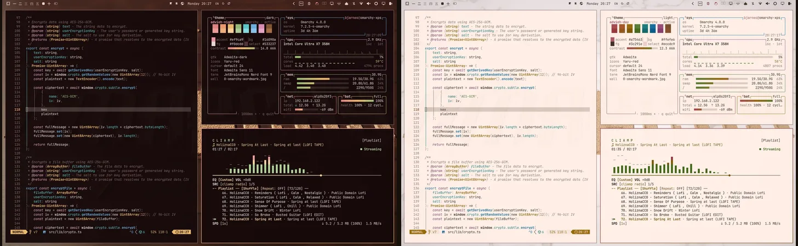](https://bjarneo.github.io/spice-themes/#advieh)

`96` · Origin: Iran · Folder: [`advieh/`](advieh/) · [Open on the site](https://bjarneo.github.io/spice-themes/#advieh)

A Persian blend of rose petals, cinnamon, cardamom and cumin. It flavors rice dishes and stews.

Parts: rose, ceylon cinnamon, green cardamom, cumin · Part: blend · Flavor: floral, warm, sweet · Heat: none

| Variant | Theme name | `background` | `foreground` | `accent` | Icons |
| --- | --- | --- | --- | --- | --- |
| Night | [`advieh-night`](advieh/night/) | `#16090a` | `#f0dcdd` | `#ef9ca9` | `Yaru-red` |
| Day | [`advieh-day`](advieh/day/) | `#ffefe6` | `#3c291e` | `#a75463` | `Yaru-red` |

<details>
<summary>All 16 ANSI colors of each variant</summary>

| Variant | Normal, 0 to 7 | Bright, 8 to 15 |
| --- | --- | --- |
| Night | `#271718` `#e48685` `#98bf79` `#f2bd6c` `#6bb3e5` `#dd8eb9` `#5bcccd` `#dac4c6` | `#846a6b` `#f2a2a1` `#b2d39a` `#ffd79e` `#8ec8f2` `#ecaacd` `#89e0e0` `#fdf4f5` |
| Day | `#f1dbd0` `#a54649` `#52792f` `#966500` `#0d6a9b` `#984a77` `#13797a` `#5c483e` | `#8a756a` `#933238` `#3f6615` `#7c5300` `#045883` `#863766` `#0e6465` `#20120a` |

</details>

```bash
curl -fsSL https://bjarneo.github.io/spice-themes/install.sh | bash -s -- advieh --set
```

### Chaat Masala

[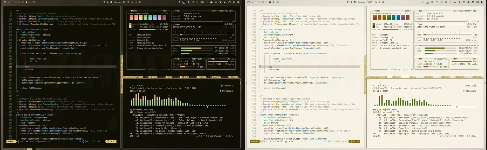](https://bjarneo.github.io/spice-themes/#chaat-masala)

`97` · Origin: India · Folder: [`chaat-masala/`](chaat-masala/) · [Open on the site](https://bjarneo.github.io/spice-themes/#chaat-masala)

A tangy Indian blend of dried mango, cumin and black salt, which smells of sulfur. It goes on fruit, salads and street food.

Parts: amchur, cumin, coriander seed, black pepper · Part: blend · Flavor: tangy, salty, funky · Heat: mild

| Variant | Theme name | `background` | `foreground` | `accent` | Icons |
| --- | --- | --- | --- | --- | --- |
| Night | [`chaat-masala-night`](chaat-masala/night/) | `#0f0e04` | `#e4e2d3` | `#c4b164` | `Yaru-yellow` |
| Day | [`chaat-masala-day`](chaat-masala/day/) | `#f6f2e5` | `#332e1c` | `#806c00` | `Yaru-yellow` |

<details>
<summary>All 16 ANSI colors of each variant</summary>

| Variant | Normal, 0 to 7 | Bright, 8 to 15 |
| --- | --- | --- |
| Night | `#1e1c10` `#e4877f` `#98bf79` `#e0c66a` `#6eb3e6` `#d391ca` `#5bccca` `#cdcbbb` | `#75735e` `#f2a39c` `#b2d39a` `#f2de94` `#91c8f3` `#e3acdc` `#89dfde` `#f8f7f0` |
| Day | `#e6e0ce` `#a54743` `#52792f` `#826b00` `#16699c` `#8f4d88` `#007a7a` `#524d3c` | `#807a68` `#933331` `#3f6615` `#6d5a06` `#005886` `#7d3b77` `#006565` `#1a1608` |

</details>

```bash
curl -fsSL https://bjarneo.github.io/spice-themes/install.sh | bash -s -- chaat-masala --set
```

### Hawaij

[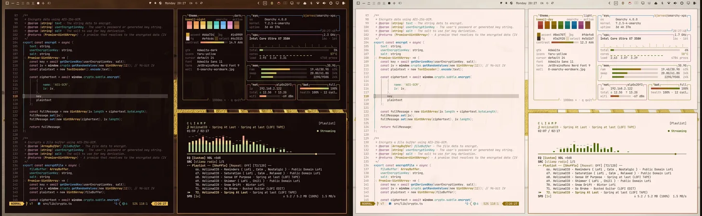](https://bjarneo.github.io/spice-themes/#hawaij)

`98` · Origin: Yemen · Folder: [`hawaij/`](hawaij/) · [Open on the site](https://bjarneo.github.io/spice-themes/#hawaij)

A Yemeni blend of cumin, black pepper, turmeric and cardamom for soups. A sweet version with ginger goes into coffee.

Parts: cumin, black pepper, turmeric, green cardamom · Part: blend · Flavor: earthy, warm, peppery · Heat: mild

| Variant | Theme name | `background` | `foreground` | `accent` | Icons |
| --- | --- | --- | --- | --- | --- |
| Night | [`hawaij-night`](hawaij/night/) | `#140909` | `#efdcdc` | `#dda734` | `Yaru-yellow` |
| Day | [`hawaij-day`](hawaij/day/) | `#fdefe8` | `#3a2920` | `#8e6707` | `Yaru-yellow` |

<details>
<summary>All 16 ANSI colors of each variant</summary>

| Variant | Normal, 0 to 7 | Bright, 8 to 15 |
| --- | --- | --- |
| Night | `#241617` `#eb8371` `#9dbf6c` `#f2bf4e` `#63b4ea` `#e18abc` `#4dcec8` `#d9c5c5` | `#836b6b` `#f8a090` `#b7d390` `#fed990` `#89c9f7` `#f0a6cf` `#81e1dc` `#fef4f4` |
| Day | `#efdcd1` `#ac4132` `#58781a` `#8d6800` `#0b6a9c` `#9c457a` `#137a76` `#5a493f` | `#89766b` `#992c1e` `#456300` `#745500` `#015884` `#8a3169` `#0d6562` `#1f130b` |

</details>

```bash
curl -fsSL https://bjarneo.github.io/spice-themes/install.sh | bash -s -- hawaij --set
```

### Jerk Seasoning

[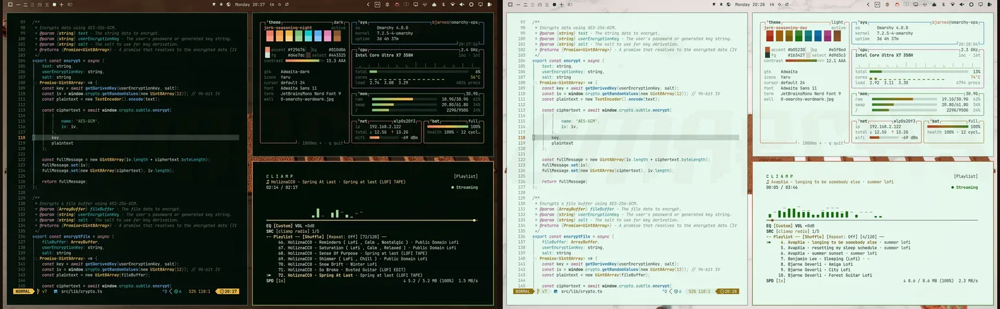](https://bjarneo.github.io/spice-themes/#jerk-seasoning)

`99` · Origin: Jamaica · Folder: [`jerk-seasoning/`](jerk-seasoning/) · [Open on the site](https://bjarneo.github.io/spice-themes/#jerk-seasoning)

A hot Jamaican blend of allspice and Scotch bonnet chili with thyme. It seasons chicken and pork, grilled over pimento wood.

Parts: allspice, habanero, black pepper, nutmeg · Part: blend · Flavor: hot, warm, herbal · Heat: very hot

| Variant | Theme name | `background` | `foreground` | `accent` | Icons |
| --- | --- | --- | --- | --- | --- |
| Night | [`jerk-seasoning-night`](jerk-seasoning/night/) | `#010d06` | `#d4e7dc` | `#f29676` | `Yaru` |
| Day | [`jerk-seasoning-day`](jerk-seasoning/day/) | `#e5f8ed` | `#1b3427` | `#b05230` | `Yaru` |

<details>
<summary>All 16 ANSI colors of each variant</summary>

| Variant | Normal, 0 to 7 | Bright, 8 to 15 |
| --- | --- | --- |
| Night | `#091c12` `#f37e67` `#7dc675` `#f3bf42` `#5bb2f9` `#e885c0` `#09d1d1` `#bcd0c4` | `#5e796a` `#ff9d89` `#9ed996` `#fed98a` `#8ac8fd` `#f6a3d3` `#6be4e3` `#f1f9f4` |
| Day | `#cde8d8` `#b23a25` `#2e7e26` `#8d6a06` `#0a68a4` `#a23d7d` `#0c7b7b` `#3c5346` | `#698173` `#a02109` `#106b04` `#745704` `#07578a` `#90276c` `#036766` `#091a11` |

</details>

```bash
curl -fsSL https://bjarneo.github.io/spice-themes/install.sh | bash -s -- jerk-seasoning --set
```

### Mulling Spices

[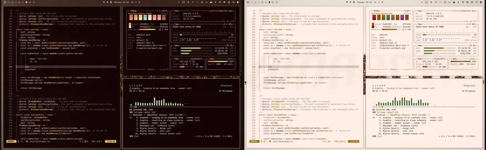](https://bjarneo.github.io/spice-themes/#mulling-spices)

`100` · Signature palette · Origin: Northern Europe · Folder: [`mulling-spices/`](mulling-spices/) · [Open on the site](https://bjarneo.github.io/spice-themes/#mulling-spices)

Whole cinnamon, clove, star anise, allspice and orange peel. They steep in hot wine or cider for mulled wine and glögg.

Parts: ceylon cinnamon, clove, star anise, allspice, chenpi · Part: blend · Flavor: warm, sweet, citrus · Heat: none

| Variant | Theme name | `background` | `foreground` | `accent` | Icons |
| --- | --- | --- | --- | --- | --- |
| Night | [`mulling-spices-night`](mulling-spices/night/) | `#130304` | `#f4dada` | `#f49851` | `Yaru` |
| Day | [`mulling-spices-day`](mulling-spices/day/) | `#ffefe6` | `#3e281b` | `#ab5902` | `Yaru` |

<details>
<summary>All 16 ANSI colors of each variant</summary>

| Variant | Normal, 0 to 7 | Bright, 8 to 15 |
| --- | --- | --- |
| Night | `#240f10` `#da6b6e` `#9dc494` `#fac871` `#f0995b` `#e68aaf` `#fed2cb` `#dec3c3` | `#896868` `#e78989` `#b7d9b0` `#fee4b8` `#fdb583` `#f4a7c4` `#fceae6` `#fef4f4` |
| Day | `#f5dacb` `#982431` `#4e7646` `#906709` `#9b4f03` `#993e67` `#8d655e` `#5d483c` | `#8d7669` `#86011f` `#3c6533` `#775409` `#834102` `#872a56` `#79514a` `#211209` |

</details>

```bash
curl -fsSL https://bjarneo.github.io/spice-themes/install.sh | bash -s -- mulling-spices --set
```


## How the themes are made

The scripts in [`tools/`](tools/) make every file in this repo. They need Node.js 22 or later, Chromium, ImageMagick and ffmpeg. `tools/photo.mjs` and `tools/dust.mjs` also need a GPU that Chromium can use through Vulkan. `tools/capture.sh` also needs Omarchy, Hyprland and grim.

| Script | Output |
| --- | --- |
| `tools/palettes.mjs` | The spice table and the color math. Every other script reads it. |
| `tools/build.mjs` | `colors.toml` and `icons.theme` of each variant, and `site/assets/themes.js` |
| `tools/render.mjs` | The profile card of each variant at 6K. `tools/render.html` draws it on a canvas. |
| `tools/photo.mjs` | The 4 photographic backgrounds of each variant at 6K. `tools/photo.html` ray-marches the 3D scenes on the GPU. |
| `tools/dust.mjs` | The dust video of each variant. `tools/dust.html` draws the dust once, `tools/photo.html` renders the board from above, and ffmpeg lays the dust over it. |
| `tools/capture.sh` | `preview.png` of each variant and the site screenshots. It applies each variant on this desktop and takes a screenshot of workspace 8. |
| `tools/preview.mjs` | Optional. Draws a desktop preview for each variant on a computer without Omarchy. `tools/capture.sh` replaces these drawings with real screenshots. |
| `tools/assets.mjs` | The site previews, the thumbnails, the Aether copies and the mosaic |
| `tools/readme.mjs` | This README |

To build everything again, run the scripts in this order:

```bash
node tools/build.mjs
node tools/render.mjs
node tools/photo.mjs
node tools/dust.mjs
tools/capture.sh
node tools/assets.mjs
node tools/readme.mjs
```

`tools/photo.mjs` takes about 5 hours for all 800 photos on an Intel Arc GPU. It draws small tiles and waits for the GPU after every few tiles. Some GPU drivers reset the GPU when one job runs longer than 5 seconds. Each shape of spice compiles its own shader the first time, so the first image of each shape takes longer.

`tools/capture.sh` takes about 30 minutes. It changes the theme of the desktop 200 times and shows workspace 8 the whole time. Open the windows that you want in the screenshots on workspace 8 first. If you switch to another workspace, the script stops and restores your theme. Run it again to continue where it stopped. On a computer without Omarchy, run `node tools/preview.mjs` instead.

To change a spice, edit its row in `tools/palettes.mjs`, then run the scripts with the theme name, for example `node tools/photo.mjs saffron` and `tools/capture.sh saffron`.

The site in [`site/`](site/) is a static page. The workflow in `.github/workflows/pages.yml` copies `install.sh` and every `colors.toml` into it and publishes it to GitHub Pages.
